```text
Phase A — Internal Control Surface（控制面輸出） | TURN=第 1 次對話 | PROMPT=1.16.1 | REFRESH=Manual Prompt Refresh APPLIED | REFRESH_REMINDER=NONE | STATE={MainlineMode=Transcript; MainlineSource=逐字稿_03.txt; Locator=Session=03／L5–L159; KP=Well-Ordering Principle→Principle of Mathematical Induction 的成立理由; Boundary=VERIFIED，L161起轉入一般歸納法例子並再往 Theorem 4.2 推進; Transcript={File=逐字稿_03.txt; Session=03; SessionSource=FilenamePrefix; WithinSessionOrder=NA/UNKNOWN，同 Session 另有逐字稿_03_v0.0.1.txt且非part命名，本輪不視為後續片段; Span=L5–L159; Coverage=FULL，檔案由上課開場延伸至老師收課; TeachingState=TAUGHT_CORE; Signals=TeacherExplanation+Scope; Scope=Z+／正整數; Correction=NONE; ASR=minor wording uncertainty; Residual=checked through L161}; Reference={Aligned=教材截圖1000004033.png之Well-Ordering Principle正式敘述; PrecisionStatus=HIGH for WOP，PARTIAL for完整Theorem4.1教材原文; 課本詳解.pdf=AVAILABLE但本知識點未以其重構正式題目}; Practice={LearningObjective=尚未實際檢查; Modality=NA; ExpectedArtifact=NA; AcceptedSubmission=NA; RequiredModality=NO; TaskOrigin=NA; SourceReopened=NA; SourceIdentity=NA; ContentFidelity=NA; SourceMatch=NA; AssessmentFidelity=Learning; SubmissionStatus=NOT_SUBMITTED}; AdjQueue=Theorem4.2→Example4.14→4.1指定習題→後續整數性質; ExerciseDebt=NOT_YET_CREATED; TeachingMainlineDebt=Session03其餘內容待複習; AssessmentRequirementDebt=目前知識點未確認; ReferenceResolutionDebt=LOW; PastExamDebt=P0 candidate，已找到數學歸納法proof考古題但原始考卷尚未重新核對; Weakness=UNKNOWN; Coverage=第一知識點尚未驗證學會; Completion=IN_PROGRESS; Evidence=Transcript L5–L159＋教材WOP原文; Blockers=NONE for current KP; NextLegal=完成本知識點教學與練習後才進Theorem4.2} | PLAN={ThisResponse=只教第三堂第一個自然知識點，完成必要知識包後給3個Generated Practice Tasks; ExpectedDebtChange=產生並輸出Exercise Debt對應任務; ExpectedNext=批改後依表現決定是否進Theorem4.2}
```

## ⭐Well-Ordering Principle（良序原理）→ Mathematical Induction（數學歸納法）為什麼成立？

主線位置：Teacher Transcript／`逐字稿_03.txt`／Session=03／L5–L159  
對齊參考：教材原文 `The Well-Ordering Principle`；`課本詳解.pdf` 已確認存在，但這一輪沒有拿它冒充定理原文。

老師第三堂一開始直接從 `Well-Ordering Principle（良序原理）` 接到「如何證明數學歸納法本身成立」，而且最後特別限制這段論證是在正整數範圍內。逐字稿_03 逐字稿_03

---

### 1. 這段到底在解決什麼問題？

你以前大概已經會用數學歸納法：

\[
S(1)\text{ 成立}
\]

再證明

\[
S(k)\Rightarrow S(k+1)
\]

然後就宣布：

\[
S(n)\text{ 對所有 }n\in\mathbb Z^+\text{ 成立。}
\]

真正的問題是：

> 為什麼只檢查「第一個」和「從一個推到下一個」，就足以涵蓋無限多個正整數？

老師這堂不是只教你「怎麼用 induction」，而是在回答「**induction 憑什麼是合法的證明方法？**」。

老師也明確說，正整數有無限多個，不可能靠一個一個列舉來驗證，因此改採 `proof by contradiction（反證法）`，去證明「反例根本不可能存在」。逐字稿_03

---

### 2. Well-Ordering Principle（良序原理）

教材的精確版本是：

> 每個非空的 \(\mathbb Z^+\) 子集合，都含有一個最小元素。

也就是：

\[
A\subseteq\mathbb Z^+,\quad A\neq\varnothing
\]

則一定存在某個 \(m\in A\)，使得

\[
m\le a\qquad \forall a\in A.
\]


///danger|符號

| 符號 | 名稱 | 白話 | 左邊通常是 | 右邊是 |
|---|---|---|---|---|
| \(\in\) | element of（屬於） | 「元素在集合裡」 | 元素 | 集合 |
| \(\subseteq\) | subset of（子集合） | 「集合包含在另一集合裡，可以完全相同」 | 集合 | 集合 |
| \(\subset\) | proper subset of（真子集合） | 「集合包含在另一集合裡，而且不能完全相同」 | 集合 | 集合 |

///

教材也把這件事簡稱為：

\[
\mathbb Z^+\text{ is well ordered.}
\]

這個教材敘述已直接核對。1000004033

生活化想像：假設你從正整數中任意挑一些數字。

例如：

\[
A=\{8,17,25,101,\ldots\}
\]

只要 \(A\) 不是空的，它就一定有「最前面那一個」，例如這裡的 \(8\)。

這就是後面證明最重要的武器：**如果真的存在反例，那所有反例之中一定存在「第一個反例」。**

---

### 3. 數學歸納法的正式邏輯

設 \(S(n)\) 是一個 `open mathematical statement（開放數學敘述）`。

我們已知兩件事：

\[
\boxed{S(1)\text{ is true}}
\]

以及

\[
\boxed{\forall k\in\mathbb Z^+,\quad S(k)\Rightarrow S(k+1)}
\]

要證明：

\[
\boxed{\forall n\in\mathbb Z^+,\quad S(n)\text{ is true}}
\]

老師在逐字稿就是先建立這兩個條件，再問：「這看起來很直覺，但要怎麼保證真的成立？」逐字稿_03


///danger|符號

\[
A \Rightarrow B
\]

的意思是：如果 A 成立 ( 等於 True ) 那 B 也會成立 ( 等於 True )

///


---

### 4. 核心技巧：把「所有反例」收集成集合 \(F\)

這一步最重要。

定義：

\[
F=\{t\in\mathbb Z^+\mid S(t)\text{ is false}\}.
\]

也就是說，\(F\) 專門收集所有會讓 \(S\) 失敗的正整數。

例如假設：

\[
S(2)=\text{true},\quad
S(3)=\text{true},\quad
S(4)=\text{false},
\]

那 \(4\) 就會被丟進 \(F\)。

我們真正希望證明的是：

\[
F=\varnothing.
\]

因為如果 \(F\) 是空集合，就代表「根本不存在反例」，因此所有正整數的 \(S(n)\) 都成立。這正是老師在 L53–L71 建立的反例集合。逐字稿_03

---

### 5. 反證法一步一步推

現在假設相反的事情：

\[
F\neq\varnothing.
\]

也就是：「真的至少有一個反例。」

#### 5.1 找出第一個反例

因為

\[
F\subseteq\mathbb Z^+
\]

且 \(F\neq\varnothing\)，由 `Well-Ordering Principle（良序原理）`：

\[
F\text{ 有最小元素 }m.
\]

所以 \(m\) 就是：

> 第一個讓 \(S(n)\) 失敗的正整數。

老師的原始推進正是「假設 \(F\neq\varnothing\) → 由良序原理取得 least element \(m\)」。逐字稿_03

#### 5.2 為什麼 \(m\neq1\)？

因為 induction 的第一個條件已經告訴你：

\[
S(1)=\text{true}.
\]

但 \(F\) 只放 \(S(t)=\text{false}\) 的數。

所以：

\[
1\notin F.
\]

因此最小反例不可能是 \(1\)：

\[
m>1.
\]

於是：

\[
m-1\in\mathbb Z^+.
\]

#### 5.3 為什麼 \(S(m-1)\) 一定是真的？

因為 \(m\) 是**最小反例**。

如果 \(m-1\) 也是反例，那 \(m\) 就根本不是最小反例。

所以：

\[
m-1\notin F.
\]

由 \(F\) 的定義：

\[
S(m-1)=\text{true}.
\]

老師在這裡正是利用「\(m\) 已經是最小元素，因此 \(m-1\notin F\)」，得到 \(S(m-1)\) 為真。逐字稿_03

#### 5.4 最致命的一步

我們本來就有 induction step：

\[
S(k)\Rightarrow S(k+1).
\]

令

\[
k=m-1.
\]

那麼：

\[
S(m-1)\Rightarrow S(m).
\]

而前一步已經知道：

\[
S(m-1)=\text{true},
\]

因此：

\[
\boxed{S(m)=\text{true}}.
\]

可是 \(m\in F\)，按照 \(F\) 的定義又代表：

\[
\boxed{S(m)=\text{false}}.
\]

於是同一個 \(S(m)\) 同時必須 true 又 false：

\[
S(m)=\text{true}\land S(m)=\text{false}.
\]

矛盾。

老師就是在這一步由 \(S(m-1)\) 推出 \(S(m)\)，再和 \(m\) 為反例衝突。逐字稿_03

所以最開始的假設

\[
F\neq\varnothing
\]

一定錯。

因此：

\[
\boxed{F=\varnothing}
\]

也就是

\[
\boxed{\forall n\in\mathbb Z^+,\ S(n)\text{ is true}.}
\]

---

### 6. 把整個證明壓成一張圖

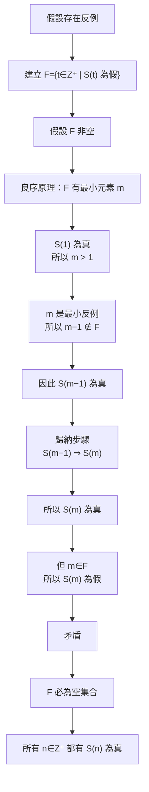

最值得記的一句不是整篇證明，而是：

\[
\boxed{\text{假設有反例}\rightarrow\text{抓最小反例}\rightarrow\text{用前一個推出它其實不是反例}}
\]

這就是整個 proof 的靈魂。

---

### 7. 為什麼偏偏要 Well-Ordering Principle？

因為我們需要「**最小反例 \(m\)**」。

如果你沒有辦法保證反例集合有最小元素，你就沒有辦法合法地談：

\[
m-1
\]

以及

\[
S(m-1).
\]

所以良序原理不是漂亮的裝飾，而是讓「最小反例法」成立的地基。

這也是為什麼老師最後再次提醒：這段不能隨便講成「任何數字都成立」，這裡是在 \(\mathbb Z^+\) 的架構下做證明。逐字稿_03

一個快速反例：正有理數集合

\[
\left\{1,\frac12,\frac13,\frac14,\ldots\right\}
\]

就沒有最小元素，所以你不能直接把這套 `Well-Ordering Principle` 原封不動搬去所有正有理數。

---

### 8. 這裡最容易錯的三件事

第一個錯法是把 induction step 寫成：

\[
S(k+1)\text{ is true}
\]

卻沒有假設 \(S(k)\) true。真正條件是：

\[
\boxed{S(k)\Rightarrow S(k+1)}.
\]

第二個錯法是看到 \(m\) 是最小反例，就直接說 \(S(m-1)\) true，卻沒有交代為什麼。完整邏輯是：

\[
m\text{ 最小}
\Rightarrow m-1\notin F
\Rightarrow S(m-1)\text{ true}.
\]

第三個錯法是把矛盾寫成「沒有最小元素」。更精準、更適合考試寫法是：

\[
m\in F\Rightarrow S(m)\text{ false},
\]

但 induction step 又推出

\[
S(m)\text{ true},
\]

因此矛盾。

這個寫法會比口頭敘述更乾淨。

---

### 9. 本堂後續先不要跳

這個自然邊界在老師完成 induction 成立性的反證、再次限制正整數範圍後收束；後面才轉向一般歸納法例子，再進 `Theorem 4.2`。逐字稿_03

另外我已找到一題直接相關的歷屆 `108 Quiz1 Problem 12`，要求用 mathematical induction 做 divisibility proof；它屬於之後值得做的 proof 型校準題。不過目前只找到整理版索引，還沒有重新打開原始考卷核對，所以這輪不會把它冒充正式原題。考古題_所有小考_v0.0.3

### 10. Practice Tasks（練習任務）

#### 10.1 Task 1 — Concept Classification

**Instruction:** Determine whether the Well-Ordering Principle guarantees a smallest element for each set. Briefly explain why.

\[
A=\{5,9,13,17,\ldots\}\subseteq\mathbb Z^+
\]

\[
B=\left\{1,\frac12,\frac13,\frac14,\ldots\right\}
\]

回答格式可寫：

`A: Yes/No, because ...`  
`B: Yes/No, because ...`


#### 10.2 Task 2 — Complete the Least-Counterexample Proof

**Instruction:** Fill in the five blanks.

Let

\[
F=\{t\in\mathbb Z^+\mid S(t)\text{ is false}\}.
\]

Assume \(F\neq\varnothing\), and let \(m\) be its smallest element.

1. Since \(S(1)\) is true, \(m\ \_\_\_\ 1\).
2. Since \(m\) is the smallest element of \(F\), \(m-1\ \_\_\_\ F\).
3. Therefore, \(S(m-1)\) is \(\_\_\_\).
4. By the induction step, \(S(m)\) is \(\_\_\_\).
5. But because \(m\in F\), \(S(m)\) is \(\_\_\_\).


#### 10.3 Task 3 — Explain the Core Logic

**Instruction:** In 2–5 sentences, explain why the existence of a “smallest counterexample” leads to a contradiction in the proof of mathematical induction.

你可以直接用中文回答，公式也可以直接打 LaTeX


A 是，因為全部都是正整數。B 不是，因為裡面有小數。

1. !=
2. 不屬於
3. true
4. true
5. false

因為 s(m) 是false， s(m-1) 就是 true，但是根據 mathematical induction，s(m-1) = true->s(m) = true，s(m) = true矛盾s(m) 是false，所以不可能有"s(m) 是false"，所以不會有任何一個m，所以f是空集合。

```text
Phase A — Internal Control Surface（控制面輸出） | TURN=第 1 次對話 | PROMPT=1.16.1 | REFRESH=Manual Prompt Refresh APPLIED（學習進度保留） | REFRESH_REMINDER=NONE | STATE={MainlineMode=Transcript; MainlineSource=逐字稿_03.txt; Locator=Session=03／L5–L159已完成→L171–L191; KP=Well-Ordering Principle→Mathematical Induction已通過，下一知識點=Theorem 4.2之另一種Mathematical Induction形式; Boundary=上一KP VERIFIED／新KP暫定L171–L191; Transcript={File=逐字稿_03.txt; Session=03; SessionSource=FilenamePrefix; WithinSessionOrder=NA; Span=L171–L191; Coverage=FULL; TeachingState=TAUGHT_CORE; Signals=TeacherExplanation+TeacherEmphasis; Scope=另一種induction形式; Correction=NONE; ASR=公式措辭以逐字稿脈絡重構; Residual=下一段L193起轉Example4.14}; Reference={Aligned=目前以逐字稿精確脈絡為主; PrecisionStatus=PARTIAL}; Practice={LearningObjective=理解多個base cases及假設S(n0)…S(k)的歸納形式; Modality=ConceptClassification+Reasoning; ExpectedArtifact=文字／公式; AcceptedSubmission=中英文皆可; RequiredModality=NO; TaskOrigin=Generated; SourceReopened=NA; SourceIdentity=NA; ContentFidelity=GENERATED; SourceMatch=NA; AssessmentFidelity=Learning; SubmissionStatus=NOT_SUBMITTED}; AdjQueue=Theorem4.2→Example4.14→4.1習題指定→後續主線; ExerciseDebt=新KP教完後產生; TeachingMainlineDebt=Session03其餘內容待複習; AssessmentRequirementDebt=目前無明確正式要求; ReferenceResolutionDebt=LOW; PastExamDebt=P0 candidate但原題尚未重新核對; Weakness=NONE（前題依使用者要求視同答對，不列錯題）; Coverage=Well-Ordering/Induction proof已通過; Completion=上一KP COMPLETE／新KP IN_PROGRESS; Evidence=前輪作答＋使用者明確要求算對; Blockers=NONE; NextLegal=Theorem4.2} | PLAN={ThisResponse=確認上一題算對並進入Theorem4.2，講完後安排2題Generated Practice; ExpectedDebtChange=建立並輸出新KP Exercise Debt; ExpectedNext=通過後進Example4.14}
```

上一題依你的要求**算對**，不列錯題，也不再要求你重做。現在往老師第三堂下一個實際授課知識點走。

## ⭐Theorem 4.2 — 為什麼數學歸納法有時不能只假設 \(S(k)\)？

主線位置：Teacher Transcript／`逐字稿_03.txt`／Session=03／L171–L191

老師接著介紹另一種 Mathematical Induction（數學歸納法）形式：不是一定從 \(1\) 開始，而且可能先確認一整段起始情況，再用前面多個已成立的 statement 去證明下一個。老師還特別說這件事「很重要」。逐字稿_03

---

### 1. 先回想剛才的普通 induction

剛才學的是：

\[
S(1)=True
\]

以及

\[
S(k)\Rightarrow S(k+1).
\]

重點是：

> 要證 \(S(k+1)\)，只使用前一個 \(S(k)\)。

像：

\[
S(1)\to S(2)\to S(3)\to S(4)\to\cdots
\]

一張骨牌推下一張。

---

### 2. 但有些問題「只知道 \(S(k)\)」不夠

假設某個證明中，要證：

\[
S(k+1)
\]

可是你的計算必須使用：

\[
S(k-2)
\]

甚至可能同時需要：

\[
S(k),\quad S(k-1),\quad S(k-2).
\]

那你如果歸納假設只有：

\[
S(k)=True
\]

就不夠用了。

所以我們改成更強的假設：

\[
\boxed{
S(n_0),S(n_0+1),\ldots,S(k)
\text{ 全部為 True}
}
\]

再用這些已知條件去證：

\[
\boxed{S(k+1)=True}.
\]

這就是老師 Theorem 4.2 在處理的核心。逐字稿_03

---

### 3. 為什麼還會有 \(n_0,n_1\)？

老師這裡不是強迫：

\[
n=1
\]

開始。

可以從某個：

\[
n_0
\]

開始。

例如：

\[
n_0=14.
\]

而且有時你需要先證明好幾個起始 case：

\[
S(n_0),S(n_0+1),\ldots,S(n_1).
\]

例如：

\[
S(14),S(15),S(16)
\]

先全部成立。

之後才啟動 induction。

---

### 4. Theorem 4.2 的結構

你可以先把老師這段整理成：

**Base Cases（基礎情況）：**

\[
\boxed{
S(n_0),S(n_0+1),\ldots,S(n_1)
\text{ 都成立}
}
\]

接著對：

\[
k\ge n_1
\]

做 `Inductive Hypothesis（歸納假設）`：

\[
\boxed{
S(n_0),S(n_0+1),\ldots,S(k)
\text{ 都成立}
}
\]

然後證：

\[
\boxed{S(k+1)\text{ 成立}}
\]

就可以推出：

\[
\boxed{
S(n)\text{ 對所有 }n\ge n_0\text{ 成立}
}
\]

---

### 5. 它跟剛才版本差在哪？

最重要就這張表：

| 普通 induction | 老師 Theorem 4.2 形式 |
|---|---|
| 通常一個起始 case | 可以有多個起始 cases |
| 假設 \(S(k)\) | 假設 \(S(n_0),\ldots,S(k)\) 全部成立 |
| 用 \(S(k)\) 證 \(S(k+1)\) | 可以使用前面任何已成立的 \(S(j)\) 證 \(S(k+1)\) |
| 像一張骨牌推下一張 | 像下一步可以參考前面整排骨牌 |

所以右邊的假設「比較強」。

---

### 6. 為什麼要多個 Base Cases？

假設你的 induction step 要使用：

\[
S(k-2)
\]

那剛開始時就必須確保 \(k-2\) 已經落在你證明過的範圍。

例如起點是：

\[
14
\]

而第一次 induction 使用：

\[
k=16.
\]

這時：

\[
k-2=14.
\]

所以你至少先需要：

\[
S(14),S(15),S(16)
\]

都成立。

這也是老師下一個 Example 4.14 會真正拿來操作的地方：他會利用 \(14,15,16\) 當起始 cases，再往後推。這部分我們下一輪正式進入，不先把例題答案混進來。逐字稿_03

---

### 7. 一句話分辨兩種

普通版本：

\[
\boxed{
S(k)\Rightarrow S(k+1)
}
\]

Theorem 4.2 的核心：

\[
\boxed{
S(n_0),S(n_0+1),\ldots,S(k)
\Rightarrow S(k+1)
}
\]

也就是：

> **普通歸納法：只借前一個。**

> **這個版本：前面已證明的都可以借來用。**

### 8. Practice Tasks（練習任務）

#### 8.1 Task 1 — Classification

**Instruction:** Which induction form is more suitable?

要證明 \(S(k+1)\) 時，推導過程一定需要使用 \(S(k-2)\)。

A. 只假設 \(S(k)\) 為真  
B. 假設 \(S(n_0),S(n_0+1),\ldots,S(k)\) 全部為真

請回答 `A` 或 `B`，再說一句原因。

#### 8.2 Task 2 — Base Cases

**Instruction:** Suppose the induction starts at \(n_0=10\), and the inductive step for \(S(k+1)\) needs \(S(k-2)\). If the first inductive step begins at \(k=12\), which initial statements should be verified first?

請寫成：

\[
S(\_\_),\quad S(\_\_),\quad S(\_\_)
\]


```text
Phase A — Internal Control Surface（控制面輸出） | TURN=第 12 次對話 | PROMPT=1.16.1 | REFRESH=NO（最新訊息主要意圖為作答，附帶Prompt不觸發刷新） | REFRESH_REMINDER=建議手動貼上最新版複習-Prompt 重新刷新規則❗❗❗ | STATE={MainlineMode=Transcript; MainlineSource=逐字稿_03.txt; Locator=Session=03／L171–L189; KP=Theorem4.2較一般化的MathematicalInduction; Boundary=VERIFIED; Transcript={File=逐字稿_03.txt; Session=03; SessionSource=FilenamePrefix; Span=L171–L189; Coverage=FULL; TeachingState=TAUGHT_CORE; Signals=TeacherExplanation+Emphasis; Scope=從n0開始且可使用前面一整段成立敘述; Correction=NONE; ASR=minor; Residual=CHECKED}; Reference={Aligned=Transcript; PrecisionStatus=PARTIAL但足以安全學習}; Practice={LearningObjective=理解一般化歸納法如何從多個base cases向後推進; Modality=MultipleChoice+Explanation; ExpectedArtifact=選項+理由; AcceptedSubmission=中文或英文; RequiredModality=NO; TaskOrigin=Generated; SourceReopened=NA; SourceIdentity=NA; ContentFidelity=GENERATED; SourceMatch=NA; AssessmentFidelity=Learning; SubmissionStatus=GRADABLE}; AdjQueue=Example4.14→4.1指定習題→4.3; ExerciseDebt=CLEARED; TeachingMainlineDebt=Example4.14及後續待複習; AssessmentRequirementDebt=4.1 Exercises 2,6,10,13,21待原題核對; ReferenceResolutionDebt=LOW; PastExamDebt=一般induction有P0候選但原題未核對; Weakness=「k>=7都是true」措辭需精確化但不列錯題; Coverage=Theorem4.2已練習; Completion=THEOREM4.2_COMPLETE; Evidence=使用者選B且核心推進邏輯正確; Blockers=NONE; NextLegal=Example4.14} | PLAN={ThisResponse=先修正使用者理由的精確說法，接著教Example4.14並安排1題練習; ExpectedDebtChange=建立並輸出Example4.14 Exercise Debt; ExpectedNext=通過後處理4.1作業指定與下一主線}
```

#### 1. 批改

✅ **B 正確。**

你的核心理解對，不過這句：

> 「因為 \(k\ge7\) 都是 true」

要稍微修正。

不是說「所有 \(k\ge7\) 一開始就已經知道是 True」，而是：

\[
S(5),S(6),S(7)
\]

先確定為 True，然後利用

\[
S(5),S(6),\ldots,S(k)\Rightarrow S(k+1)
\]

一個一個往後推出：

\[
S(8),S(9),S(10),\ldots
\]

所以最後才得到：

\[
\boxed{S(n)\text{ 對所有 }n\ge5\text{ 都成立}}
\]

你選 B 沒問題，這題通過。

---

## ⭐Example 4.14 — 為什麼需要前面「一整段」都成立？

主線位置：Teacher Transcript／`逐字稿_03.txt`／Session=03／L193–L315

老師接著真的拿 Theorem 4.2 做了一個完整例子：證明**每個 \(n\ge14\) 的整數，都可以寫成若干個 3 和 8 的總和**。逐字稿_03

### 1. 先定義 \(S(n)\)

令：

\[
S(n):
\]

> \(n\) 可以寫成若干個 \(3\) 和 \(8\) 相加。

例如：

\[
14=3+3+8
\]

所以：

\[
S(14)=True.
\]

另外：

\[
15=3+3+3+3+3
\]

所以：

\[
S(15)=True.
\]

以及：

\[
16=8+8
\]

所以：

\[
S(16)=True.
\]

因此一開始有三個 Base Cases（基礎情況）：

\[
\boxed{S(14),S(15),S(16)\text{ 都成立}}
\]

老師就是取：

\[
n_0=14,\qquad n_1=16.
\]

逐字稿_03

---

### 2. 接著假設前面一路到 \(k\) 都成立

假設：

\[
S(14),S(15),S(16),\ldots,S(k)
\]

全部為 True，其中：

\[
k\ge16.
\]

現在我們要證：

\[
S(k+1)=True.
\]

也就是：

> \(k+1\) 也能用 3 和 8 加出來。

---

### 3. 為什麼老師突然看 \(k-2\)？

這是整題最重要的技巧。

因為：

\[
\boxed{k+1=(k-2)+3}
\]

所以如果我們已經知道：

\[
k-2
\]

可以用 3、8 加出來，

那再多加一個 \(3\)，就得到：

\[
k+1.
\]

例如假設：

\[
k=20
\]

那：

\[
k+1=21
\]

而：

\[
k-2=18.
\]

如果 18 已經可以用 3 和 8 表示：

\[
18=3+3+3+3+3+3
\]

那：

\[
21=18+3
\]

自然也可以。

---

### 4. 但我們怎麼知道 \(S(k-2)\) 可以用？

因為：

\[
k\ge16.
\]

所以：

\[
k-2\ge14.
\]

而當然也有：

\[
k-2\le k.
\]

因此：

\[
\boxed{14\le k-2\le k}
\]

而我們的 Induction Hypothesis（歸納假設）不是只有：

\[
S(k)=True
\]

而是整段：

\[
S(14),S(15),\ldots,S(k)
\]

全部都 True。

所以其中自然包含：

\[
\boxed{S(k-2)=True}.
\]

老師正是先指出 \(k-2\) 落在 \(14\) 到 \(k\) 之間，再利用它推出 \(k+1=(k-2)+3\)。逐字稿_03

---

### 5. 最後推出 \(S(k+1)\)

既然：

\[
S(k-2)=True
\]

表示 \(k-2\) 可以由 3、8 相加而成。

又：

\[
k+1=(k-2)+3
\]

因此只要在原本表示式後面再加一個 \(3\)：

\[
\boxed{S(k+1)=True}.
\]

所以從：

\[
S(14),S(15),S(16)
\]

開始，就能一路推出：

\[
S(17),S(18),S(19),\ldots
\]

最後：

\[
\boxed{\forall n\ge14,\quad S(n)=True}
\]

老師就是用這條邏輯收束證明。逐字稿_03

### 6. Practice Tasks（練習任務）

#### 6.1 Task 1

**Instruction:** Why do we need all three base cases \(S(14),S(15),S(16)\), instead of proving only \(S(14)\)?

A. Because the proof of \(S(k+1)\) uses \(S(k-2)\), so the first few cases must already cover 14, 15, and 16.  
B. Because 14, 15, and 16 are all prime numbers.  
C. Because mathematical induction always requires exactly three base cases.  
D. Because \(k+1=k+3\).

直接回答 A/B/C/D，再用一句話說明為什麼。


```text
Phase A — Internal Control Surface（控制面輸出） | TURN=第 13 次對話 | PROMPT=1.16.1 | REFRESH=NO（最新訊息主要意圖為作答，附帶Prompt不觸發刷新） | REFRESH_REMINDER=建議手動貼上最新版複習-Prompt 重新刷新規則❗❗❗ | STATE={MainlineMode=Transcript; MainlineSource=逐字稿_03.txt; Locator=Session=03／L193–L315; KP=Example4.14一般化數學歸納法; Boundary=VERIFIED; Transcript={File=逐字稿_03.txt; Session=03; SessionSource=FilenamePrefix; Span=L193–L315; Coverage=FULL; TeachingState=TAUGHT_CORE; Signals=TeacherExplanation; Scope=n>=14可由3與8之和表示; Correction=NONE; ASR=minor; Residual=CHECKED}; Reference={Aligned=Example4.14教材截圖; PrecisionStatus=HIGH for base cases}; Practice={LearningObjective=理解為何需S(14),S(15),S(16)及S(k-2); Modality=MultipleChoice+Explanation; ExpectedArtifact=選項+理由; AcceptedSubmission=中文或英文; RequiredModality=NO; TaskOrigin=Generated; ContentFidelity=GENERATED; AssessmentFidelity=Learning; SubmissionStatus=GRADABLE}; AdjQueue=4.1作業指定→4.3 Divisibility; ExerciseDebt=CLEARED; TeachingMainlineDebt=4.3及後續待複習; AssessmentRequirementDebt=4.1 Exercises 2,6,10,13,21待原題核對與完成; ReferenceResolutionDebt=LOW; PastExamDebt=induction/divisibility皆有候選但原題未核對; Weakness=NONE; Coverage=Example4.14已練習; Completion=EXAMPLE4.14_COMPLETE; Evidence=使用者選A且正確指出證S(k+1)需已知S(k-2); Blockers=NONE; NextLegal=4.3 Divisibility} | PLAN={ThisResponse=確認答對後進入4.3第一個自然知識點Divisibility定義與符號，安排1題概念練習; ExpectedDebtChange=建立並輸出新KP Exercise Debt; ExpectedNext=通過後進Theorem4.3 divisibility properties}
```

✅ **A 正確，而且理由也正確。**

你已經抓到這題真正的關鍵：

\[
S(k+1)
\]

的證明不是只靠 \(S(k)\)，而是會用到

\[
S(k-2).
\]

而歸納假設已經保證：

\[
S(14),S(15),\ldots,S(k)
\]

全部成立，所以只要證明：

\[
14\le k-2\le k,
\]

我們就能合法使用 \(S(k-2)\)。

再由：

\[
k+1=(k-2)+3
\]

得到 \(S(k+1)\) 成立。老師就是這樣推的。逐字稿_03

還有一個更深的觀察：為什麼剛好需要 \(14,15,16\) 三個 Base Cases（基礎情況）？因為後面每次本質上是「已有一個可表示的數，再加 \(3\)」，所以要先把連續三種情況都啟動起來。

---

老師接著指定了 4.1 的 Exercise 2、6、10、13，以及程式題 21；這些我會保留成 `Assessment Requirement（課程要求）`，之後若正式帶你做，我會先重新核對課本原題與 `課本詳解.pdf`，不會自行改題。接著老師明確跳到 4.3。逐字稿_03

---

## ⭐Divisibility（整除）— \(b\mid a\) 到底代表什麼？

主線位置：Teacher Transcript／`逐字稿_03.txt`／Session=03／L345–L417  
對齊參考：標準 Integer Divisibility（整數整除）定義已交叉核對。

### 1. 老師接下來實際先教的是「整除」

老師雖然先口頭提到 `Division Algorithm（除法演算法）`，但接下來第一件真正展開的事情其實是：

\[
\boxed{b\mid a}
\]

也就是：

> **\(b\) divides \(a\)：\(b\) 整除 \(a\)**

老師接著把它寫成存在某個整數 \(n\)，使：

\[
\boxed{a=bn}
\]

逐字稿_03 逐字稿_03

正式定義也確實如此：\(b\mid a\) 表示存在某個 integer（整數）\(n\)，使 \(a=bn\)。[Mathematics LibreTexts](https://math.libretexts.org/Bookshelves/Combinatorics_and_Discrete_Mathematics/Elementary_Number_Theory_%28Raji%29/01%3A_Introduction/1.03%3A_Divisibility_and_the_Division_Algorithm?utm_source=chatgpt.com)

---

### 2. 例子：\(3\mid12\)

因為可以找到整數：

\[
n=4
\]

使：

\[
12=3\times4.
\]

所以：

\[
\boxed{3\mid12}
\]

是 True。

也可以說：

- 3 is a divisor of 12（3 是 12 的除數）
- 12 is a multiple of 3（12 是 3 的倍數）

---

### 3. 那 \(5\mid12\) 呢？

要問：

> 能不能找到某個 \(n\in\mathbb Z\)，讓

\[
12=5n?
\]

如果硬算：

\[
n=\frac{12}{5}=2.4
\]

但：

\[
2.4\notin\mathbb Z.
\]

所以不存在符合要求的整數 \(n\)。

因此：

\[
\boxed{5\nmid12}
\]

念作：

> 5 does not divide 12（5 不整除 12）。

---

### 4. 特別注意：\(\mid\) 不是除法運算

這個很容易和你之前問的 \(\Rightarrow\) 一樣混淆。

\[
3\mid12
\]

不是在「算一個數值」。

它是一個 proposition（命題），答案只有：

\[
True\quad\text{或}\quad False.
\]

所以：

\[
3\mid12
\]

是 True。

但：

\[
\frac{12}{3}=4
\]

才是在做 division（除法），結果是一個數字。

可以記成：

\[
\boxed{b\mid a\quad\text{是在問：能不能整除？}}
\]

\[
\boxed{\frac ab\quad\text{是在問：除完是多少？}}
\]

離散數學教材也特別提醒不要把 \(a\mid b\) 與 \(a/b\) 混在一起；前者是 True/False 的關係，後者是數值。[Mathematics LibreTexts](https://math.libretexts.org/Bookshelves/Combinatorics_and_Discrete_Mathematics/A_Spiral_Workbook_for_Discrete_Mathematics_%28Kwong%29/05%253A_Basic_Number_Theory/5.03%253A_Divisibility?utm_source=chatgpt.com)

---

### 5. 為什麼一定要求乘數 \(n\) 是整數？

因為如果 \(n\) 可以隨便是實數，那任何非零 \(b\) 幾乎都可以寫：

\[
a=b\left(\frac ab\right).
\]

例如：

\[
12=5(2.4).
\]

那就會變成「5 整除 12」，顯然不是我們要的 `divisibility（整除）`。

所以條件：

\[
\boxed{n\in\mathbb Z}
\]

非常重要。

### 6. Practice Tasks（練習任務）

#### 6.1 Task 1

**Instruction:** Determine whether each statement is True or False, and give the integer witness \(n\) when it is True.

1. \[
4\mid20
\]

2. \[
6\mid20
\]

3. \[
-3\mid12
\]

回答格式例如：

`1. True, n = ...`  
`2. False, because ...`  
`3. True/False, ...`


```text
Phase A — Internal Control Surface（控制面輸出） | TURN=第 14 次對話 | PROMPT=1.16.1 | REFRESH=NO（最新訊息主要意圖為作答，附帶Prompt不觸發刷新） | REFRESH_REMINDER=建議手動貼上最新版複習-Prompt 重新刷新規則❗❗❗ | STATE={MainlineMode=Transcript; MainlineSource=逐字稿_03.txt; Locator=Session=03／L345–L417; KP=Divisibility定義; Boundary=VERIFIED; Transcript={File=逐字稿_03.txt; Session=03; SessionSource=FilenamePrefix; Span=L345–L417; Coverage=FULL; TeachingState=TAUGHT_CORE; Signals=TeacherExplanation; Scope=整數整除b|a↔a=bn; Correction=老師口頭曾立即修正divides方向; ASR=minor; Residual=CHECKED}; Reference={Aligned=整除標準定義; PrecisionStatus=HIGH}; Practice={LearningObjective=判斷整除並給integer witness; Modality=TrueFalse+Witness; ExpectedArtifact=True/False+等式; AcceptedSubmission=中文或英文; RequiredModality=NO; TaskOrigin=Generated; SourceReopened=NA; SourceIdentity=NA; ContentFidelity=GENERATED; SourceMatch=NA; AssessmentFidelity=Learning; SubmissionStatus=GRADABLE}; AdjQueue=Theorem4.3 divisibility properties→休息後續主線; ExerciseDebt=CLEARED; TeachingMainlineDebt=Theorem4.3及後續待複習; AssessmentRequirementDebt=4.1 Exercises 2,6,10,13,21待原題核對; ReferenceResolutionDebt=LOW; PastExamDebt=Divisibility有候選但原題未核對; Weakness=NONE; Coverage=Divisibility定義已練習; Completion=DIVISIBILITY_DEFINITION_COMPLETE; Evidence=三題全部答對且1、3給出合法integer witness; Blockers=NONE; NextLegal=Theorem4.3} | PLAN={ThisResponse=批改後進入Theorem4.3整除性質與linear combination，示範f性質證明並安排2題練習; ExpectedDebtChange=建立並輸出Theorem4.3 Exercise Debt; ExpectedNext=通過後繼續第三堂休息後主線}
```

#### 1. 批改

三題全部 ✅。

| 題目 | 你的答案 | 結果 |
|---|---|---|
| \(4\mid20\) | \(20=4\cdot5\) | ✅ |
| \(6\mid20\) | 不可整除 | ✅ |
| \(-3\mid12\) | \(12=(-3)(-4)\) | ✅ |

第二題如果寫正式證明，可以補成：

\[
20=6n
\]

會得到

\[
n=\frac{10}{3}\notin\mathbb Z,
\]

因此不存在整數 \(n\)，所以

\[
6\nmid20.
\]

你已經掌握 \(a\mid b\) 的定義，可以往下。

---

/// danger | 整除公式規則


## ⭐Theorem 4.3 — 整除有哪些可以直接使用的規則？


| 已知條件 | 可以推出嗎？ |
| --- | --- |
| $g \mid A$ 且 $g \mid B$ | ✅ $g \mid (A - B)$ |
| 只有 $g \mid (A - B)$ | ❌ 不一定有 $g \mid A$ 或 $g \mid B$ |
| $g \mid (A - B)$ 且 $g \mid A$ | ✅ $g \mid B$ |

///

主線位置：Teacher Transcript／`逐字稿_03.txt`／Session=03／L419–L457

老師接著一次列出多個 `Divisibility Properties（整除性質）`，而且明確說這些性質之後會「直接拿來使用」。後面特別進入 `linear combination（線性組合）`。逐字稿_03

### 1. \(1\) 整除任何整數

\[
\boxed{1\mid a}
\]

因為：

\[
a=1\cdot a
\]

而 \(a\in\mathbb Z\)。

例如：

\[
1\mid37
\]

因為：

\[
37=1(37).
\]

---

### 2. 非零整數都可以整除 \(0\)

\[
\boxed{a\mid0}
\]

因為：

\[
0=a\cdot0.
\]

例如：

\[
7\mid0
\]

因為：

\[
0=7(0).
\]

這一點剛開始很反直覺：

> 「7 怎麼會整除 0？」

但記得 \(\mid\) 的定義不是問商是不是正數，而是在問：

\[
\exists n\in\mathbb Z,\quad 0=7n?
\]

有：

\[
n=0.
\]

所以成立。

---

### 3. 互相整除時，只可能差一個正負號

如果：

\[
a\mid b
\]

而且：

\[
b\mid a,
\]

那麼：

\[
\boxed{a=\pm b}.
\]

老師也直接列出這個性質。逐字稿_03

例如：

\[
3\mid -3
\]

以及：

\[
-3\mid3,
\]

所以：

\[
3=-(-3).
\]

---

### 4. 整除具有 Transitivity（傳遞性）

如果：

\[
a\mid b
\]

以及

\[
b\mid c,
\]

那：

\[
\boxed{a\mid c}.
\]

例如：

\[
2\mid6
\]

且：

\[
6\mid24
\]

所以：

\[
2\mid24.
\]

為什麼？

因為：

\[
b=ax,\qquad c=by
\]

其中 \(x,y\in\mathbb Z\)。

代入：

\[
c=(ax)y=a(xy).
\]

而：

\[
xy\in\mathbb Z,
\]

因此：

\[
a\mid c.
\]

---

### 5. 如果 \(a\mid b\)，那 \(b\) 的任何整數倍也能被 \(a\) 整除

\[
a\mid b
\]

則對所有：

\[
x\in\mathbb Z
\]

都有：

\[
\boxed{a\mid bx}.
\]

例如：

\[
3\mid12.
\]

因此：

\[
3\mid(12\cdot100)
\]

也成立。

甚至：

\[
3\mid(12\cdot(-5))
\]

也成立。

---

### 6. Linear Combination（線性組合）是這段最重要的規則

老師接著說：

如果：

\[
a\mid b
\]

以及：

\[
a\mid c,
\]

那對任意整數：

\[
x,y\in\mathbb Z
\]

都有：

\[
\boxed{a\mid(bx+cy)}.
\]

其中：

\[
bx+cy
\]

就叫做 \(b,c\) 的 `linear combination（線性組合）`。逐字稿_03

---

### 7. 為什麼一定成立？

從：

\[
a\mid b
\]

可寫：

\[
b=ar.
\]

從：

\[
a\mid c
\]

可寫：

\[
c=as.
\]

其中：

\[
r,s\in\mathbb Z.
\]

現在：

\[
bx+cy
\]

代入：

\[
=(ar)x+(as)y
\]

整理：

\[
=a(rx+sy).
\]

因為：

\[
r,x,s,y\in\mathbb Z
\]

所以：

\[
rx+sy\in\mathbb Z.
\]

因此符合整除定義：

\[
\boxed{a\mid(bx+cy)}.
\]

這也是老師說教材下面特別有證明的那個性質。逐字稿_03

---

### 8. 實際例子

已知：

\[
6\mid30
\]

以及：

\[
6\mid42.
\]

那我可以亂選兩個整數，例如：

\[
x=5,\qquad y=-3.
\]

因此：

\[
6\mid(30\cdot5+42\cdot(-3)).
\]

算裡面：

\[
150-126=24.
\]

所以：

\[
6\mid24.
\]

重點不是 24 本身，而是：


///danger|Linear Combination（線性組合）

> **只要 \(a\) 同時整除幾個數，它也會整除那些數的整數線性組合。**

///

老師還把這個概念推廣到多個 \(c_i\)：如果 \(a\) 整除每個 \(c_i\)，那也整除它們的整數 linear combination。逐字稿_03

### 9. Practice Tasks（練習任務）

#### 9.1 Task 1

**Instruction:** Given

\[
4\mid12,\qquad4\mid20,
\]

determine whether the following must be true:

\[
4\mid(3\cdot12-2\cdot20).
\]

先算右邊，再回答 True / False。

#### 9.2 Task 2

**Instruction:** If

\[
a\mid b,\qquad a\mid c,
\]

which statement is guaranteed to be true for every \(x,y\in\mathbb Z\)?

A. \(\;b\mid ax+cy\)

B. \(\;a\mid bx+cy\)

C. \(\;a=bx+cy\)

D. \(\;b=c\)

直接回答第 1 題的計算＋T/F，以及第 2 題 A/B/C/D。


```text
Phase A — Internal Control Surface（控制面輸出） | TURN=第 15 次對話 | PROMPT=1.16.1 | REFRESH=NO（最新訊息主要意圖為作答，附帶Prompt不觸發刷新） | REFRESH_REMINDER=建議手動貼上最新版複習-Prompt 重新刷新規則❗❗❗ | STATE={MainlineMode=Transcript; MainlineSource=逐字稿_03.txt; Locator=Session=03／L419–L457; KP=Theorem4.3整除性質與LinearCombination; Boundary=VERIFIED; Transcript={File=逐字稿_03.txt; Session=03; SessionSource=FilenamePrefix; Span=L419–L457; Coverage=FULL; TeachingState=TAUGHT_CORE; Signals=TeacherExplanation; Scope=DivisibilityProperties+LinearCombination; Correction=NONE; ASR=minor; Residual=CHECKED}; Reference={Aligned=Transcript; PrecisionStatus=HIGH}; Practice={LearningObjective=能用整除性質判斷linear combination; Modality=Calculation+MultipleChoice; ExpectedArtifact=計算+選項; AcceptedSubmission=中文或英文; RequiredModality=NO; TaskOrigin=Generated; SourceReopened=NA; SourceIdentity=NA; ContentFidelity=GENERATED; SourceMatch=NA; AssessmentFidelity=Learning; SubmissionStatus=GRADABLE}; AdjQueue=17整除應用例題→Prime Lemma4.1→Theorem4.4; ExerciseDebt=CLEARED; TeachingMainlineDebt=Session03後續待複習; AssessmentRequirementDebt=4.1 Exercises 2,6,10,13,21待原題核對; ReferenceResolutionDebt=LOW; PastExamDebt=Divisibility有候選但原題未核對; Weakness=NONE; Coverage=Theorem4.3核心性質已練習; Completion=THEOREM4.3_CORE_COMPLETE; Evidence=使用者正確算出4|(36−40)=4|(−4)且正確選B; Blockers=NONE; NextLegal=17整除應用例題} | PLAN={ThisResponse=批改後進入老師的17整除應用例題，教如何湊出目標linear combination並安排1題proof練習; ExpectedDebtChange=建立並輸出應用例題Exercise Debt; ExpectedNext=通過後進Prime Lemma4.1}
```

#### 1. 批改

兩題都 ✅。

第一題：

\[
4\mid(36-40)
\]

\[
4\mid-4
\]

而且：

\[
-4=4(-1)
\]

其中 \(-1\in\mathbb Z\)，所以完全符合 divisibility（整除）的定義。

第二題：

\[
\boxed{B}
\]

也正確：

\[
a\mid b,\quad a\mid c
\Rightarrow
a\mid(bx+cy).
\]

這段可以過。

---

## ⭐利用 Linear Combination（線性組合）「湊」出想證明的式子

主線位置：Teacher Transcript／`逐字稿_03.txt`／Session=03／L510–L514

老師下一個例子開始變成真正的「解題技巧」。

已知：

\[
\boxed{17\mid(2a+3b)}
\]

其中：

\[
a,b\in\mathbb Z.
\]

要證明：

\[
\boxed{17\mid(9a+5b)}.
\]

老師說這題的核心就是：

> 想辦法把已知的 \(2a+3b\) 組合成 \(9a+5b\)。

而老師實際選的方法是先乘 \(-4\)，再和一個明顯可被 17 整除的式子相加。逐字稿_03

### 1. 已知的東西先乘 \(-4\)

因為：

\[
17\mid(2a+3b),
\]

所以它的任何整數倍仍然可以被 17 整除：

\[
17\mid-4(2a+3b).
\]

展開：

\[
-4(2a+3b)=-8a-12b.
\]

因此：

\[
\boxed{17\mid(-8a-12b)}.
\]

---

### 2. 再造一個「一定是 17 倍數」的式子

因為：

\[
17a+17b=17(a+b),
\]

而：

\[
a+b\in\mathbb Z,
\]

所以：

\[
\boxed{17\mid(17a+17b)}.
\]

---

### 3. 把兩個可以被 17 整除的式子加起來

現在：

\[
(-8a-12b)+(17a+17b)
\]

整理：

\[
=(-8+17)a+(-12+17)b
\]

\[
=9a+5b.
\]

所以：

\[
17\mid(-8a-12b)
\]

以及：

\[
17\mid(17a+17b)
\]

可以推出：

\[
\boxed{17\mid(9a+5b)}.
\]

---

### 4. 真正要學的是這個 Mental Model（心智模型）

你看到：

\[
17\mid(2a+3b)
\]

然後題目要你證：

\[
17\mid(9a+5b),
\]

不要想成：

> 「我要直接算 \(a,b\) 是多少。」

其實 \(a,b\) 根本沒有固定值。

你要想的是：

\[
\boxed{\text{怎麼把已知式子的整數倍，和17的倍數組合成目標式？}}
\]

這題就是：

\[
\boxed{
9a+5b
=
-4(2a+3b)+(17a+17b)
}
\]

右邊第一塊可被 17 整除，第二塊也可被 17 整除，所以整個目標式也可被 17 整除。

這就是老師說的「要去做一些嘗試」，不是憑空看出答案。逐字稿_03

### 5. Practice Tasks（練習任務）

#### 5.1 Task 1

**Instruction:** Let \(a,b\in\mathbb Z\). Suppose

\[
13\mid(2a+5b).
\]

Prove that

\[
13\mid(9a+3b)
\]

using the same `linear combination（線性組合）` technique.

提示只給方向：

\[
9a+3b
=
\text{某個整數}\cdot(2a+5b)
+
\text{一個明顯是13倍數的式子}.
\]

請寫出那個組合式，再下結論。


///danger|linear combination（線性組合）延伸

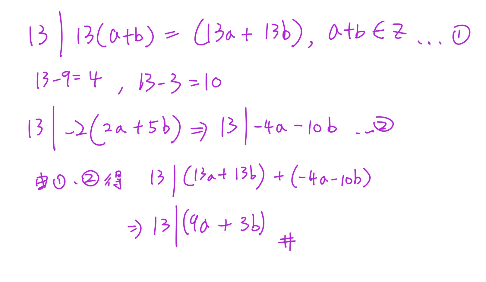

///

```text id="g4f9k2"
Phase A — Internal Control Surface（控制面輸出） | TURN=第 16 次對話 | PROMPT=1.16.1 | REFRESH=NO（最新訊息主要意圖為提交手寫作答並詢問是否正確，附帶Prompt不觸發刷新） | REFRESH_REMINDER=建議手動貼上最新版複習-Prompt 重新刷新規則❗❗❗ | STATE={MainlineMode=Transcript; MainlineSource=逐字稿_03.txt; Locator=Session=03／L510–L514; KP=17整除LinearCombination應用; Boundary=VERIFIED; Transcript={File=逐字稿_03.txt; Session=03; SessionSource=FilenamePrefix; Span=L510–L514; Coverage=FULL; TeachingState=TAUGHT_CORE; Signals=TeacherExplanation+解題技巧; Scope=利用已知整除式的整數倍加上17倍數湊出目標; Correction=NONE; ASR=minor; Residual=CHECKED}; Reference={Aligned=Transcript; PrecisionStatus=HIGH}; Practice={LearningObjective=能自行構造linear combination證明整除; Modality=HandwrittenProof; ExpectedArtifact=組合式+整除推論; AcceptedSubmission=手寫圖片; RequiredModality=NO; TaskOrigin=Generated; SourceReopened=NA; SourceIdentity=NA; ContentFidelity=GENERATED; SourceMatch=NA; AssessmentFidelity=Learning; SubmissionStatus=GRADABLE}; AdjQueue=Lemma4.1 prime divisor→Theorem4.4 infinitely many primes→DivisionAlgorithm; ExerciseDebt=待本輪批改; TeachingMainlineDebt=Session03後續待複習; AssessmentRequirementDebt=4.1與後續指定習題待原題核對; ReferenceResolutionDebt=LOW; PastExamDebt=UNKNOWN/原題未核對; Weakness=NONE; Coverage=17整除應用已教待批改; Completion=IN_PROGRESS; Evidence=使用者已提交可讀手寫證明; Blockers=NONE; NextLegal=批改後若通過則Lemma4.1} | PLAN={ThisResponse=批改手寫證明；若通過則進入Lemma4.1最小反例證明並安排1題練習; ExpectedDebtChange=清償目前Exercise Debt並建立下一KP Exercise Debt; ExpectedNext=通過Lemma4.1後進Theorem4.4}
```

#### 1. 批改：對，這樣是正確的

✅ 你的整個證明邏輯成立，而且你用的就是老師這段教的 `linear combination（線性組合）` 技巧。老師原本的例子也是「把已知可整除的式子乘某個整數，再加上一個明顯是 17 倍數的式子，剛好湊出目標」。逐字稿_03

你的三步可以整理成：

| 你的步驟 | 判定 |
|---|---|
| \(13\mid(13a+13b)\) | ✅ 因為 \(13a+13b=13(a+b)\)，且 \(a+b\in\mathbb Z\) |
| \(13\mid-2(2a+5b)=(-4a-10b)\) | ✅ 已知 \(13\mid(2a+5b)\)，乘整數 \(-2\) 仍可整除 |
| 把兩式相加得到 \(13\mid(9a+3b)\) | ✅ 正確 |

因為：

\[
(13a+13b)+(-4a-10b)=9a+3b.
\]

所以：

\[
\boxed{13\mid(9a+3b)}
\]

證完。

你中間寫：

\[
13-9=4,\qquad13-3=10
\]

這也很有用。這是在**找怎麼湊**：

\[
4a+10b=2(2a+5b),
\]

因此反過來就想到：

\[
9a+3b=(13a+13b)-2(2a+5b).
\]

這其實就是這類題的解題技巧。

如果是考試正式寫，我只會建議你把第一行再補一句：

\[
13a+13b=13(a+b),\quad a+b\in\mathbb Z.
\]

這樣會更完整。

---

## ⭐Lemma 4.1 — 為什麼每個 Composite Number（合成數）一定有 Prime Divisor（質數因數）？

主線位置：Teacher Transcript／`逐字稿_03.txt`／Session=03／約 L515–L523

老師下一段又把我們前面學過的 `Well-Ordering Principle（良序原理）` 拿回來：假設真的存在「沒有任何質數可以整除的合成數」，就挑其中最小的一個來製造矛盾。逐字稿_03

### 1. 要證明什麼？

Lemma 4.1 的核心是：

\[
\boxed{
n\text{ 是 composite positive integer}
\Rightarrow
\exists\text{ prime }p,\ p\mid n
}
\]

例如：

\[
12
\]

是 composite（合成數），確實有：

\[
2\mid12,\qquad3\mid12.
\]

---

### 2. 老師又用「最小反例」

假設這個敘述是錯的。

建立集合：

\[
S=
\{\text{沒有任何 prime divisor 的 composite positive integers}\}.
\]

假設：

\[
S\neq\varnothing.
\]

由 Well-Ordering Principle（良序原理），\(S\) 有最小元素：

\[
m=\min S.
\]

這個套路是不是很眼熟？

之前證 Mathematical Induction（數學歸納法）也是：

\[
\boxed{\text{假設有反例}\rightarrow\text{挑最小反例}\rightarrow\text{製造更小的問題}}
\]

老師這裡明確再次用良序原理挑出最小的 \(m\)。逐字稿_03

### 3. 因為 \(m\) 是合成數

所以可以寫成：

\[
m=m_1m_2
\]

其中：

\[
1<m_1<m.
\]

現在關鍵來了：

\[
m_1<m
\]

而 \(m\) 是 \(S\) 裡最小的元素。

所以：

\[
m_1\notin S.
\]

因此 \(m_1\) 不可能是「完全沒有 prime divisor 的合成數」。

於是一定存在某個質數 \(p\)，使：

\[
p\mid m_1.
\]

如果 \(m_1\) 本身就是 prime，那直接取 \(p=m_1\) 即可。

---

### 4. 然後矛盾出現

因為：

\[
m=m_1m_2.
\]

又有：

\[
p\mid m_1.
\]

依我們剛學的 Theorem 4.3：

> 如果 \(p\) 整除一個數，也整除這個數的任何整數倍。


/// danger|每個 Composite Number（合成數）一定有 Prime Divisor（質數因數）

所以：

\[
p\mid m_1m_2.
\]

也就是：

\[
\boxed{p\mid m}.
\]

可是 \(m\in S\) 的定義明明就是：

> \(m\) 沒有任何 prime divisor。


現在卻找到：

\[
p\mid m.
\]

矛盾。

所以最開始：

\[
S\neq\varnothing
\]


一定是錯的。

因此：

\[
\boxed{S=\varnothing}
\]

也就是每個 composite positive integer 都一定有 prime divisor。老師正是用這條最小反例鏈完成證明。逐字稿_03

///

### 5. Practice Tasks（練習任務）

#### 5.1 Task 1

**Instruction:** In the proof above, \(m\) is the smallest composite integer with no prime divisor, and

\[
m=m_1m_2,\qquad 1<m_1<m.
\]

Why can we conclude that \(m_1\notin S\), and how does this eventually contradict \(m\in S\)?

用中文回答 2～3 句即可。


```text
Phase A — Internal Control Surface（控制面輸出） | TURN=第 19 次對話 | PROMPT=1.16.1 | REFRESH=NO（最新訊息主要意圖為繼續複習，附帶Prompt不重置進度） | REFRESH_REMINDER=建議手動貼上最新版複習-Prompt 重新刷新規則❗❗❗ | STATE={MainlineMode=Transcript; MainlineSource=逐字稿_03.txt; Locator=Session=03／Lemma4.1結束; KP=每個composite integer都有prime divisor; Boundary=VERIFIED; Transcript={File=逐字稿_03.txt; Session=03; SessionSource=FilenamePrefix; Span=L514–L516; Coverage=FULL; TeachingState=TAUGHT_CORE; Signals=TeacherExplanation; Scope=Well-Ordering最小反例證明; Correction=NONE; ASR=minor; Residual=CHECKED}; Reference={Aligned=NA; PrecisionStatus=HIGH}; Practice={LearningObjective=least counterexample→prime divisor→contradiction; Modality=ShortProofExplanation; ExpectedArtifact=完整邏輯鏈; AcceptedSubmission=文字; RequiredModality=NO; TaskOrigin=Generated; SourceReopened=NA; SourceIdentity=NA; ContentFidelity=GENERATED; SourceMatch=NA; AssessmentFidelity=Learning; SubmissionStatus=GRADABLE}; AdjQueue=Theorem4.4／Infinitely many primes; ExerciseDebt=CLEARED; TeachingMainlineDebt=Theorem4.4及後續; AssessmentRequirementDebt=Theorem4.4有EXAM_SIGNAL; ReferenceResolutionDebt=NONE; PastExamDebt=UNKNOWN; Weakness=需持續注意集合定義與最小反例的中間推論; Coverage=Lemma4.1已達最低標準; Completion=Lemma4.1_COMPLETE; Evidence=使用者能正確寫出m最小→m1不在S→prime divisor→m矛盾; Blockers=NONE; NextLegal=Theorem4.4} | PLAN={ThisResponse=教Theorem4.4質數無窮多＋反證法並安排練習; ExpectedDebtChange=產生並清償Theorem4.4 ExerciseDebt; ExpectedNext=Division Algorithm}
```

## ⭐Theorem 4.4 — 為什麼 Prime(質數)一定有無窮多個？
主線位置：Teacher Transcript／`逐字稿_03.txt`／Session=03／L517–L519

老師這裡特別說這題「蠻常考」，主要是在考你能不能掌握 `Proof by contradiction(反證法)` 的邏輯。逐字稿_03

### 1. 這題到底要證明什麼？

目標：

\[
\text{There are infinitely many primes.}
\]

也就是：

\[
\boxed{\text{質數不可能只有有限個}}
\]

這種「無窮多個」很難直接一個一個證明，所以老師採用：

\[
\boxed{\text{Proof by contradiction(反證法)}}
\]

先假裝相反的事情是真的。

---

### 2. 第一步：假設質數只有有限個

假設所有質數全部都已經被列完：

\[
p_1,p_2,\ldots,p_k
\]

其中 \(p_k\) 是最後一個。

也就是我們假設：

\[
\boxed{\text{世界上沒有其他質數了}}
\]

這就是等等要推翻的假設。老師上課也是從「假設質數有限個」開始。逐字稿_03

---

### 3. 第二步：故意造出一個奇怪的數

定義

\[
B=p_1p_2\cdots p_k+1
\]

為什麼偏偏要「全部乘起來再 \(+1\)」？

因為任何清單裡的質數 \(p_i\) 都可以整除乘積

\[
p_1p_2\cdots p_k.
\]

所以：

\[
p_i\mid p_1p_2\cdots p_k.
\]

但是 \(B\) 比那個乘積多了 \(1\)。

因此拿 \(B\) 去除以任何 \(p_i\)，都會餘 \(1\)：

\[
B\equiv1\pmod{p_i}.
\]

所以：

\[
\boxed{p_i\nmid B\quad\text{for every }i=1,\ldots,k}
\]

這一步是整題的靈魂。

---

### 4. 用小例子看懂「為什麼要 +1」

假設我們亂假設世界上只有：

\[
2,3,5
\]

這三個質數。

那我們造：

\[
B=2\cdot3\cdot5+1=31.
\]

你拿 31 去除：

\[
31\div2\text{ 餘 }1
\]

\[
31\div3\text{ 餘 }1
\]

\[
31\div5\text{ 餘 }1.
\]

所以清單裡的質數沒有任何一個能整除 \(31\)。

關鍵不是「31剛好是質數」，而是：

\[
\boxed{\text{舊清單裡的所有質數都不可能整除 }B}
\]

---

### 5. 接 Lemma 4.1：矛盾出現了

現在 \(B>1\)。

如果 \(B\) 是 `composite(合數)`，我們剛剛的 Lemma 4.1 已經證明：

\[
\boxed{\text{每個合數一定有 prime divisor(質因數)}}
\]

所以一定存在某個質數 \(p_j\)，使得

\[
p_j\mid B.
\]

可是我們一開始假設**所有質數**就是

\[
p_1,\ldots,p_k.
\]

所以這個 \(p_j\) 一定也在清單裡。

同時：

\[
p_j\mid p_1p_2\cdots p_k.
\]

又有：

\[
p_j\mid B.
\]

所以根據整除的減法性質：

\[
p_j\mid
\left(B-p_1p_2\cdots p_k\right).
\]

可是：

\[
B-p_1p_2\cdots p_k=1.
\]

因此：

\[
p_j\mid1.
\]

但 \(p_j\) 是質數，因此 \(p_j\ge2\)，不可能整除 \(1\)。

所以：

\[
\boxed{\text{Contradiction(矛盾)}}
\]

這正是老師上課走的核心證明鏈。逐字稿_03

---

### 6. 所以真正被推翻的是什麼？

我們不是得到：

> 「數學壞掉了。」

而是代表**最一開始的假設錯了**：

\[
\text{「質數只有有限個」}
\]

是錯的。

所以：

\[
\boxed{\text{There are infinitely many primes.}}
\]

---

### 7. 一個非常容易寫錯的地方

不要背成：

\[
p_1p_2\cdots p_k+1
\]

**永遠一定是質數。**

這是錯的。

老師自己也特別提醒：「全部質數乘起來加一就一定是質數」這種說法**不一定成立**。逐字稿_03

真正正確的是：

\[
\boxed{\text{它不會被原本清單中的任何質數整除}}
\]

因此如果你宣稱那張清單已經包含「所有質數」，一定會發生矛盾。

這才是證明的核心。

---

### 8. 考試最短骨架

你可以記：

///danger|證明質數無限個

\[
\begin{aligned}
&\text{Assume primes are }p_1,\ldots,p_k.\\
&B=p_1p_2\cdots p_k+1.\\
&\text{By Lemma 4.1, some prime }p_j\mid B.\\
&p_j\mid p_1p_2\cdots p_k.\\
&\therefore p_j\mid(B-p_1\cdots p_k)=1,
\end{aligned}
\]

contradiction.

所以質數有無窮多個。

///

### 9. Practice Tasks(練習任務)

#### 9.1 Task 1

**Why is the following statement NOT the key conclusion of the proof?**

\[
p_1p_2\cdots p_k+1\text{ is always prime.}
\]

請用中文說明「真正需要證明的是什麼」。

#### 9.2 Task 2

**Complete the contradiction in 3–5 lines.**

Assume all primes are

\[
p_1,p_2,\ldots,p_k
\]

and let

\[
B=p_1p_2\cdots p_k+1.
\]

Suppose a prime \(p_j\) from the list divides \(B\). Explain why this leads to a contradiction.

直接回 `1. ...`、`2. ...` 即可。

```text
Phase A — Internal Control Surface（控制面輸出） | TURN=第 ? 次對話 | PROMPT=1.17.0 | REFRESH=NO | REFRESH_REMINDER=NONE | STATE={MainlineMode=Transcript; MainlineSource=逐字稿_03.txt; Locator=Session=03／L524–L526; KP=The Division Algorithm（除法演算法）; Boundary=已核對，L528切換至GCD; Transcript={File=逐字稿_03.txt; Session=03; SessionSource=FilenamePrefix; WithinSessionOrder=NA; Span=L524–L526; Coverage=FULL_FOR_KP; TeachingState=TAUGHT_BRIEF; Signals=Explanation+Homework/Exam; Scope=定理敘述與existence/uniqueness概念，課堂此處未重新證明; Correction=NONE; ASR=低風險; Residual=已核對至GCD切換}; Reference={Aligned=課本詳解.pdf目前未定位到此定理的直接詳解頁；後續課本例證可見division algorithm被用於GCD proof; PrecisionStatus=PARTIAL}; QuickSheet={Status=PENDING; Type=Formula+ProcedureSkeleton; SourceScope=VERIFIED_ONLY}; Practice={LearningObjective=能正確寫出a=qb+r並遵守0≤r<b及理解唯一性; Modality=Calculation+Explanation; ExpectedArtifact=q,r與理由; AcceptedSubmission=文字／公式／手寫圖片; RequiredModality=NO; TaskOrigin=Generated; SourceReopened=NA; SourceIdentity=NA; ContentFidelity=GENERATED; SourceMatch=NA; AssessmentFidelity=Learning; SubmissionStatus=NOT_SUBMITTED}; AdjQueue=Common Divisor→GCD→Theorem4.6; ExerciseDebt=本輪產生; TeachingMainlineDebt=後續GCD主線; AssessmentRequirementDebt=習題訊號存在; ReferenceResolutionDebt=無高優先; PastExamDebt=UNKNOWN; Weakness=NONE_CURRENT; Coverage=開始新KP; Completion=IN_PROGRESS; Evidence=逐字稿L524–L528; Blockers=NONE; NextLegal=完成本輪練習後進Common Divisor/GCD} | PLAN={ThisResponse=教Division Algorithm的公式、限制、existence/uniqueness與最小例子，輸出Quick Sheet及2題練習; ExpectedDebtChange=ExerciseDebt待使用者作答; ExpectedNext=Common Divisor與GCD}
```

## ⭐The Division Algorithm（除法演算法）—「除不盡」到底能不能永遠寫成固定形式？

主線位置：Teacher Transcript／`逐字稿_03.txt`／Session=03／L524–L526  
對齊參考：老師這裡明確說明公式與 `existence（存在性）`、`uniqueness（唯一性）`；這堂此處沒有重新展開完整證明，而是說之後可以直接使用。逐字稿_03

---

### 1. 先抓最核心公式

只要

\[
a,b\in\mathbb Z,\qquad b>0
\]

就存在唯一的整數 \(q,r\)，使得

\[
\boxed{a=qb+r}
\]

而且

\[
\boxed{0\le r<b}
\]

其中：

| 符號 | 意思 |
|---|---|
| \(a\) | dividend（被除數） |
| \(b\) | divisor（除數） |
| \(q\) | quotient（商） |
| \(r\) | remainder（餘數） |

老師這段真正強調的是：**商 \(q\) 跟餘數 \(r\) 不只是找得到，而且是唯一的一組。** 逐字稿_03

---

### 2. 其實就是你從小學就在做的事情

例如：

\[
17\div5=3\text{ 餘 }2
\]

在這堂課要寫成：

\[
\boxed{17=3(5)+2}
\]

所以

\[
a=17,\quad b=5,\quad q=3,\quad r=2
\]

檢查餘數：

\[
0\le2<5
\]

成立。

所以這就是合法的 Division Algorithm 表示法。

---

### 3. 為什麼一定要有 \(0\le r<b\)？

這個限制非常重要，因為沒有它的話，同一個數字可以亂寫很多種：

\[
17=3(5)+2
\]

但其實也可以寫：

\[
17=2(5)+7
\]

或

\[
17=4(5)-3
\]

三個式子代數上都對。

可是後兩個不符合

\[
0\le r<5.
\]

所以只有

\[
\boxed{17=3(5)+2}
\]

是 Division Algorithm 要的那一組。

也就是：

\[
\boxed{0\le r<b}
\]

這個條件把答案「鎖死」，讓 \(q,r\) 成為唯一。

---

### 4. 負數才是這個公式最容易搞錯的地方

例如：

\[
a=-17,\qquad b=5
\]

很多人第一眼會寫：

\[
-17=(-3)(5)-2
\]

代數確實成立，但

\[
r=-2<0
\]

所以 **不符合 Division Algorithm**。

我們要重新調整：

\[
\boxed{-17=(-4)(5)+3}
\]

此時

\[
q=-4,\qquad r=3
\]

而且

\[
0\le3<5.
\]

這才是合法答案。

核心觀念是：

> remainder（餘數）不是「隨便剩下多少」，它必須落在  
> \[
> \boxed{0,1,2,\ldots,b-1}
> \]
> 之中。

---

### 5. Exist（存在）跟 Unique（唯一）到底差在哪？

老師特別說，這個定理若要證明，要分兩件事情：existence（存在性）跟 uniqueness（唯一性）。逐字稿_03

**Existence（存在性）**是在說：

\[
\boxed{\text{至少找得到一組 }q,r}
\]

讓

\[
a=qb+r,\qquad0\le r<b.
\]

**Uniqueness（唯一性）**是在說：

\[
\boxed{\text{不可能再有第二組不同的 }q,r}
\]

也符合全部條件。

所以不是：

\[
\text{「我找到一組就結束」}
\]

而是更強：

\[
\boxed{\text{一定找得到，而且只有這一組。}}
\]

老師這堂在這裡沒有重新證完整 proof，而是明確說這個 proof 已處理過，現在重點是後面要直接使用。逐字稿_03

---

### 6. 為什麼這東西下一段馬上有用？

因為老師接下來進入 `GCD（最大公因數）`，而後面的 proof 就會出現這種操作：

\[
a=qc+r.
\]

也就是把 \(a\) 除以 \(c\)，製造出一個比 \(c\) 更小的 remainder（餘數） \(r\)，再拿這個 \(r\) 去製造矛盾。

課本的後續 proof 也直接使用：

\[
a=qc+r,\qquad0<r<c
\]

來推進 GCD 的證明。1000004035

所以這一段你現在不用背一大堆證明，先把 **「怎麼合法地拆成 \(qb+r\)」**弄熟，下一部分會立刻用到。

---

### 7. Exam Quick Sheet（考試速記／最短骨架）

///danger|除法表示

**Must Know**

\[
\boxed{a,b\in\mathbb Z,\ b>0}
\]

\[
\boxed{a=qb+r}
\]

\[
\boxed{q,r\in\mathbb Z,\quad0\le r<b}
\]

**一句話：**

\[
\boxed{\text{任意整數 }a\text{ 除以正整數 }b,\text{ 有且只有一組商與餘數。}}
\]

**Common Trap**

\[
\boxed{r\text{ 不能是負數，也不能 }\ge b}
\]

例如：

\[
-17=(-3)(5)-2\quad\text{❌}
\]

\[
-17=(-4)(5)+3\quad\text{✅}
\]

///

### 8. Practice Tasks（練習任務）

#### 8.1 Task 1

**Using the Division Algorithm, find the unique integers \(q\) and \(r\) such that**

\[
38=7q+r,\qquad0\le r<7.
\]

寫出：

\[
q=?,\qquad r=?
\]

#### 8.2 Task 2

**Using the Division Algorithm, find the unique integers \(q\) and \(r\) such that**

\[
-23=7q+r,\qquad0\le r<7.
\]

順便告訴我為什麼

\[
-23=(-3)(7)-2
\]

不能當答案。

你可以直接回「Task 1：…；Task 2：…」。


```text
Phase A — Internal Control Surface（控制面輸出） | TURN=第 ? 次對話 | PROMPT=1.17.0 | REFRESH=NO（最新訊息主要意圖為作答，附帶Prompt不觸發刷新） | REFRESH_REMINDER=NONE | STATE={MainlineMode=Transcript; MainlineSource=逐字稿_03.txt; Locator=Session=03／L524–L530; KP=The Division Algorithm（除法演算法）; Boundary=已核對並即將切換至Common Divisor/GCD; Transcript={File=逐字稿_03.txt; Session=03; SessionSource=FilenamePrefix; WithinSessionOrder=NA; Span=L524–L530; Coverage=FULL_FOR_KP; TeachingState=TAUGHT_BRIEF→TAUGHT_CORE; Signals=Explanation; Scope=Division Algorithm練習已提交，下一主線為Common Divisor與GCD定義; Correction=NONE; ASR=低風險; Residual=已核對}; Reference={Aligned=課本後續GCD proof頁面; PrecisionStatus=PARTIAL}; QuickSheet={Status=OUTPUT_VERIFIED_FOR_DIVISION_ALGORITHM; Type=Formula+ProcedureSkeleton; SourceScope=VERIFIED_ONLY}; Practice={LearningObjective=正確使用a=qb+r且遵守0≤r<b; Modality=Calculation+Explanation; ExpectedArtifact=q,r與理由; AcceptedSubmission=文字／公式; RequiredModality=NO; TaskOrigin=Generated; SourceReopened=NA; SourceIdentity=NA; ContentFidelity=GENERATED; SourceMatch=NA; AssessmentFidelity=Learning; SubmissionStatus=GRADABLE}; AdjQueue=Common Divisor→GCD Definition→Theorem4.6; ExerciseDebt=待本則批改後判定; TeachingMainlineDebt=Common Divisor/GCD尚未處理; AssessmentRequirementDebt=存在後續習題要求但本輪不清償; ReferenceResolutionDebt=無高優先; PastExamDebt=UNKNOWN; Weakness=NONE_CURRENT; Coverage=Division Algorithm待本則正式結案; Completion=PRACTICE_SUBMITTED; Evidence=使用者已提交兩題答案; Blockers=NONE; NextLegal=批改通過後進Common Divisor/GCD} | PLAN={ThisResponse=批改Division Algorithm兩題；若全對則推進Common Divisor與GCD定義並輸出Quick Sheet及練習; ExpectedDebtChange=Division Algorithm ExerciseDebt清償並產生新KP ExerciseDebt; ExpectedNext=Theorem4.6 existence proof}
```

#### 1. 剛剛兩題批改

| Task | 你的答案 | 結果 | 檢查 |
|---|---|---|---|
| 1 | \(q=5,r=3\) | ✅ | \(38=7(5)+3\)，且 \(0\le3<7\) |
| 2 | \(q=-4,r=5\) | ✅ | \(-23=7(-4)+5\)，且 \(0\le5<7\) |

第二題的理由也完全正確：

\[
-23=(-3)(7)-2
\]

雖然等式本身成立，但 \(r=-2\) 違反

\[
0\le r<7
\]

所以不能當成 Division Algorithm(除法演算法) 的合法商、餘數。

因此這部分可以通過，我們往下一段。

---

## ⭐Common Divisor（公因數）與 Greatest Common Divisor（最大公因數）—「最大」正式上到底是什麼意思？

主線位置：Teacher Transcript／`逐字稿_03.txt`／Session=03／L528–L530

老師接下來正式進入最大公因數，先定義 `common divisor(公因數)`，再定義 `greatest common divisor(最大公因數)`。逐字稿_03

### 1. Common Divisor（公因數）

假設 \(a,b\) 是整數。

如果正整數 \(c\) 同時滿足

\[
\boxed{c\mid a}
\]

而且

\[
\boxed{c\mid b}
\]

那麼 \(c\) 就是 \(a,b\) 的 common divisor(公因數)。老師這裡就是用「\(c\) 同時整除 \(a\) 和 \(b\)」來定義。逐字稿_03

例如 \(a=12,b=18\)。

因為

\[
1\mid12,\qquad1\mid18
\]

\[
2\mid12,\qquad2\mid18
\]

\[
3\mid12,\qquad3\mid18
\]

\[
6\mid12,\qquad6\mid18
\]

所以它們的正公因數是

\[
\boxed{1,2,3,6}
\]

---

### 2. Greatest Common Divisor（最大公因數）

你以前大概會直接想：

> 把所有公因數列出來，挑最大的。

例如：

\[
1,2,3,6
\]

所以最大公因數是 \(6\)。

這個直覺沒問題。

但老師這裡給的正式條件更值得你記：

如果 \(c\) 是 greatest common divisor(最大公因數)，要滿足：

第一個條件：

\[
\boxed{c\mid a\quad\text{and}\quad c\mid b}
\]

也就是 \(c\) 自己先是 common divisor。

第二個條件：

對任何 \(a,b\) 的 common divisor \(d\)，

\[
\boxed{d\mid c}
\]

老師特別用這個方式描述「最大」：其他所有 common divisor 都要整除 \(c\)。逐字稿_03

---

### 3. 為什麼第二個條件很重要？

拿剛才：

\[
a=12,\qquad b=18
\]

候選 \(c=6\)。

首先：

\[
6\mid12,\qquad6\mid18
\]

所以 \(6\) 是公因數。

其他公因數：

\[
1,2,3,6
\]

全部又滿足：

\[
1\mid6,\qquad2\mid6,\qquad3\mid6,\qquad6\mid6.
\]

所以 \(6\) 符合正式定義。

也就是：

\[
\boxed{c\text{ 是公因數}}
\]

再加上

\[
\boxed{\text{每一個公因數 }d\text{ 都有 }d\mid c}
\]

才是 GCD 的正式骨架。

---

### 4. 一個很容易混淆的地方

例如 \(a=12,b=18\)。

\(3\) 的確是 common divisor，因為：

\[
3\mid12,\qquad3\mid18.
\]

但 \(3\) 不是 greatest common divisor。

為什麼？

因為另外一個 common divisor \(6\) 並不能整除 \(3\)：

\[
6\nmid3.
\]

所以它沒有滿足：

\[
\text{每個 common divisor }d\mid c.
\]

---

### 5. 這個定義下一步要拿來幹嘛？

老師下一步不是只要你「算出」GCD，而是要證明：

> Greatest Common Divisor 真的一定存在，而且是唯一的。

接下來的 Theorem 會同時用到你前面學過的：

\[
\text{Well-Ordering Principle}
\]

以及剛剛才練好的：

\[
\text{Division Algorithm}.
\]

老師也是在定義完 common divisor / GCD 後，立刻轉去證明 existence（存在性）和 uniqueness（唯一性）。逐字稿_03

### 6. Exam Quick Sheet（考試速記／最短骨架）

///danger|GCD

**Common divisor**

\[
\boxed{c\mid a\ \land\ c\mid b}
\]

**GCD 要檢查兩件事**

\[
\boxed{1.\ c\mid a,\ c\mid b}
\]

\[
\boxed{2.\ \forall\text{ common divisor }d,\ d\mid c}
\]

**One-line Recall**

\[
\boxed{\text{GCD = 自己是公因數，而且所有公因數都整除它。}}
\]

**Common Trap**

只證明

\[
c\mid a,\quad c\mid b
\]

只能證明 \(c\) 是 **common divisor**，還不能證明它是 **greatest**。

///


### 7. Practice Tasks（練習任務）

#### 7.1 Task 1

**Let \(a=18\) and \(b=30\).**

1. List all positive common divisors of \(18\) and \(30\).
2. Determine the greatest common divisor \(c\).
3. Verify the formal condition:

\[
c\mid18,\qquad c\mid30
\]

and for every common divisor \(d\),

\[
d\mid c.
\]

可以直接用中文回答並列式。


```text
Phase A — Internal Control Surface（控制面輸出） | TURN=第 ? 次對話 | PROMPT=1.17.0 | REFRESH=NO（最新訊息主要意圖為作答，附帶Prompt不觸發刷新） | REFRESH_REMINDER=建議手動貼上最新版複習-Prompt 重新刷新規則❗❗❗ | STATE={MainlineMode=Transcript; MainlineSource=逐字稿_03.txt; Locator=Session=03／L530; KP=Common Divisor與GCD Definition; Boundary=已核對; Transcript={File=逐字稿_03.txt; Session=03; SessionSource=FilenamePrefix; WithinSessionOrder=NA; Span=L530; Coverage=FULL_FOR_KP; TeachingState=TAUGHT_CORE; Signals=Explanation; Scope=Common Divisor與GCD正式條件; Correction=NONE; ASR=低風險; Residual=下一主線為Theorem4.6 existence}; Reference={Aligned=課本p.232; PrecisionStatus=已核對相關proof頁}; QuickSheet={Status=OUTPUT_VERIFIED; Type=MustKnow; SourceScope=VERIFIED_ONLY}; Practice={LearningObjective=辨認common divisor並驗證GCD兩條正式條件; Modality=Calculation+Verification; ExpectedArtifact=公因數集合與整除驗證; AcceptedSubmission=文字／公式; RequiredModality=NO; TaskOrigin=Generated; SourceReopened=NA; SourceIdentity=NA; ContentFidelity=GENERATED; SourceMatch=NA; AssessmentFidelity=Learning; SubmissionStatus=GRADABLE}; AdjQueue=Theorem4.6 Existence→Uniqueness→Euclidean Algorithm; ExerciseDebt=待本則批改; TeachingMainlineDebt=Theorem4.6 existence尚未處理; AssessmentRequirementDebt=後續習題要求尚存; ReferenceResolutionDebt=無高優先; PastExamDebt=UNKNOWN; Weakness=NONE_CURRENT; Coverage=CommonDivisor/GCD待本則正式結案; Completion=PRACTICE_SUBMITTED; Evidence=使用者已完整提交四項驗證; Blockers=NONE; NextLegal=批改通過後進Theorem4.6 existence} | PLAN={ThisResponse=批改GCD練習並正式進入Theorem4.6 existence proof; ExpectedDebtChange=CommonDivisor/GCD ExerciseDebt清償並建立Theorem4.6 proof ExerciseDebt; ExpectedNext=Theorem4.6 uniqueness}
```

#### 1. 批改

| 項目 | 你的答案 | 結果 |
|---|---|---|
| \(18\) 的正因數 | \(1,2,3,6,9,18\) | ✅ |
| \(30\) 的正因數 | \(1,2,3,5,6,10,15,30\) | ✅ |
| Common divisors(公因數) | \(1,2,3,6\) | ✅ |
| GCD | \(6\) | ✅ |
| \(6\mid18,\;6\mid30\) | True | ✅ |
| 所有公因數 \(d\mid6\) | \(1,2,3,6\) 都成立 | ✅ |

你現在已經不是只用「6 是最大那個數」判斷，而是真的照正式定義驗證了：

\[
6\mid18,\qquad6\mid30
\]

而且

\[
1\mid6,\quad2\mid6,\quad3\mid6,\quad6\mid6.
\]

這正是老師定義 GCD 時的兩層條件。逐字稿_03

這部分通過，往下一個主線。

---

## ⭐Theorem 4.6 — Greatest Common Divisor Existence（最大公因數的存在性）到底怎麼證？

主線位置：Teacher Transcript／`逐字稿_03.txt`／Session=03／L532–L536  
對齊參考：課本 p.232／GCD existence proof 1000004036

老師接下來要證明的不是「怎麼算 GCD」，而是更根本的問題：

> 我們憑什麼知道 GCD **一定存在**？

老師把證明拆成 `Existence(存在性)` 和之後的 `Uniqueness(唯一性)`；這一段先處理 existence。逐字稿_03

### 1. 先建立一個很特別的集合 \(S\)

考慮所有 \(a,b\) 的 **正的整數線性組合**：

\[
\boxed{
S=\{as+bt>0\mid s,t\in\mathbb Z\}
}
\]


///danger|大括號集合
看到大括號集合：

\[
\{ \text{東西}\mid \text{條件}\}
\]

就把 `|` 念成：

\[
\boxed{\text{「使得」}}
\]

例如：

\[
\{x\in\mathbb Z\mid x>0\}
\]

就是：

> 所有「是整數而且大於 0」的 \(x\)。

例如：

\[
\boxed{\mathbb Z^+=\{k\mid k\in\mathbb Z,\ k>0\}}
\]

也就是

\[
\boxed{\{\text{要收進集合的東西}\mid\text{它必須滿足的條件}\}}
\]


///

注意：

- \(as+bt\) 要是正數；
- 但是係數 \(s,t\) 本身只需要是 integers(整數)，可以正、可以負、也可以是 0。

因為 \(S\neq\varnothing\)，所以可以使用 Well-Ordering Principle(良序原理)。

因此 \(S\) 一定有 smallest element(最小元素)，把它叫做：

\[
\boxed{c}
\]

所以存在某些 \(x,y\in\mathbb Z\)，使得

\[
\boxed{c=ax+by}.
\]

這就是整個證明最關鍵的起點。老師也是先建立正線性組合集合，再用 Well-Ordering Principle 取最小的 \(c\)。逐字稿_03

這裡要特別修正一個逐字稿的口語誤差：逐字稿前面說係數是整數，但後面口頭把 \(x,y\) 說成正整數；課本的精確寫法是

\[
\boxed{x,y\in\mathbb Z},
\]

不是一定要在 \(\mathbb Z^+\)。1000004036

---

### 2. 先證明：任何 common divisor 都會整除 \(c\)

假設 \(d\) 是 \(a,b\) 的任一 common divisor：

\[
d\mid a,\qquad d\mid b.
\]

因為

\[
c=ax+by,
\]

所以整除的線性組合性質告訴我們：

\[
\boxed{d\mid c}.
\]

也就是說，我們前面 GCD 定義中的第二個條件已經拿到了：

\[
\boxed{\text{任何 common divisor }d\text{ 都滿足 }d\mid c}.
\]

但是現在還差一件事。

我們還沒有證明：

\[
c\mid a,\qquad c\mid b.
\]

也就是還沒證明 \(c\) **自己真的是公因數**。

---

### 3. 最精彩的地方：假設 \(c\nmid a\)

我們用 Proof by Contradiction(反證法)。

先假設：

\[
\boxed{c\nmid a}.
\]

現在用你剛剛才練完的 Division Algorithm(除法演算法)：

\[
a=qc+r,
\]

其中

\[
0\le r<c.
\]

但因為現在假設 \(c\nmid a\)，所以 \(r\) 不可能是 0。

否則：

\[
a=qc
\]

就會代表 \(c\mid a\)。

因此其實有：

\[
\boxed{0<r<c}.
\]

這一步非常重要。

---

### 4. 接著把餘數 \(r\) 寫成 \(a,b\) 的 linear combination

由

\[
a=qc+r
\]

得到

\[
r=a-qc.
\]

而我們已知：

\[
c=ax+by.
\]

代入：

\[
r=a-q(ax+by).
\]

展開：

\[
r=a-qax-qby.
\]

整理：

\[
\boxed{
r=(1-qx)a+(-qy)b
}
\]

注意 \(1-qx\) 和 \(-qy\) 都是整數。

而且我們剛才已知：

\[
r>0.
\]

所以 \(r\) 也是「\(a,b\) 的正整數線性組合」，因此：

\[
\boxed{r\in S}.
\]

---

### 5. 矛盾出現了

我們一開始是怎麼選 \(c\) 的？

\[
\boxed{c=\text{集合 }S\text{ 的最小元素}}
\]

但現在卻得到：

\[
r\in S
\]

而且

\[
0<r<c.
\]

也就是：

> \(S\) 裡出現了一個比最小元素 \(c\) 還小的元素 \(r\)。

矛盾。

所以原假設

\[
c\nmid a
\]

一定是錯的。

因此：

\[
\boxed{c\mid a}.
\]

完全相同的方法可以證：

\[
\boxed{c\mid b}.
\]

老師逐字稿也是以「假設 \(c\) 不能整除 \(a\) → 除法演算法產生 \(r\) → \(r\in S\) 且 \(r<c\) → 與 \(c\) 是最小元素矛盾」完成存在性證明。逐字稿_03

---

### 6. 現在兩個 GCD 條件都齊了

我們已經證明：

\[
c\mid a,\qquad c\mid b.
\]

所以 \(c\) 是 common divisor。

同時對任何 common divisor \(d\)：

\[
d\mid c.
\]

因此 \(c\) 符合 GCD 的正式定義。

所以：

\[
\boxed{\text{Greatest common divisor exists.}}
\]

---

### 7. 你可以把整個證明想成這一句

最核心的技巧其實是：

> **在所有正的線性組合裡抓最小的 \(c\)，如果 \(c\) 不能整除 \(a\)，除法產生的餘數 \(r\) 又會變成一個更小的正線性組合，直接打臉「\(c\) 最小」。**

這裡把你前面學的兩個東西接起來了：

\[
\boxed{\text{Well-Ordering Principle}}
\]

負責「選出最小 \(c\)」；

\[
\boxed{\text{Division Algorithm}}
\]

負責「製造出更小的 \(r\)」。

### 8. Exam Quick Sheet（考試速記／最短骨架）


///danger|最大公因數證明

**Proof Skeleton**

\[
S=\{as+bt>0:s,t\in\mathbb Z\}
\]

\[
c=\min S,\qquad c=ax+by
\]

任一 common divisor \(d\)：

\[
d\mid a,\ d\mid b
\Rightarrow d\mid(ax+by)
\Rightarrow d\mid c.
\]

假設

\[
c\nmid a
\]

則 Division Algorithm：

\[
a=qc+r,\qquad0<r<c.
\]

又

\[
r=a-qc
=(1-qx)a+(-qy)b
\]

所以

\[
r\in S.
\]

但

\[
r<c
\]

與 \(c=\min S\) 矛盾。

因此

\[
\boxed{c\mid a}
\]

同理

\[
\boxed{c\mid b}.
\]

所以 \(c\) 是 GCD。

**最短記法**

\[
\boxed{\text{最小正線性組合 }c
\;\xrightarrow{\;c\nmid a\;}\;
0<r<c,\ r\in S
\;\Rightarrow\;\bot}
\]

**Common Trap**

\[
\boxed{x,y\in\mathbb Z\text{，不一定是正整數}}
\]

以及要說 \(r\in S\)，你必須同時確認：

\[
\boxed{r>0}
\]

和

\[
\boxed{r=\text{integer linear combination of }a,b}.
\]

///


### 9. Practice Tasks（練習任務）

#### 9.1 Task 1

**Let**

\[
S=\{18s+30t>0\mid s,t\in\mathbb Z\},
\]

and let \(c\) be the least element of \(S\).

Without calculating \(\gcd(18,30)\) directly, use the argument above to prove that

\[
c\mid18.
\]

Your proof should explicitly contain:

\[
18=qc+r,
\]

the inequality for \(r\), the expression of \(r\) as a linear combination of \(18\) and \(30\), and the final contradiction.

可以用中文寫完整證明。

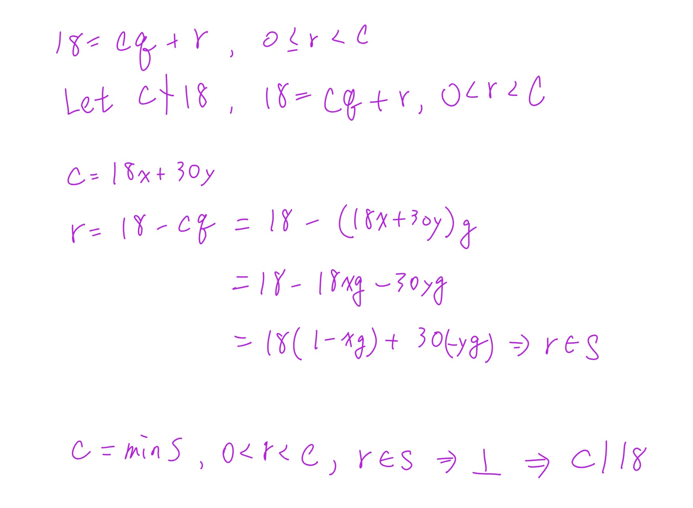


```text
Phase A — Internal Control Surface（控制面輸出） | TURN=第 ? 次對話 | PROMPT=1.17.0 | REFRESH=NO（最新訊息主要意圖為繼續複習） | REFRESH_REMINDER=建議手動貼上最新版複習-Prompt 重新刷新規則❗❗❗ | STATE={MainlineMode=Transcript; MainlineSource=逐字稿_03.txt; Locator=L532–L536+L611; KP=Theorem 4.6／gcd existence and uniqueness; Boundary=已核對至唯一性證明; Transcript={File=逐字稿_03.txt; Session=03; SessionSource=FilenamePrefix; Coverage=PARTIAL; TeachingState=TAUGHT_CORE; Signals=Explanation; ASR=係數x,y口語有不一致}; Practice={LearningObjective=完成gcd存在性與唯一性證明; Modality=Proof; RequiredModality=NO; TaskOrigin=Generated; AssessmentFidelity=Learning; SubmissionStatus=NOT_SUBMITTED}; Weakness=線性組合展開正負號; Completion=IN_PROGRESS; Evidence=已理解c|min S與c|18反證骨架; NextLegal=完成c|30、任意公因數d|c、uniqueness} | PLAN={ThisResponse=完成Theorem 4.6剩餘證明並安排短練習; ExpectedDebtChange=完成必要知識包; ExpectedNext=通過後進入Euclidean Algorithm}}
```

## ⭐Theorem 4.6（續）— 為什麼這個 \(c\) 真的就是最大公因數？

主線位置：Teacher Transcript／逐字稿_03.txt／Session=03／L532–L536、L611 附近。老師先用最小正線性組合建立 \(c\)，再用除法演算法證明整除性；休息後接著證明 `Uniqueness(唯一性)`。逐字稿_03 逐字稿_03

### 1. 你剛剛已經完成第一塊：證明 \(c\mid18\)

我們現在有

\[
S=\{18s+30t>0\mid s,t\in\mathbb Z\},
\]

並令

\[
c=\min S.
\]

因為 \(c\in S\)，所以存在某些整數 \(x,y\)，使得

\[
c=18x+30y.
\]

你剛剛用反證法證明了：

\[
\boxed{c\mid18}.
\]

核心就是：

\[
c\nmid18
\Rightarrow
18=qc+r,\ 0<r<c
\]

再把 \(c=18x+30y\) 代進去：

\[
r=18(1-qx)+30(-qy).
\]

因此 \(r\in S\)，可是 \(0<r<c\)，跟 \(c=\min S\) 矛盾。

---

### 2. 接著要證明 \(c\mid30\)

完全同一招，只是把 \(18\) 換成 \(30\)。

假設

\[
c\nmid30.
\]

由 `Division Algorithm(除法演算法)`，

\[
30=qc+r,\qquad 0\le r<c.
\]

因為假設 \(c\nmid30\)，所以 \(r\neq0\)，因此

\[
0<r<c.
\]

又因為

\[
c=18x+30y,
\]

所以

\[
\begin{aligned}
r
&=30-qc\\
&=30-q(18x+30y)\\
&=-18qx+30-30qy\\
&=18(-qx)+30(1-qy).
\end{aligned}
\]

而

\[
-qx,\ 1-qy\in\mathbb Z,
\]

又 \(r>0\)，所以

\[
r\in S.
\]

可是

\[
0<r<c,
\]

這跟

\[
c=\min S
\]

矛盾。

因此

\[
\boxed{c\mid30}.
\]

所以現在我們已經知道：

\[
\boxed{c\mid18\quad\text{且}\quad c\mid30}.
\]

也就是說，\(c\) 至少確定是一個 `Common Divisor(公因數)`。

---

### 3. 但「是公因數」還不夠，還要證明它是最大的

這裡是整個證明另一個超重要的地方。

假設 \(d\) 是 **18 和 30 任意一個公因數**：

\[
d\mid18,\qquad d\mid30.
\]

我們已經知道

\[
c=18x+30y.
\]

因為 \(d\mid18\)，所以 \(d\) 也整除 \(18x\)。

因為 \(d\mid30\)，所以 \(d\) 也整除 \(30y\)。

因此 \(d\) 一定整除兩者的和：

\[
d\mid(18x+30y).
\]

可是

\[
18x+30y=c.
\]

所以

\[
\boxed{d\mid c}.
\]

這一句非常重要：

> **任何 18、30 的公因數，都一定整除 \(c\)。**

這正是老師定義 `Greatest Common Divisor(最大公因數)` 時用的條件之一。老師在這段證明也是先利用 \(c=ax+by\)，推出任意公因數 \(d\) 都整除 \(c\)。逐字稿_03

---

### 4. 所以現在為什麼能說 \(c=\gcd(18,30)\)？

把兩件事情放在一起：

第一件：

\[
c\mid18,\qquad c\mid30.
\]

所以 \(c\) 自己是公因數。

第二件：

對任何公因數 \(d\)，

\[
d\mid c.
\]

所以所有公因數都「塞得進」\(c\)。

因此：

\[
\boxed{c=\gcd(18,30)}.
\]

以實際數字來看，

\[
\gcd(18,30)=6,
\]

而且的確：

\[
6=18(2)+30(-1).
\]

所以這個抽象證明最後找到的 \(c\)，實際上就是 6。

---

### 5. 這裡有一個很容易混淆的地方

你可能會想：

> 最大公因數不是應該證明「\(c\) 比其他公因數都大」嗎？

其實老師這裡用的是：

\[
\boxed{\text{每個公因數 }d\text{ 都滿足 }d\mid c}.
\]

因為 \(d,c\) 都是正整數，只要

\[
d\mid c,
\]

就有某個正整數 \(k\)：

\[
c=dk.
\]

所以自然有

\[
d\le c.
\]

因此這其實也保證了 \(c\) 數值上不會比任何其他正公因數小。

---

### 6. 最後還差一件事：為什麼最大公因數是唯一的？

老師休息完接著證明這個。假設竟然有兩個最大公因數：

\[
c_1,\qquad c_2.
\]

因為 \(c_1\) 是最大公因數，而 \(c_2\) 是一個公因數，所以

\[
c_2\mid c_1.
\]

反過來，因為 \(c_2\) 也是最大公因數，而 \(c_1\) 也是公因數，所以

\[
c_1\mid c_2.
\]

於是：

\[
c_1\mid c_2
\quad\text{且}\quad
c_2\mid c_1.
\]

兩個都是正整數，所以只能是

\[
\boxed{c_1=c_2}.
\]

因此 `GCD(最大公因數)` 不只是存在，而且是唯一的。這就是老師休息後的 `Uniqueness(唯一性)` 證明。逐字稿_03

### 7. Exam Quick Sheet(考試速記／最短骨架)

`Proof Skeleton(證明骨架)`：

\[
S=\{as+bt>0:s,t\in\mathbb Z\},\qquad c=\min S
\]

\[
c=ax+by
\]

先證：

\[
c\mid a,\ c\mid b
\]

方法：

\[
c\nmid a
\Rightarrow a=qc+r,\ 0<r<c
\Rightarrow r=a-qc
\]

把 \(c=ax+by\) 代入，得到 \(r\) 又是正的線性組合，所以

\[
r\in S,\quad r<c
\]

矛盾。

再證：

\[
d\mid a,\ d\mid b
\Rightarrow d\mid(ax+by)=c.
\]

因此 \(c=\gcd(a,b)\)。

唯一性：

\[
c_1,c_2\text{ 都是 gcd}
\Rightarrow
c_1\mid c_2,\ c_2\mid c_1
\Rightarrow
c_1=c_2.
\]

### 8. Practice Tasks(練習任務)

#### 8.1 Task 1

**Using \(c=18x+30y\), prove that \(c\mid30\) by contradiction.**

你只需要寫出：

1. 假設什麼。
2. \(30=qc+r\) 後 \(r\) 的範圍。
3. 把 \(r\) 改寫成 \(18(\cdots)+30(\cdots)\)。
4. 最後矛盾在哪裡。

#### 8.2 Task 2

**Let \(d\) be any common divisor of 18 and 30. Explain why \(d\mid c\), where \(c=18x+30y\).**

你可以直接用中文作答；手寫拍照也可以。


```text
Phase A — Internal Control Surface（控制面輸出） | TURN=第 ? 次對話 | PROMPT=1.17.0 | REFRESH=NO（最新訊息主要意圖為繼續複習，附帶Prompt不觸發刷新） | REFRESH_REMINDER=建議手動貼上最新版複習-Prompt 重新刷新規則❗❗❗ | STATE={MainlineMode=Transcript; MainlineSource=逐字稿_03.txt; Locator=L609–L617; KP=Theorem 4.6／GCD existence已練習、uniqueness待處理; Transcript={File=逐字稿_03.txt; Session=03; SessionSource=FilenamePrefix; TeachingState=TAUGHT_CORE}; Reference={Aligned=課本Theorem 4.6 p.232; PrecisionStatus=已核對}; QuickSheet={Status=PENDING; Type=ProofSkeleton}; Practice={PreviousTask2=PASS; SubmissionStatus=GRADABLE}; ExerciseDebt=Uniqueness待練; Completion=IN_PROGRESS; NextLegal=Theorem 4.6 uniqueness→Euclidean Algorithm} | PLAN={ThisResponse=完成uniqueness教學並安排1題練習; ExpectedDebtChange=輸出uniqueness practice; ExpectedNext=Euclidean Algorithm}}
```

## ⭐Theorem 4.6 — Uniqueness(唯一性)：為什麼最大公因數不可能有兩個不同答案？
主線位置：Teacher Transcript／逐字稿_03.txt／Session=03／L609–L617  
對齊參考：Textbook／Theorem 4.6／p.232

你剛剛已經處理完 `Existence(存在性)` 的核心。老師接下來就是證明 `Uniqueness(唯一性)`，而且老師自己也說這一段比較簡單：假設有兩個最大公因數 \(c_1,c_2\)，最後證明它們其實必須相等。逐字稿_03

課本的證明也是同一個結構：先得到 \(c_2\mid c_1\)，反過來得到 \(c_1\mid c_2\)，因此 \(c_1=c_2\)。1000004037

### 1. 先回想最大公因數的兩個條件

假設 \(c\) 是 \(a,b\) 的 greatest common divisor(最大公因數)，你現在可以把它想成兩個條件：

\[
\boxed{c\mid a\quad\text{且}\quad c\mid b}
\]

也就是 \(c\) 本身是 common divisor(公因數)。

而且：

\[
\boxed{\text{如果 }d\mid a,\ d\mid b,\text{ 那麼 }d\mid c}
\]

也就是**任何公因數 \(d\)，都要能整除 \(c\)**。

你剛剛 Task 2 證的其實就是第二條。

---

### 2. 現在故意假設有兩個最大公因數

假設：

\[
c_1=\gcd(a,b)
\]

而且又有

\[
c_2=\gcd(a,b).
\]

我們現在的目標不是立刻說它們相等，而是一步一步逼出來。

---

### 3. 為什麼 \(c_2\mid c_1\)？

因為 \(c_2\) 也是最大公因數，所以當然：

\[
c_2\mid a,\qquad c_2\mid b.
\]

換句話說，\(c_2\) 是 \(a,b\) 的一個 common divisor(公因數)。

而 \(c_1\) 是最大公因數。

依照剛才第二個條件：

> 任何 \(a,b\) 的公因數，都會整除 \(c_1\)。

因此：

\[
\boxed{c_2\mid c_1}.
\]

---

### 4. 然後把角色完全反過來

現在把 \(c_1,c_2\) 的角色交換。

\(c_1\) 本身也是 \(a,b\) 的公因數，而 \(c_2\) 是最大公因數。

所以：

\[
\boxed{c_1\mid c_2}.
\]

於是我們得到：

\[
c_2\mid c_1
\]

而且

\[
c_1\mid c_2.
\]

---

### 5. 為什麼互相整除就代表相等？

因為 \(c_1,c_2\) 都是 positive integers(正整數)。

例如假設：

\[
c_2\mid c_1,
\]

那就有某個正整數 \(m\)：

\[
c_1=c_2m.
\]

又因為

\[
c_1\mid c_2,
\]

所以有某個正整數 \(n\)：

\[
c_2=c_1n.
\]

代回去：

\[
c_1=(c_1n)m
\]

\[
c_1=c_1mn.
\]

因為 \(c_1>0\)，可除掉 \(c_1\)：

\[
1=mn.
\]

而 \(m,n\) 都是正整數，所以只能：

\[
m=n=1.
\]

因此：

\[
\boxed{c_1=c_2}.
\]

這就完成 `Uniqueness(唯一性)`。

---

### 6. 你要特別分清楚：「c 唯一」不代表「x,y 唯一」

這裡非常容易混。

我們之前有：

\[
c=ax+by.
\]

Theorem 4.6 證明的是：

\[
\boxed{\gcd(a,b)\text{ 這個數值 }c\text{ 是唯一的}}
\]

但不代表寫成

\[
c=ax+by
\]

時的 \(x,y\) 只有一組。

例如同一個 \(c\) 有可能有很多不同的 integer linear combination(整數線性組合) 表示法。

所以：

\[
\boxed{c\text{ unique}}
\]

不等於

\[
\boxed{x,y\text{ unique}}.
\]

### 7. Exam Quick Sheet(考試速記／最短骨架)

`Uniqueness Proof Skeleton`：

\[
c_1,c_2\text{ 都是 gcd}
\]

\[
c_2\text{ 是 common divisor},\ c_1\text{ 是 gcd}
\Rightarrow c_2\mid c_1
\]

\[
c_1\text{ 是 common divisor},\ c_2\text{ 是 gcd}
\Rightarrow c_1\mid c_2
\]

\[
c_1,c_2>0,\quad c_1\mid c_2,\ c_2\mid c_1
\Rightarrow
\boxed{c_1=c_2}.
\]

最短記憶：

\[
\boxed{\text{兩個 gcd }\Rightarrow\text{互相整除}\Rightarrow\text{相等}}
\]

### 8. Practice Tasks(練習任務)

#### 8.1 Task 1

**Suppose \(c_1\) and \(c_2\) are both greatest common divisors of \(a\) and \(b\). Fill in the blanks and explain the conclusion.**

\[
c_2\mid \underline{\qquad}
\]

\[
c_1\mid \underline{\qquad}
\]

therefore

\[
\underline{\qquad}=\underline{\qquad}.
\]

再用一句中文說明「為什麼前兩個整除關係成立」。

直接填空＋一句理由即可。


```text
Phase A — Internal Control Surface（控制面輸出） | TURN=第 ? 次對話 | PROMPT=1.17.0 | REFRESH=NO（最新訊息主要意圖為作答，附帶Prompt不觸發刷新） | REFRESH_REMINDER=建議手動貼上最新版複習-Prompt 重新刷新規則❗❗❗ | STATE={MainlineMode=Transcript; MainlineSource=逐字稿_03.txt; Locator=L611–L628; KP=Theorem 4.6 uniqueness已教並收到作答; Transcript={File=逐字稿_03.txt; Session=03; SessionSource=FilenamePrefix; Coverage=PARTIAL; TeachingState=TAUGHT_CORE}; Reference={PrecisionStatus=已核對逐字稿相關段落}; QuickSheet={Status=OUTPUT_VERIFIED; Type=ProofSkeleton}; Practice={LearningObjective=說明GCD唯一性; Modality=Fill-in+Explanation; TaskOrigin=Generated; ContentFidelity=GENERATED; AssessmentFidelity=Learning; SubmissionStatus=GRADABLE}; ExerciseDebt=uniqueness已出題待本輪批改; TeachingMainlineDebt=Euclidean Algorithm待處理; AssessmentRequirementDebt=既有§4.1作業另行保留; ReferenceResolutionDebt=無高優先阻斷; PastExamDebt=UNKNOWN; Completion=IN_PROGRESS; NextLegal=批改uniqueness後進入Euclidean Algorithm} | PLAN={ThisResponse=批改Task 8.1並正式進入Euclidean Algorithm; ExpectedDebtChange=uniqueness通過、建立並輸出Euclidean Algorithm練習; ExpectedNext=Extended Euclidean Algorithm}}
```

#### 1. 先批改你剛剛的答案

| 部分 | 你的答案 | 結果 |
|---|---|---|
| \(c_2\mid \_\_\_\) | \(c_1\) | ✅ |
| \(c_1\mid \_\_\_\) | \(c_2\) | ✅ |
| 結論 | \(c_1=c_2\) | ✅ |
| 理由 | 「最大公因數可以被所有因數整除」 | ✅ 核心概念對，但用詞要修正 |

老師這裡的證明確實就是：\(c_2\) 是 common divisor(公因數)，而 \(c_1\) 是 greatest common divisor(最大公因數)，所以 \(c_2\mid c_1\)；交換角色又有 \(c_1\mid c_2\)，因此兩者相等。逐字稿_03

你唯一要修正的是：

> 「所有**因數**」→「所有**公因數**」。

最精確寫法是：

\[
\boxed{\text{任何 }a,b\text{ 的公因數 }d,\ 都有\ d\mid \gcd(a,b)}
\]

因為不是 \(a\) 的任何因數都一定整除 gcd。例如：

\[
a=18,\quad b=30,\quad \gcd(18,30)=6
\]

\(9\mid18\)，但 \(9\nmid30\)，所以 \(9\) 不是「公因數」，而且 \(9\nmid6\)。

所以你的這題算答對，只要把「因數」改成「公因數」即可。

---

## ⭐Euclidean Algorithm(歐幾里得演算法／輾轉相除法) — 怎麼真的把最大公因數算出來？
主線位置：Teacher Transcript／逐字稿_03.txt／Session=03／L613–L621

老師證明完 gcd 的 existence(存在性) 和 uniqueness(唯一性) 後，立刻轉到：「那最大公因數到底怎麼算？」接著正式進入 Euclidean Algorithm(歐幾里得演算法)，也就是你以前學過的輾轉相除法。逐字稿_03

### 1. 最重要的想法：一直「除、拿餘數再除」

假設我們要求：

\[
\gcd(a,b)
\]

而且先假設：

\[
a>b>0.
\]

第一步，用 \(b\) 去除 \(a\)：

\[
a=q_1b+r_2
\]

其中：

- \(q_1\)：quotient(商)
- \(r_2\)：remainder(餘數)

而且：

\[
0\le r_2<b.
\]

如果 \(r_2=0\)，那直接結束：

\[
\gcd(a,b)=b.
\]

如果不等於 0，就繼續。

---

### 2. 下一次不是又拿 \(a\) 算，而是把數字往前推

第一次：

\[
a=q_1b+r_2
\]

接下來變成：

\[
b=q_2r_2+r_3
\]

再下一次：

\[
r_2=q_3r_3+r_4
\]

一直做下去。

你可以把它想成：

\[
(a,b)
\rightarrow
(b,r_2)
\rightarrow
(r_2,r_3)
\rightarrow
(r_3,r_4)
\rightarrow\cdots
\]

也就是：

> **前一次的除數，變成下一次的被除數；前一次的餘數，變成下一次的除數。**

老師也是這樣描述：餘數 \(r_2\) 繼續拿來除，得到 \(r_3\)，再用 \(r_3\) 繼續，直到可以整除。逐字稿_03

### 3. 為什麼可以一直這樣換？

這是最值得理解的一點。

假設：

\[
a=qb+r.
\]

也就是：

\[
r=a-qb.
\]

如果某個 \(d\) 同時整除 \(a,b\)：

\[
d\mid a,\qquad d\mid b,
\]

那當然也會整除：

\[
a-qb.
\]

所以：

\[
d\mid r.
\]

因此 \(a,b\) 的公因數，也會是 \(b,r\) 的公因數。

反過來，如果：

\[
d\mid b,\qquad d\mid r,
\]

因為：

\[
a=qb+r,
\]

所以 \(d\) 也會整除 \(a\)。

因此：

\[
\boxed{a,b\text{ 和 }b,r\text{ 擁有同一批公因數}}
\]

那它們的最大公因數當然也一樣：

\[
\boxed{\gcd(a,b)=\gcd(b,r)}
\]

這就是輾轉相除法可以一直把數字越變越小，卻不會把 gcd 弄丟的原因。

---

### 4. 老師的 Example 4.34：\(\gcd(250,111)\)

老師接著直接用 \(250\) 和 \(111\) 示範。逐字稿_03

第一步：

\[
250=2(111)+28
\]

所以：

\[
\gcd(250,111)=\gcd(111,28).
\]

第二步：

\[
111=3(28)+27
\]

所以變成：

\[
\gcd(28,27).
\]

第三步：

\[
28=1(27)+1.
\]

所以變成：

\[
\gcd(27,1).
\]

最後：

\[
27=27(1)+0.
\]

現在餘數終於變成 \(0\)。

所以看「最後一個非零餘數」：

\[
\boxed{1}
\]

因此：

\[
\boxed{\gcd(250,111)=1}.
\]

老師在逐字稿也是直接強調：「最後一個非零的餘數」就是最大公因數。逐字稿_03

### 5. 你真正要記的不是那些 \(r_0,r_1,r_2\) 名字

初學時最容易被：

\[
r_0,r_1,r_2,q_1,q_2,\ldots
\]

弄到很亂。

先記這個人話版本就好：

\[
\boxed{\text{大數 ÷ 小數 → 得到餘數}}
\]

然後：

\[
\boxed{\text{小數 ÷ 剛才的餘數}}
\]

再來：

\[
\boxed{\text{剛才的餘數 ÷ 新餘數}}
\]

一直重複，直到：

\[
\boxed{\text{餘數}=0}.
\]

答案就是：

\[
\boxed{\text{最後一個不是 0 的餘數}}.
\]

### 6. Exam Quick Sheet(考試速記／最短骨架)

`Euclidean Algorithm(歐幾里得演算法)`：

\[
a=q_1b+r_2
\]

\[
b=q_2r_2+r_3
\]

\[
r_2=q_3r_3+r_4
\]

\[
\cdots
\]

直到：

\[
r_{n-1}=q_nr_n+0.
\]

則：

\[
\boxed{\gcd(a,b)=r_n}
\]

一句話記：

\[
\boxed{\text{一直用「除數 ÷ 餘數」，最後一個非零餘數就是 gcd}}
\]

Common Trap(常見陷阱)：**餘數變成 0 時，答案不是 0，而是它前面的那個非零餘數。**

### 7. Practice Tasks(練習任務)

#### 7.1 Task 1

[Generated: Euclidean Algorithm learning practice]

**Use the Euclidean Algorithm to find \(\gcd(252,105)\). Show every division equation and identify the last nonzero remainder.**

格式照這樣寫即可：

\[
252=(\quad)105+(\quad)
\]

接著繼續除，直到餘數為 \(0\)。

最後寫：

\[
\gcd(252,105)=\ ?
\]

再補一句中文：為什麼那個數字就是最大公因數？


```text
Phase A — Internal Control Surface（控制面輸出） | TURN=第 ? 次對話 | PROMPT=1.17.0 | REFRESH=NO（最新訊息主要意圖為作答，附帶Prompt不觸發刷新） | REFRESH_REMINDER=建議手動貼上最新版複習-Prompt 重新刷新規則❗❗❗ | STATE={MainlineMode=Transcript; MainlineSource=逐字稿_03.txt; Locator=L613–L628; KP=Euclidean Algorithm; Transcript={File=逐字稿_03.txt; Session=03; SessionSource=FilenamePrefix; Coverage=PARTIAL; TeachingState=TAUGHT_CORE}; Reference={PrecisionStatus=已核對逐字稿}; QuickSheet={Status=OUTPUT_VERIFIED; Type=ProcedureSkeleton}; Practice={LearningObjective=使用Euclidean Algorithm求gcd; Modality=Calculation; TaskOrigin=Generated; ContentFidelity=GENERATED; AssessmentFidelity=Learning; SubmissionStatus=GRADABLE}; ExerciseDebt=本輪待批改; TeachingMainlineDebt=倒推線性組合待處理; AssessmentRequirementDebt=既有作業另行保留; ReferenceResolutionDebt=無高優先阻斷; PastExamDebt=UNKNOWN; Completion=Euclidean Algorithm練習已提交待驗證; NextLegal=批改後進入倒推線性組合} | PLAN={ThisResponse=批改252與105並進入back-substitution; ExpectedDebtChange=Euclidean Algorithm通過並建立線性組合練習; ExpectedNext=線性組合與Extended Euclidean Algorithm}}
```

#### 1. 你的 Euclidean Algorithm(歐幾里得演算法)計算是對的

| 步驟 | 你的答案 | 結果 |
|---|---|---|
| \(252=2(105)+42\) | 正確 | ✅ |
| \(105=2(42)+21\) | 正確 | ✅ |
| \(42=2(21)+0\) | 正確 | ✅ |
| \(\gcd(252,105)=21\) | 正確 | ✅ |

老師這裡的規則就是：一直做除法，直到餘數變成 \(0\)，**最後一個非零餘數就是 greatest common divisor(最大公因數)**。逐字稿_03

你只少了題目最後要求的那一句理由。最完整可以寫：

\[
\boxed{\text{因為 }21\text{ 是 Euclidean Algorithm 中最後一個非零餘數，所以 }\gcd(252,105)=21.}
\]

這不是計算觀念錯誤，所以這題 Euclidean Algorithm 的操作我算你通過。

---

## ⭐Back-substitution(倒推還原) — 怎麼真的得到 \(as+bt=\gcd(a,b)\)？
主線位置：Teacher Transcript／逐字稿_03.txt／Session=03／L625–L631

這裡剛好接回你前面一直問的：

> 「\(as+bt\) 到底是什麼？」

現在答案會非常具體：

\[
\boxed{\text{Euclidean Algorithm 找出 gcd；倒著代回去則找出 }s,t.}
\]

老師前面也有先預告，multiplicative inverse(乘法反元素)會用到 Extended Euclidean Algorithm(延伸歐幾里得演算法)。逐字稿_03

### 1. 老師用 \(250,111\) 的例子倒帶

前面算出：

\[
250=2(111)+28
\]

\[
111=3(28)+27
\]

\[
28=1(27)+1
\]

所以：

\[
\gcd(250,111)=1.
\]

現在我們不往下除了，而是**從最後一行倒著回去**。老師稱這個動作為「還原、倒帶」。逐字稿_03

第一步：

\[
28=27+1
\]

所以：

\[
1=28-27.
\]

可是：

\[
27=111-3(28).
\]

代進去：

\[
1=28-[111-3(28)]
\]

整理：

\[
1=4(28)-111.
\]

可是 \(28\) 又來自：

\[
28=250-2(111).
\]

再代：

\[
1=4[250-2(111)]-111
\]

整理：

\[
\boxed{1=4(250)-9(111)}.
\]

老師最後得到的也正是：

\[
250\times4+111\times(-9).
\]

逐字稿_03

### 2. 所以 \(s,t\) 終於出現了

我們現在有：

\[
\gcd(250,111)=1
\]

而且：

\[
1=250(4)+111(-9).
\]

對照：

\[
\gcd(a,b)=as+bt
\]

就可以直接看出：

\[
a=250,\qquad b=111
\]

\[
\boxed{s=4,\qquad t=-9}.
\]

所以 \(s,t\) 沒有什麼神祕的。

它們就是：

> **把 Euclidean Algorithm 的式子倒著代回去之後，最後算出來的兩個整數係數。**

### 3. 你之前那個疑惑現在可以完整整理了

一開始證明 existence(存在性) 時，我們只知道：

\[
\gcd(a,b)
\]

**可以**寫成：

\[
as+bt.
\]

那是在證明「這樣的 \(s,t\) 存在」。

現在 Euclidean Algorithm 做的是更實際的事情：

\[
\boxed{\text{直接把那一組 }s,t\text{ 算出來。}}
\]

而且老師特別提醒：gcd 是唯一的，但它的 linear combination(線性組合)表示法不唯一。逐字稿_03

### 4. Exam Quick Sheet(考試速記／最短骨架)

Euclidean Algorithm：

\[
a=qb+r
\]

一直做到最後一個非零餘數 \(d\)：

\[
d=\gcd(a,b).
\]

接著從最後一條式子**倒著代回去**：

\[
d=as+bt.
\]

一句話：

\[
\boxed{\text{往下除找 gcd，往回代找 }s,t.}
\]

### 5. Practice Tasks(練習任務)

#### 5.1 Task 1

[Generated: Back-substitution practice]

**Using your Euclidean Algorithm equations below, use back-substitution to express \(21\) as a linear combination of \(252\) and \(105\). Then identify \(s\) and \(t\).**

已知：

\[
252=2(105)+42
\]

\[
105=2(42)+21
\]

請最後整理成：

\[
21=252s+105t
\]

並回答：

\[
s=?\qquad t=?
\]

你可以直接從 \(21=105-2(42)\) 開始往回代。


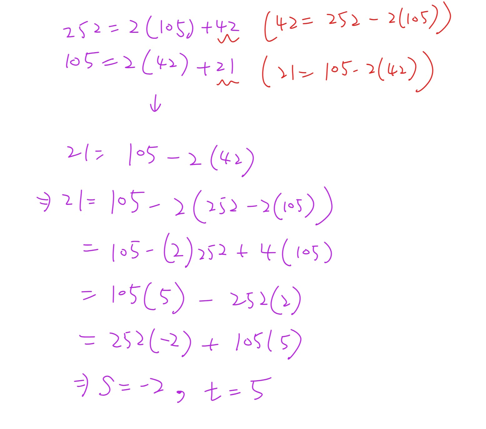


```text
Phase A — Internal Control Surface（控制面輸出） | TURN=第 ? 次對話 | PROMPT=1.17.0 | REFRESH=NO（最新訊息主要意圖為作答，附帶Prompt不觸發刷新） | REFRESH_REMINDER=建議手動貼上最新版複習-Prompt 重新刷新規則❗❗❗ | STATE={MainlineMode=Transcript; MainlineSource=逐字稿_03.txt; Locator=L625–L636; KP=Back-substitution; Transcript={File=逐字稿_03.txt; Session=03; SessionSource=FilenamePrefix; Coverage=PARTIAL; TeachingState=TAUGHT_CORE}; Reference={PrecisionStatus=本輪已重新核對逐字稿}; QuickSheet={Status=OUTPUT_VERIFIED; Type=ProcedureSkeleton}; Practice={LearningObjective=將gcd倒推成兩原數的linear combination; Modality=HandwrittenCalculation; TaskOrigin=Generated; ContentFidelity=GENERATED; AssessmentFidelity=Learning; SubmissionStatus=GRADABLE}; ExerciseDebt=待本輪批改; TeachingMainlineDebt=下一項為linear combination不唯一; AssessmentRequirementDebt=既有作業另行保留; ReferenceResolutionDebt=無高優先阻斷; PastExamDebt=UNKNOWN; Completion=Back-substitution已提交待驗證; NextLegal=批改後進入linear combination不唯一} | PLAN={ThisResponse=批改手寫倒推並推進到linear combination不唯一; ExpectedDebtChange=Back-substitution通過; ExpectedNext=練習不同係數也可表示同一gcd}
```

#### 1. 對，這樣完全正確 ✅

你的倒推是：

\[
21=105-2(42)
\]

而

\[
42=252-2(105)
\]

代回去：

\[
\begin{aligned}
21
&=105-2(252-2(105))\\
&=105-2(252)+4(105)\\
&=5(105)-2(252)\\
&=252(-2)+105(5).
\end{aligned}
\]

所以：

\[
\boxed{s=-2,\qquad t=5}
\]

檢查一次：

\[
252(-2)+105(5)
=-504+525
=21.
\]

完全符合

\[
\gcd(252,105)=252s+105t.
\]

你現在已經真的會做老師說的「還原、倒帶」：從最後一個非零餘數一路代回原本兩個數。老師課堂也是用這種方式把 gcd 寫回兩個原數的 linear combination(線性組合)。逐字稿_03

---

## ⭐Linear Combination(線性組合)不唯一 — 為什麼 \(s,t\) 不只一組？
主線位置：Teacher Transcript／逐字稿_03.txt／Session=03／L629–L636

老師接下來特別強調一件事：

> **gcd 是唯一的，但表示 gcd 的 linear combination 不一定唯一。**

也就是同一個 \(21\)，可以有很多組不同的 \(s,t\)。逐字稿_03

### 1. 用你剛剛的答案直接看

你已經找到：

\[
21=252(-2)+105(5).
\]

現在注意：

\[
252(5)=1260
\]

而

\[
105(12)=1260.
\]

所以如果我在第一個係數多加 \(5\)，第二個係數同時少 \(12\)，多出來的東西會互相抵消：

\[
252(5)+105(-12)=0.
\]

因此：

\[
21
=
252(-2+5)+105(5-12).
\]

也就是：

\[
\boxed{21=252(3)+105(-7)}.
\]

檢查：

\[
756-735=21.
\]

所以我們現在已經有兩組：

\[
(s,t)=(-2,5)
\]

以及

\[
(s,t)=(3,-7).
\]

但 gcd 還是同一個 \(21\)。

### 2. 甚至可以有無限多組

對任何整數 \(k\)：

\[
\boxed{
21
=
252(-2+5k)+105(5-12k)
}
\]

都成立。

因為新增的部分：

\[
252(5k)+105(-12k)=0.
\]

所以核心觀念是：

\[
\boxed{\text{gcd 唯一，但 }s,t\text{ 不唯一。}}
\]

這正是老師在逐字稿裡接著說的重點。逐字稿_03

### 3. Exam Quick Sheet(考試速記／最短骨架)

已知一組：

\[
g=as_0+bt_0
\]

不代表 \(s_0,t_0\) 唯一。

你這題：

\[
21=252(-2)+105(5)
\]

另一組可以是：

\[
21=252(3)+105(-7).
\]

One-line Recall：

\[
\boxed{\text{gcd 唯一；linear combination 的係數可以有很多組。}}
\]

### 4. Practice Tasks(練習任務)

#### 4.1 Task 1

[Generated: Linear-combination practice]

**Let \(k=2\) in**

\[
21=252(-2+5k)+105(5-12k).
\]

Find the new values of \(s\) and \(t\), then verify that

\[
252s+105t=21.
\]

直接回覆 \(s,t\) 和最後的驗算即可。


```text
Phase A — Internal Control Surface（控制面輸出） | TURN=第 ? 次對話 | PROMPT=1.17.0 | REFRESH=NO（最新訊息主要意圖為作答，附帶Prompt不觸發刷新） | REFRESH_REMINDER=建議手動貼上最新版複習-Prompt 重新刷新規則❗❗❗ | STATE={MainlineMode=Transcript; MainlineSource=逐字稿_03.txt; Locator=L635–L643; KP=Linear Combination不唯一; Boundary=已核對並進入應用題4.38; Transcript={File=逐字稿_03.txt; Session=03; SessionSource=FilenamePrefix; Coverage=PARTIAL; TeachingState=TAUGHT_CORE; Signals=Explanation}; Reference={PrecisionStatus=本輪已重新核對逐字稿}; QuickSheet={Status=OUTPUT_VERIFIED; Type=ProcedureSkeleton}; Practice={LearningObjective=用參數k產生另一組linear combination係數; Modality=Calculation; TaskOrigin=Generated; ContentFidelity=GENERATED; AssessmentFidelity=Learning; SubmissionStatus=GRADABLE}; ExerciseDebt=上一知識點已提交待本輪驗證; TeachingMainlineDebt=下一項為linear combination應用題; AssessmentRequirementDebt=既有作業另行保留; ReferenceResolutionDebt=無高優先阻斷; PastExamDebt=UNKNOWN; Weakness=無; Completion=Linear Combination不唯一已練習待驗證; NextLegal=4.38整數解應用} | PLAN={ThisResponse=批改Task並正式進入線性組合應用題; ExpectedDebtChange=上一知識點通過並建立新Exercise Debt; ExpectedNext=練習找出所有非負整數解}
```

#### 1. 批改

| 項目 | 結果 | 評語 |
|---|---|---|
| \(k=2\) 代入 | ✅ | \(-2+5(2)=8\)，\(5-12(2)=-19\) |
| \(s,t\) | ✅ | \((s,t)=(8,-19)\) |
| 驗算 | ✅ | \(252(8)+105(-19)=2016-1995=21\) |

完全正確。這也直接證明了同一個 gcd：

\[
21
\]

可以同時寫成

\[
252(-2)+105(5)
\]

也可以寫成

\[
252(8)+105(-19).
\]

所以你已經掌握「**gcd 唯一，但 linear combination(線性組合) 的係數不唯一**」。

---

## ⭐Linear Diophantine Application(線性整數方程應用) — 怎麼把 gcd 技巧拿來解實際問題？
主線位置：Teacher Transcript／逐字稿_03.txt／Session=03／L635–L643

老師接著用 programming contest 的例子：debug 一個 Java 程式花 6 分鐘，C++ 花 10 分鐘，總共剛好使用 104 分鐘；令 \(x\) 是 Java 程式數量、\(y\) 是 C++ 程式數量，就得到

\[
6x+10y=104.
\]

老師再把它化簡成

\[
3x+5y=52.
\]

這就是把實際問題轉成 linear combination(線性組合)。逐字稿_03

### 1. 第一步：先找一組整數解

因為

\[
\gcd(3,5)=1
\]

而且：

\[
1=3(2)+5(-1).
\]

兩邊乘 \(52\)：

\[
52=3(104)+5(-52).
\]

所以先得到一組解：

\[
x=104,\qquad y=-52.
\]

當然這組不能直接當實際答案，因為「程式數量」不能是負的。

但它的作用是：**先給我們一個起點。**

### 2. 第二步：利用不唯一性產生所有整數解

因為

\[
3(5)-5(3)=0,
\]

所以我們可以讓 \(x\) 減少 \(5\)，同時讓 \(y\) 增加 \(3\)，總和仍然不變：

\[
\boxed{x=104-5k}
\]

\[
\boxed{y=-52+3k}
\]

其中

\[
k\in\mathbb Z.
\]

老師課堂也是用這個形式。逐字稿_03

### 3. 第三步：加上現實世界的限制

因為 \(x,y\) 是程式的數量，所以要：

\[
x\ge0,\qquad y\ge0.
\]

因此：

\[
104-5k\ge0
\]

得到

\[
k\le\frac{104}{5}=20.8,
\]

另一方面：

\[
-52+3k\ge0
\]

得到

\[
k\ge\frac{52}{3}\approx17.33.
\]

而 \(k\) 必須是整數，所以只有：

\[
\boxed{k=18,19,20}.
\]

代入：

\[
k=18:\quad (x,y)=(14,2)
\]

\[
k=19:\quad (x,y)=(9,5)
\]

\[
k=20:\quad (x,y)=(4,8).
\]

也就是有三種可行組合；這正是老師最後得到的三組解。逐字稿_03

### 4. 你真正要記的解題流程

這類題不是一直亂試 \(x,y\)。

流程是：

\[
\boxed{\text{建立方程式}}
\]

\[
\downarrow
\]

\[
\boxed{\text{用 gcd / Extended Euclidean Algorithm 找一組整數解}}
\]

\[
\downarrow
\]

\[
\boxed{\text{加參數 }k\text{ 產生所有整數解}}
\]

\[
\downarrow
\]

\[
\boxed{\text{用 }x,y\ge0\text{ 篩掉不合理解}}
\]

最重要的觀念是：

> **數學先給所有 integer solution(整數解)，題目的現實條件再幫你留下可行解。**

### 5. Exam Quick Sheet(考試速記／最短骨架)

對

\[
ax+by=c
\]

先找一組

\[
(x_0,y_0).
\]

若 \(g=\gcd(a,b)\)，一般整數解的變化方向是：

\[
\boxed{x=x_0+\frac bgk}
\]

\[
\boxed{y=y_0-\frac agk}
\]

其中 \(k\in\mathbb Z\)。

應用題最後別忘：

\[
\boxed{\text{再套 }x,y\ge0\text{ 等實際限制}}
\]

### 6. Practice Tasks(練習任務)

#### 6.1 Task 1

[Generated: Linear Diophantine practice]

A student spends **4 minutes** on each Type A problem and **6 minutes** on each Type B problem. They spend exactly **38 minutes** in total.

Let \(x\) be the number of Type A problems and \(y\) the number of Type B problems.

**Find all nonnegative integer solutions \((x,y)\) to**

\[
4x+6y=38.
\]

請寫：

1. 化簡後的方程式  
2. 一組整數解  
3. 含 \(k\) 的所有整數解  
4. 最後所有符合 \(x,y\ge0\) 的解。


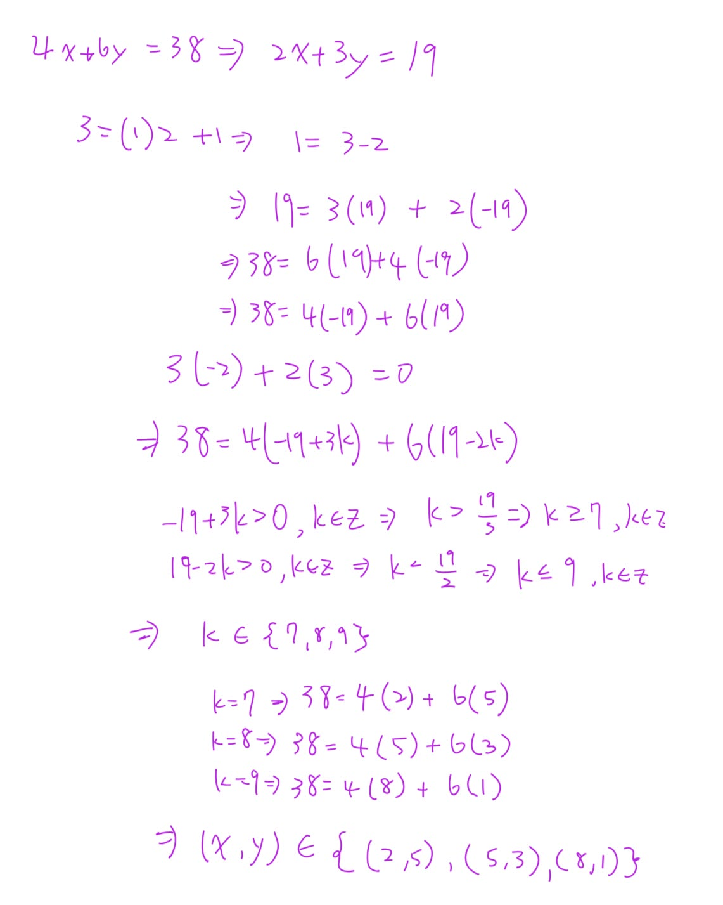


///danger|數學歸納法

## ⭐數學歸納法

///
```text
Phase A — Internal Control Surface（控制面輸出） | TURN=第 ? 次對話 | PROMPT=1.17.0 | REFRESH=NO | REFRESH_REMINDER=NONE | STATE={MainlineMode=Transcript; KP=Mathematical Induction複習; Practice={TaskOrigin=Homework-user-provided; SubmissionStatus=NOT_SUBMITTED}; Completion=整理中} | PLAN={ThisResponse=整理數學歸納法步驟並以Ex 4.1第2題(a)示範; ExpectedNext=使用者自行寫作業}
```

#### 1. Mathematical Induction(數學歸納法)到底在做什麼？

它的想法很像「骨牌」。

你要證明某個敘述 \(S(n)\) 從某個整數開始，後面全部都成立，只需要做兩件核心的事：

\[
\boxed{\text{第一張會倒}}
\]

以及

\[
\boxed{\text{如果第 }k\text{ 張倒了，第 }k+1\text{ 張也一定倒}}
\]

這樣就可以一路推下去。

---

#### 2. 數學歸納法的標準步驟

假設題目要求：

\[
S(n)\text{ 對所有 }n\ge n_0\text{ 成立}
\]

標準寫法如下。

**Step 0：先定義 \(S(n)\)**

先說清楚你到底要證明什麼。

例如：

\[
S(n):\quad \sum_{i=1}^{n}2^{i-1}=2^n-1
\]

---

**Step 1：Base Case(基礎步驟)**

把最小的 \(n\) 代進去。

如果題目是

\[
n\ge1
\]

就檢查：

\[
S(1)
\]

如果題目是

\[
n\ge10
\]

就檢查：

\[
S(10)
\]

所以不是永遠從 \(1\) 開始。

---

**Step 2：Induction Hypothesis(歸納假設)**

假設對某一個任意的 \(k\)：

\[
S(k)\text{ is true}
\]

注意這一步不是要你重新證明 \(S(k)\)。

而是「暫時假設它成立」，然後拿它去推下一個。

---

**Step 3：Inductive Step(歸納步驟)**

利用剛剛假設的

\[
S(k)
\]

去證明

\[
S(k+1)
\]

也就是證明：

\[
S(k)\Rightarrow S(k+1)
\]

這通常是整題最重要的地方。

---

**Step 4：Conclusion(結論)**

最後寫：

\[
\therefore S(n)\text{ is true for all }n\ge n_0
\]

by the Principle of Mathematical Induction(數學歸納法原理)。

---

#### 3. 用你剛剛作業第一題來看

你圖片中的第 \(2\) 題 (a) 是：

\[
\sum_{i=1}^{n}2^{i-1}
=
\sum_{i=0}^{n-1}2^i
=
2^n-1,
\qquad n\ge1
\]

主要要證明的是：

\[
\boxed{\sum_{i=1}^{n}2^{i-1}=2^n-1}
\]

我們定義：

\[
S(n):\quad \sum_{i=1}^{n}2^{i-1}=2^n-1
\]

---

#### 4. Step 1：Base Case

題目說：

\[
n\ge1
\]

所以先驗證 \(n=1\)。

左邊：

\[
\sum_{i=1}^{1}2^{i-1}
=
2^{1-1}
=
2^0
=
1
\]

右邊：

\[
2^1-1=1
\]

所以：

\[
1=1
\]

因此

\[
\boxed{S(1)\text{ is true}}
\]

---

#### 5. Step 2：Induction Hypothesis

假設對某個 \(k\ge1\)，

\[
S(k)\text{ is true}
\]

也就是假設：

\[
\boxed{
\sum_{i=1}^{k}2^{i-1}=2^k-1
}
\]

這一行非常重要，後面就是要拿它來代換。

---

#### 6. Step 3：證明 \(S(k+1)\)

我們要證明：

\[
\sum_{i=1}^{k+1}2^{i-1}
=
2^{k+1}-1
\]

先從左邊開始：

\[
\sum_{i=1}^{k+1}2^{i-1}
\]

把最後一項拆出來：

\[
=
\sum_{i=1}^{k}2^{i-1}+2^k
\]

這時候就可以使用 Induction Hypothesis(歸納假設)：

\[
\sum_{i=1}^{k}2^{i-1}=2^k-1
\]

所以：

\[
=(2^k-1)+2^k
\]

整理：

\[
=2(2^k)-1
\]

\[
=2^{k+1}-1
\]

因此：

\[
\boxed{S(k+1)\text{ is true}}
\]

---

#### 7. 最後結論

我們已經證明：

\[
S(1)\text{ is true}
\]

而且：

\[
S(k)\Rightarrow S(k+1)
\]

因此根據 Principle of Mathematical Induction(數學歸納法原理)：

\[
\boxed{
\sum_{i=1}^{n}2^{i-1}=2^n-1
\quad\text{for all }n\ge1
}
\]

至於題目中：

\[
\sum_{i=1}^{n}2^{i-1}
=
\sum_{i=0}^{n-1}2^i
\]

只是 Index Shift(索引平移)：左邊的指數依序也是

\[
0,1,2,\ldots,n-1
\]

所以兩個總和其實是同一串數字。

---

#### 8. 你寫作業時可以直接記這個模板

\[
\boxed{
\text{Base Case}
\rightarrow
\text{Assume }S(k)
\rightarrow
\text{Prove }S(k+1)
\rightarrow
\text{Conclusion}
}
\]

最關鍵的觀念是：

\[
\boxed{\text{證 }S(k+1)\text{ 時，要想辦法做出 }S(k)\text{ 的形狀}}
\]

像剛剛：

\[
\sum_{i=1}^{k+1}2^{i-1}
\]

故意拆成

\[
\underbrace{\sum_{i=1}^{k}2^{i-1}}_{\text{這就是 }S(k)\text{ 裡的東西}}
+2^k
\]

一看到這個，就可以把歸納假設代進來。

#### 9. Exam Quick Sheet(考試速記／最短骨架)

\[
S(n),\quad n\ge n_0
\]

\[
1.\; S(n_0)\text{ true}
\]

\[
2.\; \text{Assume }S(k)\text{ true}
\]

\[
3.\; \text{Use }S(k)\text{ to prove }S(k+1)
\]

\[
4.\; \therefore S(n)\text{ true for all }n\ge n_0
\]

**最常見錯誤：** 在證 \(S(k+1)\) 的時候，完全沒有使用到 \(S(k)\) 的假設。

///danger|這裡到底要怎麼寫？是有用到s(k)就好嗎？還是我需要用 s(k+1)推回s(k)
```text
Phase A — Internal Control Surface（控制面輸出） | TURN=第 ? 次對話 | PROMPT=1.17.0 | REFRESH=NO | REFRESH_REMINDER=NONE | STATE={MainlineMode=Transcript; KP=Mathematical Induction; Completion=IN_PROGRESS; Weakness=Induction-step direction} | PLAN={ThisResponse=釐清 S(k) 與 S(k+1) 的證明方向並指出何處使用 Induction Hypothesis; ExpectedDebtChange=降低概念混淆; ExpectedNext=繼續 Ex 4.1 作業}
```

#### 1. 你要做的是「假設 \(S(k)\) 成立，去證明 \(S(k+1)\)」

不是把 \(S(k+1)\) 推回 \(S(k)\)。

Mathematical Induction(數學歸納法)的核心就是：

\[
\boxed{S(k)\text{ is true } \Longrightarrow S(k+1)\text{ is true}}
\]

所以在 Inductive Step(歸納步驟)裡：

\[
\text{Assume }S(k)\text{ is true}
\]

然後用這個已知條件，推出 \(S(k+1)\)。

#### 2. 你這題到底在哪裡「用到 \(S(k)\)」？

你的 Induction Hypothesis(歸納假設)是：

\[
S(k):\qquad
\sum_{i=1}^{k}2^{i-1}=2^k-1.
\]

現在要證明：

\[
S(k+1):\qquad
\sum_{i=1}^{k+1}2^{i-1}=2^{k+1}-1.
\]

所以從 \(S(k+1)\) 的**左邊**開始算：

\[
\begin{aligned}
\sum_{i=1}^{k+1}2^{i-1}
&=\sum_{i=1}^{k}2^{i-1}+2^k\\
&=(2^k-1)+2^k\\
&=2^{k+1}-1.
\end{aligned}
\]

重點就是中間這一步：

\[
\boxed{
\sum_{i=1}^{k}2^{i-1}
\;\longrightarrow\;
2^k-1
}
\]

這裡就是用了 \(S(k)\)。

所以不是「有寫到 \(S(k)\) 就可以」，而是你要**真的拿 \(S(k)\) 裡的等式來代換**。

#### 3. 你可以把它想成這個流程

你要蓋第 \(k+1\) 層樓。

手上已經假設：

\[
S(k)\text{ 成立}
\]

也就是前 \(k\) 項你已經知道是多少。

而第 \(k+1\) 項的總和可以拆成：

\[
\boxed{
\text{前 }k\text{ 項}
+
\text{第 }k+1\text{ 項}
}
\]

也就是：

\[
\sum_{i=1}^{k+1}2^{i-1}
=
\underbrace{\sum_{i=1}^{k}2^{i-1}}_{\text{這塊用 }S(k)}
+
2^k.
\]

然後把那一塊換成 \(2^k-1\)。

這就是歸納法最常見的技巧：

\[
\boxed{\text{把 }S(k+1)\text{ 拆到裡面出現 }S(k)}
\]

#### 4. 那可不可以從 \(S(k+1)\) 往回推？

你在**草稿找解法**時可以往回想，例如：

「我要得到 \(2^{k+1}-1\)，怎麼把它拆到跟 \(2^k-1\) 有關？」

這種 backwards reasoning(反向思考)完全可以。

但正式證明時，最好不要寫成：

\[
S(k+1)\text{ is true}
\Rightarrow \cdots
\]

因為 \(S(k+1)\) 正是你還沒證明的東西，不能先假設它成立。

正式寫法應該是：

\[
\boxed{
\text{Assume }S(k)\text{ is true. We show }S(k+1)\text{ is true.}
}
\]

然後由 \(S(k+1)\) 的一邊開始計算，途中使用 \(S(k)\)，最後得到另一邊。

#### 5. 你這題最標準的寫法

你可以直接照這個骨架：

\[
\text{Assume }S(k)\text{ is true, i.e., }
\sum_{i=1}^{k}2^{i-1}=2^k-1.
\]

We need to show \(S(k+1)\).

\[
\begin{aligned}
\sum_{i=1}^{k+1}2^{i-1}
&=\sum_{i=1}^{k}2^{i-1}+2^k\\
&=(2^k-1)+2^k \qquad \text{(by the induction hypothesis)}\\
&=2^{k+1}-1.
\end{aligned}
\]

Therefore, \(S(k+1)\) is true.

你考試時看到 Induction(歸納法)，可以直接記：

\[
\boxed{
\text{假設 }S(k)
\rightarrow
\text{把 }S(k+1)\text{ 拆出 }S(k)
\rightarrow
\text{代入 }S(k)
\rightarrow
\text{得到目標}
}
\]

///


## ⭐作業

///danger|數學歸納法證明
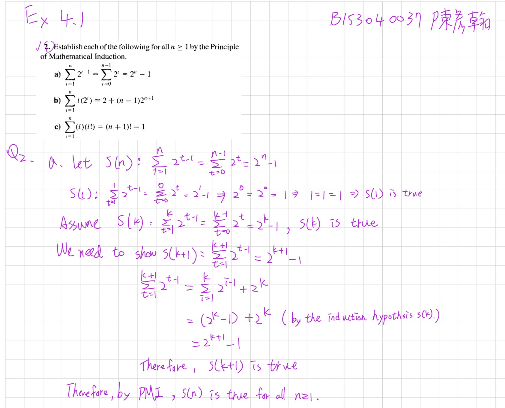
///

///danger|數學歸納法證明模板
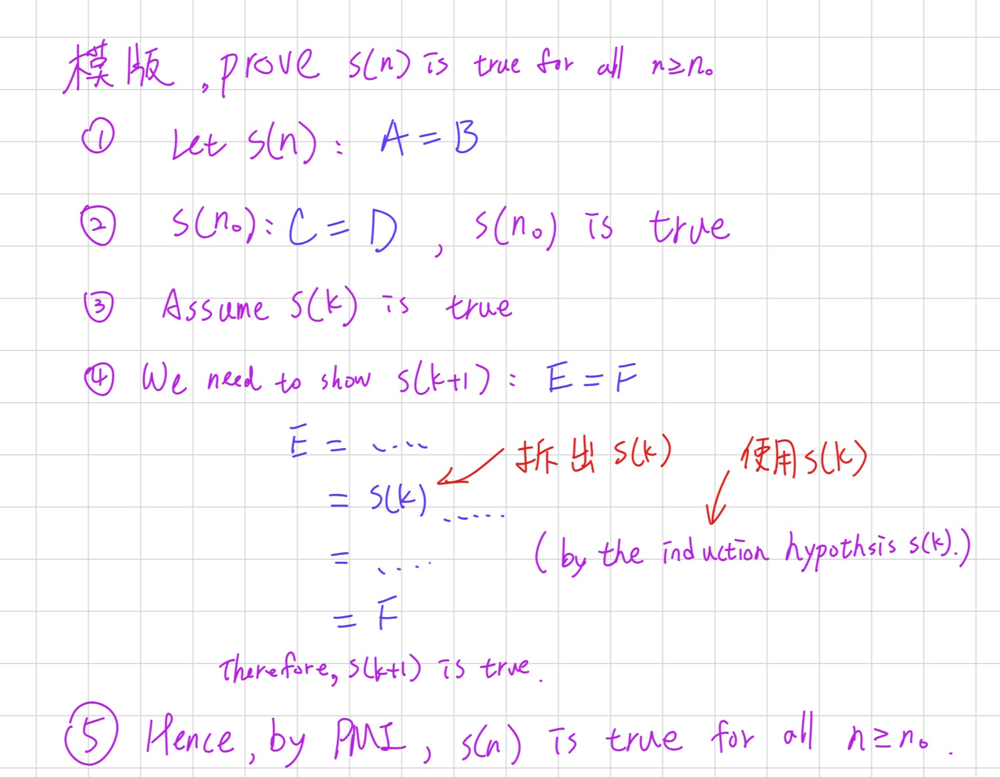
///

---

///danger|常用的 sigma
## ⭐sigma
### 公式

[YouTube 參考影片](https://www.youtube.com/watch?v=p5z0O_L1Z0U)

$$
\sum_{k=1}^{n} k = \frac{n(n+1)}{2}
$$

$$
\sum_{k=1}^{n} k^2 = \frac{n(n+1)(2n+1)}{6}
$$

$$
\sum_{k=1}^{n} k^3 = \left[\frac{n(n+1)}{2}\right]^2
$$

$$
\sum_{k=1}^{n} k(k+1) = \frac{n(n+1)(n+2)}{3}
$$

### ∑ 的性質

1. 常數和：

   $$
   \sum_{k=1}^{n} c = nc
   \quad
   (c \text{ 表示任一常數})
   $$

2. 係數可以提出：

   $$
   \sum_{k=1}^{n} c \cdot a_k
   =
   c \cdot \sum_{k=1}^{n} a_k
   $$

   其中 \(c\) 是與 \(k\) 無關的常數。

3. ∑ 的後面有加減可以拆：

   $$
   \sum_{k=1}^{n}(a_k \pm b_k)
   =
   \sum_{k=1}^{n}a_k
   \pm
   \sum_{k=1}^{n}b_k
   $$

4. ∑ 的後面很多相乘：
   先乘開，再利用加減可以拆的性質。

   例如：

   $$
   \sum_{k=1}^{n}(2k-1)(3k+1)
   $$

   先乘開：

   $$
   (2k-1)(3k+1)
   =
   6k^2-k-1
   $$

   所以：

   $$
   \sum_{k=1}^{n}(2k-1)(3k+1)
   =
   \sum_{k=1}^{n}(6k^2-k-1)
   $$

   再拆成：

   $$
   6\sum_{k=1}^{n}k^2
   -
   \sum_{k=1}^{n}k
   -
   \sum_{k=1}^{n}1
   $$

5. 相乘不能直接拆成兩個 ∑ 相乘：

   一般來說，

   $$
   \sum_{k=1}^{n}(a_kb_k)
   \neq
   \left(\sum_{k=1}^{n}a_k\right)
   \left(\sum_{k=1}^{n}b_k\right)
   $$

   原因是右邊乘開後會多出交叉項。

   例如：

   $$
   a_1b_1+a_2b_2
   \neq
   (a_1+a_2)(b_1+b_2)
   $$

   因為：

   $$
   (a_1+a_2)(b_1+b_2)
   =
   a_1b_1+a_1b_2+a_2b_1+a_2b_2
   $$

   所以遇到相乘時，通常要先把括號乘開，再利用性質 2、3 拆 ∑。

6. 平方不能直接移到 ∑ 外面：

   一般來說，

   $$
   \sum_{k=1}^{n}a_k^2
   \neq
   \left(\sum_{k=1}^{n}a_k\right)^2
   $$

   原因是右邊平方後會多出交叉項。

   例如：

   $$
   a_1^2+a_2^2
   \neq
   (a_1+a_2)^2
   $$

   因為：

   $$
   (a_1+a_2)^2
   =
   a_1^2+2a_1a_2+a_2^2
   $$

   所以要記：

   $$
   \boxed{
   \sum a_k^2
   \neq
   \left(\sum a_k\right)^2
   }
   $$

   ∑ 裡面的平方要留在每一項上，不能直接把平方搬到整個 ∑ 外面。
///


///danger|證明不成立只要一個反例即可
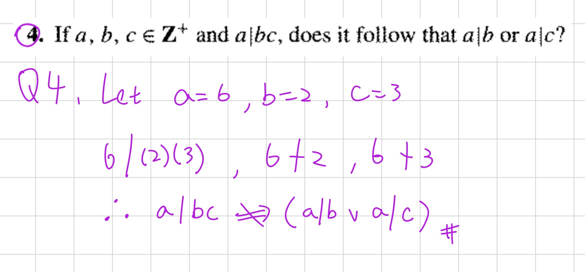
///


/// danger|Zero-Product Property(零乘積性質)

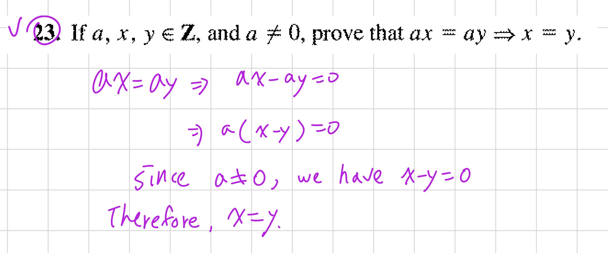

```
Phase A — Internal Control Surface（控制面輸出） | TURN=第 ? 次對話 | PROMPT=1.17.0 | REFRESH=NO | REFRESH_REMINDER=建議手動貼上最新版複習-Prompt 重新刷新規則❗❗❗ | STATE={MainlineMode=Transcript; Session=03; KP=整數消去律; Locator=使用者提供第63題截圖; TranscriptSpan=本輪未核對; Reference=課本詳解.pdf對應題解目前無法核對; Practice=尚未作答; Completion=PENDING} | PLAN={ThisResponse=教學證明與安排一題觀念檢查; ExpectedNext=批改後接續}
```

## ⭐Cancellation Law(消去律) — 為什麼可以把 \\(a\\) 消掉？

主線位置：使用者提供的第 63 題截圖；Teacher Transcript／Session=03／對應行號本輪尚未核對。

### 1. 題目在問什麼？

題目：

\\[ a,x,y\in\mathbb Z,\qquad a\neq0 \\]

Prove that

\\[ ax=ay\Rightarrow x=y. \\]

翻譯：

假設 \\(a,x,y\\) 都是整數，而且 \\(a\neq0\\)。

證明：如果 \\(ax=ay\\)，那麼 \\(x=y\\)。

這題不是要算出 \\(x,y\\) 是多少，而是要證明這個規則對所有符合條件的整數都成立。

### 2. 要怎麼證明？

你可能直覺會想：

\\[ ax=ay\Rightarrow x=y \\]

直接把兩邊的 \\(a\\) 約掉。

但這題就是要你證明「為什麼可以約掉」，所以我們把中間的理由寫出來。

Step 1：把所有項移到左邊。

\\[ ax=ay \\]

\\[ ax-ay=0 \\]

Step 2：提出共同因數 \\(a\\)。

\\[ a(x-y)=0 \\]

Step 3：使用 Zero-Product Property(零乘積性質)。

兩個整數相乘等於零，至少有一個必須是零。

因此：

\\[ a=0\quad\text{or}\quad x-y=0 \\]

但題目已經告訴我們：

\\[ a\neq0 \\]

所以只剩：

\\[ x-y=0 \\]

得到：

\\[ \boxed{x=y} \\]

證明完成。

### 3. 作業可以這樣寫（英文簡短完整版）

> Proof. Assume \\(ax=ay\\), where \\(a\neq0\\).
>
> Then \\[ ax-ay=0 \\] \\[ a(x-y)=0. \\]
>
> Since \\(a\neq0\\), we have \\(x-y=0\\).
>
> Therefore, \\(x=y\\).

這個寫法已經包含關鍵理由與完整推導，適合用在證明題。

注意：這是依整數性質寫出的證明；目前尚未核對到《課本詳解.pdf》本題對應的原文寫法。

### 4. Exam Quick Sheet(考試速記／最短骨架)

\\[ \boxed{ ax=ay \Rightarrow a(x-y)=0 \xRightarrow{a\neq0}x-y=0 \Rightarrow x=y } \\]

最重要的陷阱：\\(a\neq0\\) 不能省略。

### 5. Practice Tasks(練習任務)

#### 5.1 Task 1

[Generated: 觀念確認]

Give a counterexample showing that the conclusion \\(x=y\\) may fail when \\(a=0\\).

請自己選擇整數 \\(a,x,y\\)，讓 \\(ax=ay\\) 成立，但是 \\(x\neq y\\)。

用中文、英文或列式回答都可以。
///


/// danger|Ex 4.4 第 4 題：Bézout's Identity(貝祖等式)


```
Phase A — Internal Control Surface（控制面輸出） | TURN=第 ? 次對話 | PROMPT=1.17.0 | REFRESH=NO | REFRESH_REMINDER=建議手動貼上最新版複習-Prompt 重新刷新規則❗❗❗ | STATE={MainlineMode=Transcript; MainlineSource=逐字稿_03.txt; Session=03; SessionSource=FilenamePrefix; KP=Bézout's Identity與Ex4.4#4; TranscriptSpan=L531–L535及L619–L635; TeachingState=TAUGHT_CORE; Reference=課本詳解.pdf §4.4第4題 PDF第119頁已核對; Practice=本題原稿尚待補強; Completion=IN_PROGRESS; NextLegal=補教後重新練習} | PLAN={ThisResponse=從頭教貝祖等式、示範求係數、講解作業證明、輸出考試速記與練習; ExpectedNext=批改理解與證明}
```

## ⭐Bézout's Identity(貝祖等式) — 為什麼最大公因數可以寫成兩個數的線性組合？

主線位置：Teacher Transcript／`逐字稿_03.txt`／Session=03／L531–L535、L619–L635。

對齊參考：《課本詳解.pdf》§4.4 第 4 題，PDF 第 119 頁。

先告訴你一個重點：

這題真正難的地方不是計算，而是理解：為什麼一個 GCD(最大公因數)可以用兩個數字的加減乘法表示，以及這件事怎麼幫我們證明整除。

我們先完全不碰作業題，從簡單例子開始。

### 1. 先複習 GCD(最大公因數)

假設有兩個整數：

\\[ a=18,\qquad b=30 \\]

它們的公因數有：

\\[ 1,2,3,6 \\]

其中最大的就是 \\(6\\)。

因此：

\\[ \boxed{\gcd(18,30)=6} \\]

這部分你應該比較熟悉。

現在我換個問題：

你能不能只用 18 和 30，經過整數倍的加減，組合出 6？

可以！

\\[ 18(2)+30(-1)=36-30=6 \\]

也就是：

\\[ \boxed{6=18(2)+30(-1)} \\]

這就是 Bézout's Identity 背後的想法。

### 2. Bézout's Identity 到底在說什麼？

對正整數 \\(a,b\\)，設

\\[ g=\gcd(a,b). \\]

Bézout's Identity 告訴我們：

一定存在兩個整數 \\(s,t\\)，使得

\\[ \boxed{g=as+bt} \\]

這裡每個符號的意思是：

| 符號          | 意思                       |
| ----------- | ------------------------ |
| \\(a,b\\)   | 原本的兩個正整數                 |
| \\(g\\)     | \\(a,b\\) 的最大公因數         |
| \\(s,t\\)   | 某兩個整數，可以是正數、0 或負數        |
| \\(as+bt\\) | Linear Combination(線性組合) |

重點是「存在某組 \\(s,t\\)」，不是隨便選 \\(s,t\\) 都會得到 GCD。

以前面的例子來看：

\\[ \gcd(18,30)=6 \\]

我們找到：

\\[ 6=18(2)+30(-1) \\]

因此：

\\[ s=2,\qquad t=-1. \\]

貝祖等式最重要的一句話

最大公因數可以表示成原本兩個整數的 Linear Combination(線性組合)：

\\[ \gcd(a,b)=as+bt \\]

其中 \\(s,t\in\mathbb Z\\)。

老師在逐字稿裡也特別強調：「最大公因數可以被原本兩個數的線性組合表示」，而且線性組合不一定唯一。

逐字稿_03.txt


### 3. 那 \\(s,t\\) 是怎麼知道的？要自己猜嗎？

不用猜。可以透過 Euclidean Algorithm(歐幾里得演算法)和 Back-Substitution(回代法)找出來。

我們用剛剛的 \\(18,30\\) 示範。

Step 1：反覆做除法。

\\[ 30=18(1)+12 \\]

\\[ 18=12(1)+6 \\]

\\[ 12=6(2)+0 \\]

最後一個非零餘數是 \\(6\\)，所以：

\\[ \gcd(18,30)=6 \\]

Step 2：從 6 開始往回代。

由第二行：

\\[ 18=12+6 \\]

移項得到：

\\[ 6=18-12 \\]

但是第一行告訴我們：

\\[ 12=30-18 \\]

把它代回去：

\\[ \begin{aligned} 6&=18-12\\\ &=18-(30-18)\\\ &=18-30+18\\\ &=2(18)-30 \end{aligned} \\]

所以：

\\[ \boxed{6=18(2)+30(-1)} \\]

我們就找到：

\\[ s=2,\quad t=-1. \\]

這就是貝祖等式的實際求法。

你之前算 \\(252\\) 和 \\(105\\) 的最大公因數，最後寫成 \\(21=252(8)+105(-19)\\)，也是同一種方法。

### 4. 貝祖等式為什麼可以拿來證明「整除」？

這一點非常重要，因為等等的作業會用到。

假設有一個整數 \\(d\\)，它同時整除 \\(a,b\\)。

也就是：

\\[ d\mid a,\qquad d\mid b. \\]

這代表存在整數 \\(p,q\\)，使得：

\\[ a=dp,\qquad b=dq. \\]

現在看任意線性組合：

\\[ as+bt \\]

代入：

\\[ \begin{aligned} as+bt &=(dp)s+(dq)t\\\ &=d(ps+qt) \end{aligned} \\]

因為 \\(ps+qt\\) 是整數，所以：

\\[ \boxed{d\mid(as+bt)} \\]

也就是：

如果 \\(d\\) 同時整除兩個數，那它也一定整除這兩個數的任何整數線性組合。

而貝祖等式告訴我們：

\\[ g=as+bt \\]

因此可以推出：

\\[ d\mid g. \\]

換句話說：

> 任何公因數，都整除最大公因數。

這正是老師講解 GCD 定理時使用的性質。

逐字稿_03.txt


## ⭐Ex 4.4 第 4 題 — 如何利用貝祖等式證明 GCD 的性質？

主線位置：Teacher Transcript／`逐字稿_03.txt`／Session=03／GCD 與線性組合定理，L529–L535；本題為 §4.4 作業練習。

對齊參考：《課本詳解.pdf》§4.4 第 4 題，PDF 第 119 頁。

課本詳解.pdf


### 1. 先理解題目要證明什麼

已知：

\\[ a,b,n\in\mathbb Z^+ \\]

要證明：

\\[ \boxed{\gcd(na,nb)=n\gcd(a,b)} \\]

用中文講就是：

如果把兩個正整數都乘上相同的正整數 \\(n\\)，它們的最大公因數也會跟著乘上 \\(n\\)。

例如：

\\[ \gcd(6,10)=2 \\]

把兩個數都乘以 \\(3\\)：

\\[ \gcd(18,30)=6 \\]

而：

\\[ 6=3(2) \\]

符合：

\\[ \gcd(3\cdot6,3\cdot10)=3\gcd(6,10). \\]

但這個例子只能驗證一組數字，我們要證明所有正整數 \\(a,b,n\\) 都成立。

### 2. 第一步：為什麼要設定 \\(g,h\\)？

我們設：

\\[ \boxed{g=\gcd(a,b)} \\]

\\[ \boxed{h=\gcd(na,nb)} \\]

現在題目就變成：

\\[ \boxed{\text{證明 }h=ng} \\]

是不是比一整串 GCD 符號容易看了？

接下來要利用整除性質證明：

\\[ ng\mid h \\]

以及：

\\[ h\mid ng. \\]

兩個正整數彼此整除，就一定相等。

### 3. 第二步：先證明 \\(ng\mid h\\)

由於：

\\[ g=\gcd(a,b) \\]

因此：

\\[ g\mid a,\qquad g\mid b. \\]

也就是說，存在整數 \\(p,q\\)，使得：

\\[ a=gp,\qquad b=gq. \\]

兩邊都乘上 \\(n\\)：

\\[ na=(ng)p \\]

\\[ nb=(ng)q \\]

所以：

\\[ ng\mid na,\qquad ng\mid nb. \\]

這說明 \\(ng\\) 是 \\(na,nb\\) 的公因數。

但我們已經設定：

\\[ h=\gcd(na,nb) \\]

根據剛剛講過的 GCD 性質：

> 任何公因數都會整除最大公因數。

所以：

\\[ \boxed{ng\mid h} \\]

第一個方向完成。

### 4. 第三步：利用 Bézout's Identity 證明 \\(h\mid ng\\)

這是整題最關鍵的一步。

因為：

\\[ g=\gcd(a,b) \\]

由 Bézout's Identity，存在整數 \\(s,t\\)，使得：

\\[ \boxed{g=as+bt} \\]

現在把兩邊乘以 \\(n\\)：

\\[ ng=n(as+bt) \\]

利用分配律：

\\[ \boxed{ng=(na)s+(nb)t} \\]

注意！這個式子非常重要。

我們成功把 \\(ng\\) 寫成 \\(na,nb\\) 的整數線性組合。

回想：

\\[ h=\gcd(na,nb). \\]

所以：

\\[ h\mid na,\qquad h\mid nb. \\]

而我們剛剛已經證明：

> 一個整數若整除兩個數，就會整除它們的整數線性組合。

因此：

\\[ h\mid\big((na)s+(nb)t\big). \\]

又因為：

\\[ ng=(na)s+(nb)t, \\]

所以：

\\[ \boxed{h\mid ng}. \\]

第二個方向也完成了。

### 5. 第四步：將兩個結果合起來

我們得到了：

\\[ \boxed{ng\mid h} \\]

以及：

\\[ \boxed{h\mid ng}. \\]

這表示 \\(ng,h\\) 兩個正整數彼此整除。

因此：

\\[ h=ng. \\]

將 \\(g,h\\) 換回原本的 GCD：

\\[ \boxed{\gcd(na,nb)=n\gcd(a,b)}. \\]

證明完成。

### 6. 作業正式寫法（精簡英文版）

這是依課本詳解的技巧整理出的版本，不是逐字照抄。等你理解上面的原因後，作業可以寫這份。

Proof.

Let \\(g=\gcd(a,b)\\) and \\(h=\gcd(na,nb)\\).

Since \\(g\mid a\\) and \\(g\mid b\\), we have

\\[ ng\mid na,\qquad ng\mid nb. \\]

Thus, \\(ng\mid h\\).

By Bézout's Identity, there exist \\(s,t\in\mathbb Z\\) such that

\\[ g=as+bt. \\]

Hence,

\\[ ng=(na)s+(nb)t. \\]

Since \\(h\mid na\\) and \\(h\mid nb\\), we have \\(h\mid ng\\).

Since \\(ng,h\in\mathbb Z^+\\) and they divide each other, \\(h=ng\\).

Therefore,

\\[ \boxed{\gcd(na,nb)=n\gcd(a,b).} \\]

### 7. Exam Quick Sheet(考試速記／最短骨架)

Bézout's Identity

\\[ \gcd(a,b)=as+bt,\quad s,t\in\mathbb Z. \\]

GCD 證明模板

\\[ \begin{aligned} g&=\gcd(a,b)\\\ h&=\gcd(na,nb) \end{aligned} \\]

\\[ \underbrace{ng\mid h}\_{\text{公因數性質}} \qquad \underbrace{h\mid ng}\_{\text{貝祖等式}} \\]

\\[ \boxed{h=ng} \\]

### 8. Practice Tasks(練習任務)

先確認你真的理解這兩個最重要的動作，不用急著重寫完整作業。

#### 8.1 Task 1 — Bézout's Identity

[Generated: Learning Practice]

Given \\(\gcd(12,20)=4\\), find integers \\(s,t\\) such that

\\[ 4=12s+20t. \\]

你可以直接列出 \\(s,t\\)，也可以寫出計算過程。

#### 8.2 Task 2 — 理解證明方向

[Generated: Learning Practice]

Let

\\[ g=\gcd(a,b),\qquad h=\gcd(na,nb). \\]

Suppose

\\[ g=as+bt,\qquad s,t\in\mathbb Z. \\]

Complete the following argument:

\\[ ng=(na)s+(nb)t. \\]

Since \\(h\mid na\\) and \\(h\mid nb\\),

\\[ h\mid\ \underline{\qquad\qquad} \\]

請填入空格，並用一句中文說明原因。

你先回答這兩題，我再確認你是否理解貝祖等式的用法。


///


///danger| gcd 之證明

把兩個分別設為 g 和 h，最後用 g|h、h|g 得到 g = h 得證。
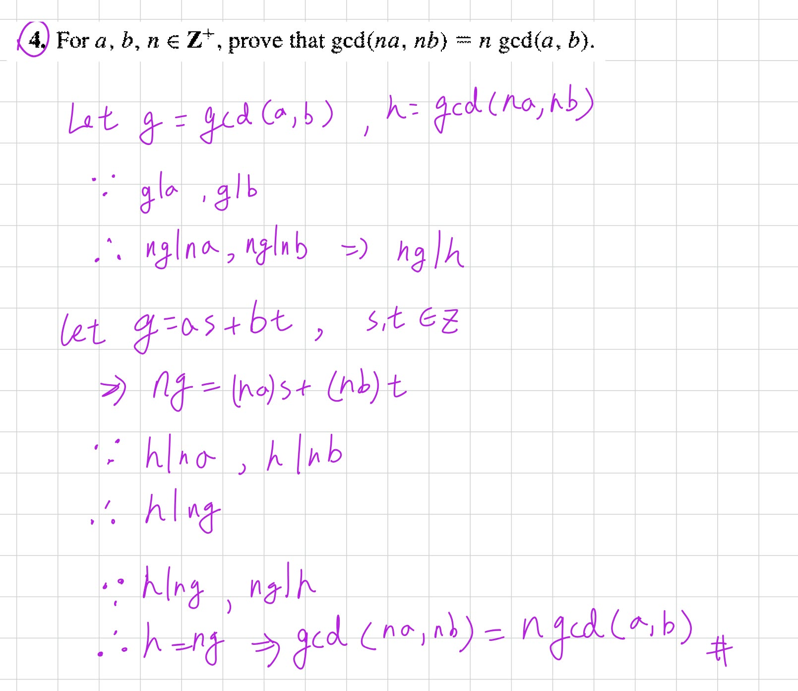
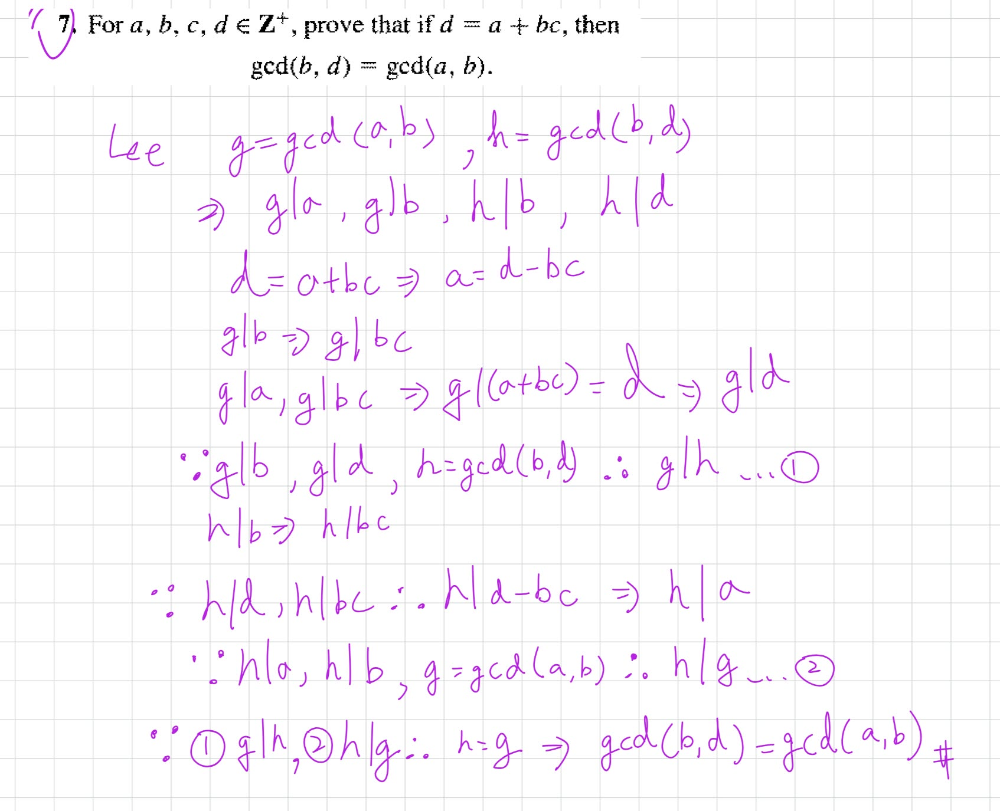
///

///danger|證明答案為 a 或 b

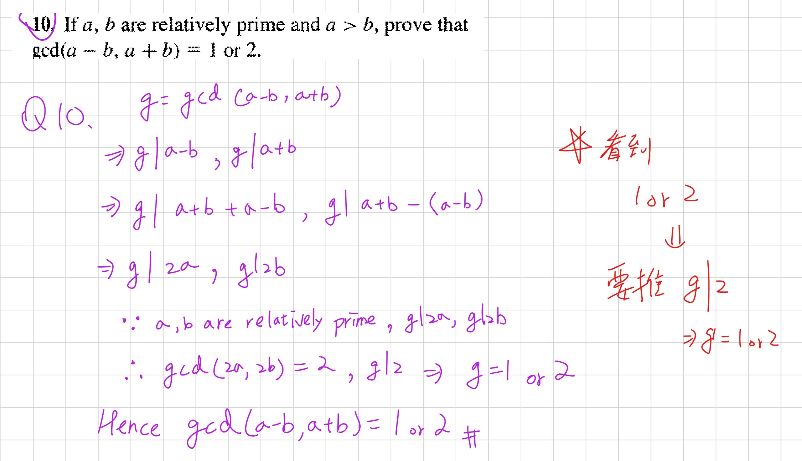

///


///danger|true 和 false 的 數學歸納法
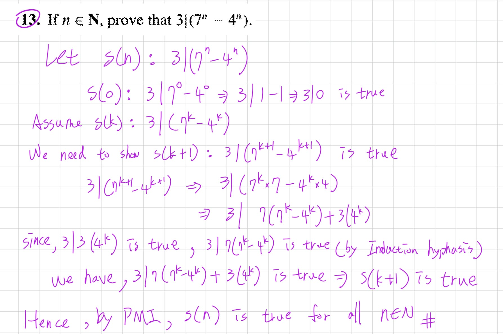
///