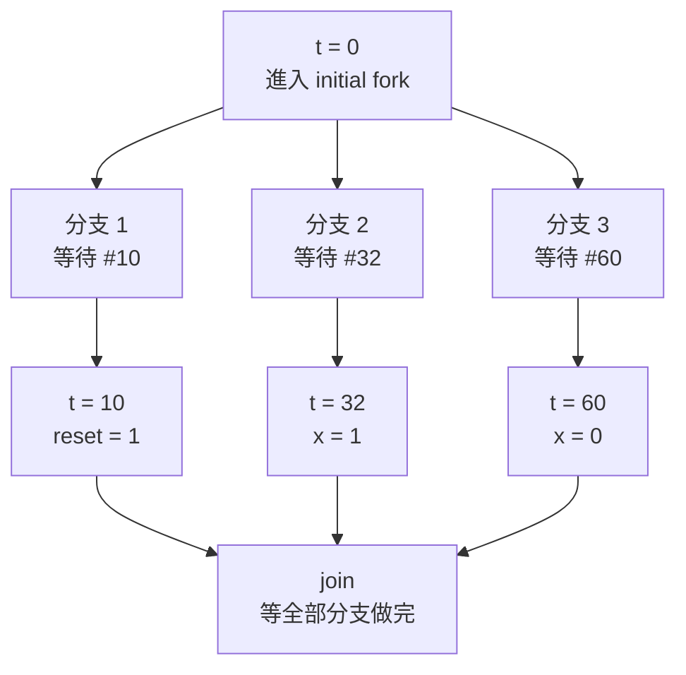

# Fork


假設我今天 Testbench 時，希望操控某時間要 reset，某時間要設定 x = 1，而不是完全用 for 迴圈跑，我要怎麼辦？


假設我希望在時間點 10 設定 reset，時間點 32 設定 x = 1，時間點 60 設定 x = 0。

我可以：
```v
initial begin
    #10 reset = 1; 
end
initial begin
    #32 x = 1; 
end
initial begin
    #60 x = 0; 
end
```

如果不要這麼多 `initial`：
```v
initial begin
    #10 reset = 1;
    #22 x = 1;    // $time = 32
    #28 x = 0;    // $time = 60
end
```

這樣還要算數學欸！超級麻煩

那我們可以更偷懶一點：
```v
initial fork
    #10 reset = 1;
    #32 x = 1;    // $time = 32
    #60 x = 0;    // $time = 60
join
```
他其實就會變成：



這邊的 fork 和 join 其實就是 Pthreads 的 XD，可以看 [Thread Libraries and Pthreads(執行緒函式庫與 Pthreads)](../114-2/電機_作業系統/期中考重點.md#thread-libraries-and-pthreads執行緒函式庫與-pthreads)。


