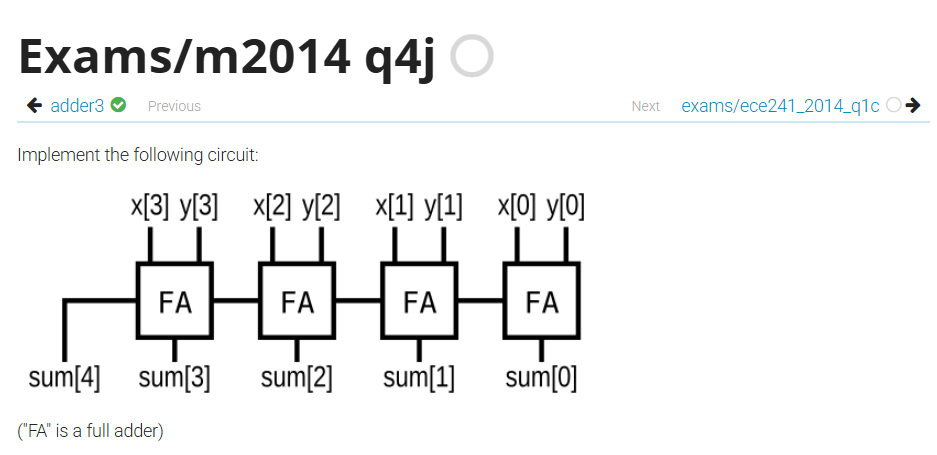

# 直接相加的 adder

題目：https://hdlbits.01xz.net/wiki/Exams/m2014_q4j



這題會怎麼寫？

```v
module top_module (
    input [3:0] x,
    input [3:0] y, 
    output [4:0] sum);
    
    wire [3:0]cout;
    
    genvar i;
    
    full_adder g1 (x[0],y[0],1'b0,cout[0],sum[0]);
    generate
        for(i=1;i<=3;i=i+1)begin : g
            full_adder(x[i],y[i],cout[i-1],cout[i],sum[i]);
        end
    endgenerate
    assign sum[4] = cout[3];

endmodule


module full_adder (
    input x,y,cin,
    output cout,sum
);
    assign sum = x^y^cin;
    assign cout = (x&y)|(y&cin)|(cin&x);
endmodule
```


```v
module top_module (
	input [3:0] x,
	input [3:0] y,
	output [4:0] sum
);
	assign sum = x+y;
endmodule
```

第二種超快，為何可以這樣呢？

這題：
```v
assign sum = x + y;
```
實際上你可以把它腦中展開成：
```v
assign sum = {1'b0, x} + {1'b0, y};
```
因為 sum 是 5-bit，而 x、y 都是預設 unsigned(無號) 的 4-bit 向量，所以在這個 assignment context 裡，它們會先做 zero-extension(補 0 擴位) 成 5-bit，再做加法。也就是說，這行不是在做「4-bit 加法再塞進 5-bit」，而是直接做「5-bit 加法」。

詳見：[四則運算與邏輯運算的位寬](四則運算與邏輯運算的位寬.md#四則運算與邏輯運算的位寬)