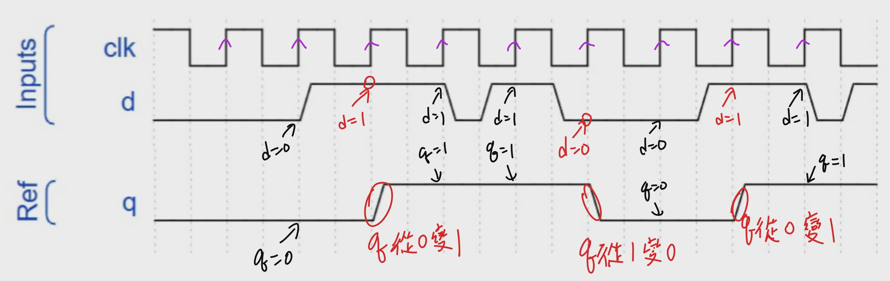
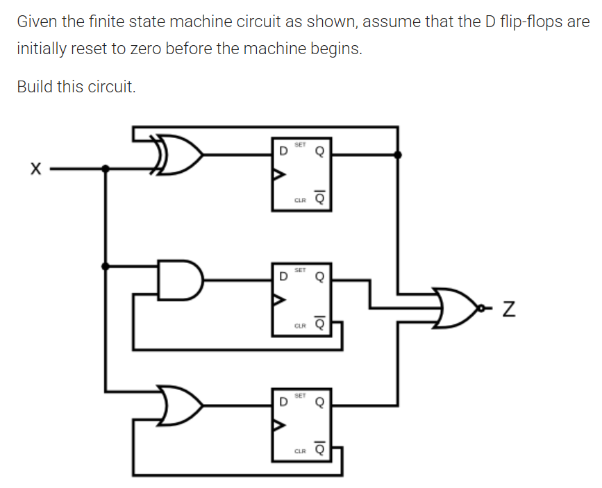
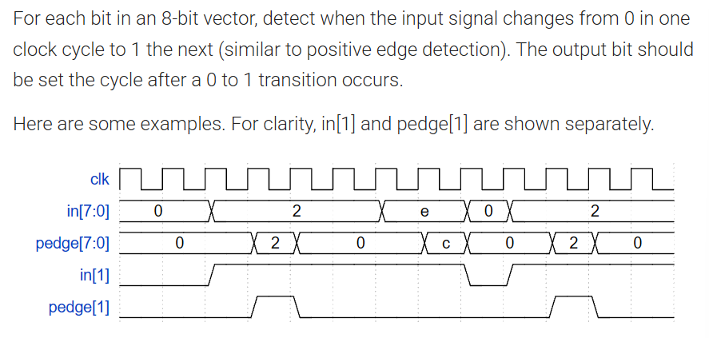
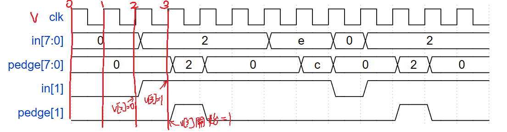
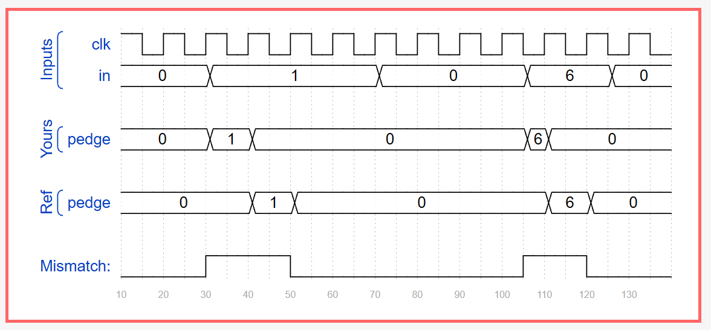

# dff

## dff 的波形圖





可以發現他實際上是慢一拍改變的。


## `<=` 到底如何運作

最有用的口訣是這三句

第一句：先拍照，再算式，最後一起換。
這句是拿來對付 <= 的。進到 always @(posedge clk) 的那一瞬間，先把所有目前暫存器的舊值想成被「拍了一張快照」；接著所有 RHS(right-hand side) 都用這張舊照片來算；最後在這個 time step(時間步) 結尾，所有 LHS(left-hand side) 才一起更新。這正是 nonblocking assignment(非阻塞賦值) 的語意：RHS 先評估，LHS 晚一點一起更新。

第二句：右邊立刻看，左邊最後換。
看到 a <= b;，不要腦中翻成「先把 a 改掉」，而要翻成：現在先看 b 是多少，a 等一下再換。這樣你就不會再把 prev <= in; 誤讀成「下面已經看到新的 prev」。

第三句：<= 看 D pin，讀變數看 Q pin。
這是社群裡很實用的硬體直覺：在 clocked block(時脈觸發區塊) 裡，b <= a; 比較像是在說「b 這個 flip-flop(D 觸發器) 的 D pin 接到 a」，而不是軟體那種「先把 b 改掉再往下跑」。所以同一個 block 裡讀 b，你讀到的是這顆 FF 的舊輸出 Q，不是你剛剛才“寫進去”的新值。


## 題目 1 基礎 dff

https://hdlbits.01xz.net/wiki/Exams/ece241_2014_q4





### 解題


題目說初始化為 0 ，這我們不用管，我們只要管如何畫出電路。


```v
module top_module (
    input  clk,
    input  x,
    output z
);

    reg q1, q2, q3;

    always @(posedge clk) begin
        q1 <= x ^ q1;
        q2 <= x & ~q2;
        q3 <= x | ~q3;
    end

    assign z = ~(q1 | q2 | q3);

endmodule
```

```
q1 <= x ^ q1;
```

其實是 q1_next <= x ^ q1;


## 題目 2 偵測邊緣

https://hdlbits.01xz.net/wiki/Edgedetect



### 解題


題目要求是 pedge[i] 要偵測 in[i] 是否變化，每一個位元獨立。並且要延遲一個週期顯示。


記錄前一個 in 為 prev_in，比較看看是否一樣，如果不一樣的話 pedge = in。

我們也可以看成一個陣列：
```cpp
if( in[i-1]==0 && in[i]==1) pedge [i]=1
else pedge [i+1] =0;
```




可以寫成以下
```v
module top_module (
    input clk,
    input [7:0] in,
    output reg[7:0] pedge
);
    reg [7:0]prev;
    integer i;
    
    always @(posedge clk) begin
        prev  <= in;
        for(i=0;i<=7;i=i+1)begin
            case({prev[i],in[i]})
                2'b00 : pedge[i] <= 0;
                2'b01 : pedge[i] <= 1;
                2'b10 : pedge[i] <= 0;
                2'b11 : pedge[i] <= 0;
            endcase
        end
    end
    
endmodule
```

這樣寫的意思是如果偵測到變化，就變成 1 ，否則變成 0 。

可以簡化為以下

```v
module top_module (
    input clk,
    input [7:0] in,
    output reg[7:0] pedge
);
    
    reg [7:0]prev;
    
    always @(posedge clk) begin
        prev  <= in;
        pedge <= in & ~prev;
    end
    
endmodule
```

### 題外話

如果我們想要現在這個當下就更新，可以寫：

```v
module top_module (
    input clk,
    input [7:0] in,
    output [7:0] pedge
);
    reg [7:0] prev;

    always @(posedge clk) begin
        prev <= in;
    end

    assign pedge = in & ~prev;
endmodule
```

