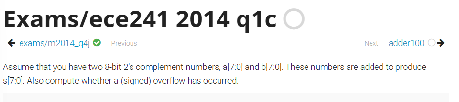

# 判斷有號數的 Overflow

題目：https://hdlbits.01xz.net/wiki/Exams/ece241_2014_q1c



如何判斷有號數的 Overflow 


```v title="無號數"
module top_module (
    input [7:0] a,
    input [7:0] b,
    output [7:0] s,
    output overflow
); 
    assign {overflow,s}=a+b;
endmodule
```


```v title="有號數"
module top_module (
    input [7:0] a,
    input [7:0] b,
    output [7:0] s,
    output overflow
);
    assign s = a + b;
    assign overflow = (~a[7] & ~b[7] & s[7]) |
                      ( a[7] &  b[7] & ~s[7]);
endmodule
```

這題是要寫第二種的有號數，為何是這樣呢？

因為我們要想想何時可能會 overflow ：
正 + 正 (太大) = 負
正 - 負 (太大) = 負
負 + 負 (太小) = 正
負 - 正 (太小) = 正

因為有號數的 MSB 是正負號的意思，當 MSB = 1，代表負數。
所以可以得到：
`overflow = (~a[7] & ~b[7] & s[7]) | ( a[7] &  b[7] & ~s[7]);`

其實我們也可以寫：
`overflow = (a[7] == b[7])&& (a[7] != s[7]);`
這是代表 a、b 正負號相同，a、s 正負號不同。