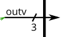

# Vector、MSB 與 LSB

## 一句話先懂

Vector 就是多 bit 訊號；宣告方向決定哪一端是 `MSB`、哪一端是 `LSB`，後續切片、串接與位寬規則都會跟著它走。

## 核心規則

- 宣告格式是 `type [MSB:LSB] name;`
- `[7:0]` 和 `[0:7]` 都合法，只是方向不同。
- `MSB` 是 most significant bit，代表高位。
- `LSB` 是 least significant bit，代表低位。
- 單一 bit 取值用 `vec[i]`，部分切片用 `vec[hi:lo]`。
- 位寬不一致時，較寬端可能補位，較窄端可能截斷。
- `{a, b}` 是串接，`{4{1'b0}}` 是 replication。

## 常用模板或例子

### 基本宣告

```verilog
wire [7:0] data;
reg  [3:0] count;
wire [0:7] reverse_bus;
```

- `wire [7:0] data;` 中，`data[7]` 是 MSB，`data[0]` 是 LSB。
- `wire [0:7] reverse_bus;` 中，`reverse_bus[0]` 是 MSB。

### bit-select 與 part-select

```verilog
wire [7:0] data;
wire       msb;
wire [3:0] upper_nibble;

assign msb          = data[7];
assign upper_nibble = data[7:4];
```

- 切片方向要和原宣告方向一致。
- 宣告成 `[7:0]` 的 vector，不要再寫成 `[0:7]` 的 part-select。

#### []內放變數

以下是一個多工器。

```v
module top_module( 
    input [1023:0] in,
    input [7:0] sel,
    output reg [3:0] out );
	integer i;
    always @(*)begin
        out = in[sel];
    end
endmodule
```

看到上面程式碼，取單一位置時可以這樣做，但是要切片時就不行了，切片時有另外的方法，我們看到下一章。

#### indexed part-select(索引式區段選取)

它的用途就是：起點可以是變數，但取出的寬度必須是常數。

看到代碼：
```v
module top_module( 
    input [1023:0] in,
    input [7:0] sel,
    output reg [3:0] out );
	integer i;
    always @(*)begin
        out = in[sel*4 +: 4];
        //in[sel*4 +: 4] = { in[sel*4+3], in[sel*4+2], in[sel*4+1], in[sel*4] }
    end
endmodule
```

索引式切片有兩種：

```v
vector[base +: width]
vector[base -: width]
```

base +: width：從 base 開始，往較高 bit 編號取 width 個 bit
base -: width：從 base 開始，往較低 bit 編號取 width 個 bit。


### 位寬延伸與截斷

```verilog
wire [3:0] a;
wire [7:0] b;
wire [3:0] c;

assign b = a;
assign c = b;
```

- `b = a`：`a` 較窄，會延伸到 8 bit。
- `c = b`：`b` 較寬，會截成 4 bit。
- 如果你要明確控制符號延伸，請自己用串接寫清楚。

### 串接與 replication

```verilog
wire [3:0] a;
wire [3:0] b;
wire [7:0] out1;
wire [7:0] out2;

assign out1 = {a, b};
assign out2 = {2{4'b1010}};
```

- `{a, b}` 把兩段 vector 接在一起。
- `{2{4'b1010}}` 代表重複兩次 `4'b1010`。

### Packed 與 unpacked

```verilog
wire [7:0] packed_vec;
reg  [7:0] mem [0:15];
```

- `packed_vec` 是一條 8-bit 訊號。
- `mem [0:15]` 是 16 個元素，每個元素是 8-bit。
- 一般 Verilog 筆記最常碰到的是「packed vector + memory array」這種組合。

## 圖示




## 常見地雷

- 忘記宣告方向，結果把 MSB/LSB 理解反。
- 原本宣告 `[7:0]`，後面卻寫成 `vec[0:3]` 這種反方向切片。
- 以為位寬變寬一定會自動做你想要的 sign extension。
- 把 packed vector 和 array/memory 的概念混在一起。

## 相關主題

- [常見資料型別](常見資料型別.md)
- [數值與 Literal](數值.md)
- [運算子](運算子.md)
