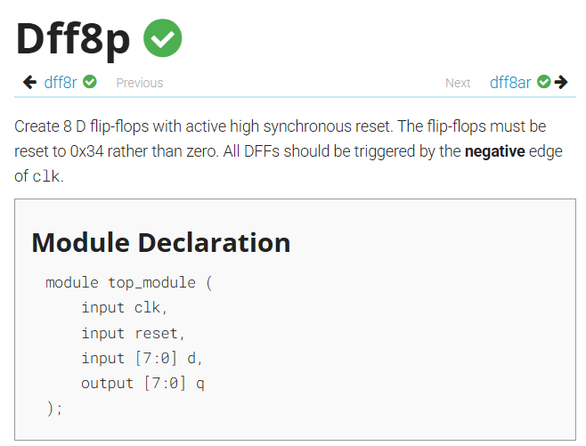
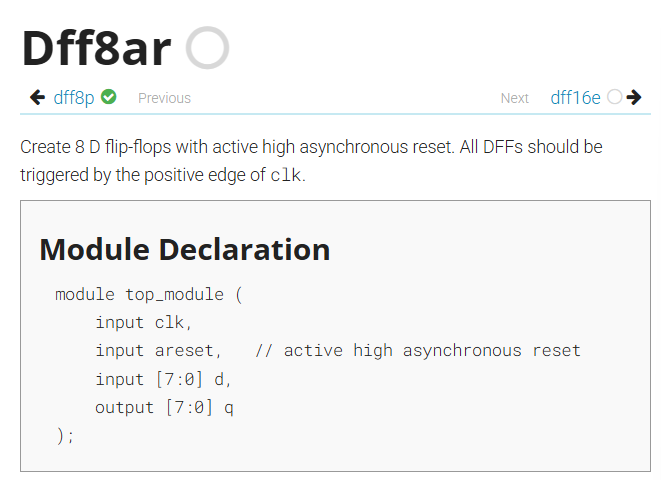

# 同步重置、非同步重置


題目1：https://hdlbits.01xz.net/wiki/Dff8p



題目2：https://hdlbits.01xz.net/wiki/Dff8ar



這兩個題目是要做同步/非同步重置的電路

- active-high asynchronous reset(高有效非同步重置)
- active-high synchronous reset(高有效同步重置)

---

- 高有效： reset = 1 時 q = 0 (重置)
- 低有效： reset = 0 時 q = 0 (重置)

---

- 同步： clk 來的時候才改變(跟 clk 同步)
- 非同步： reset 改變時就改變(不跟 clk 同步)

---

以下為兩題的答案

## 高有效同步重置

```v
module top_module (
    input clk,
    input reset,
    input [7:0] d,
    output [7:0] q
);
    
    always @(negedge clk)begin
        if(reset==1)
            q<=8'b0011_0100;
        else 
            q<=d;
    end

endmodule
```

## 高有效非同步重置

```v
module top_module (
    input clk,
    input areset,
    input [7:0] d,
    output reg [7:0] q
);

    always @(posedge clk or posedge areset) begin
        if (areset)
            q <= 8'b0;
        else
            q <= d;
    end

endmodule
```

## 進階


### 為何要寫 or ，有其他寫法嗎，像是","或是"and"

or 是代表兩個任一達到要求就進入 always block。
可以用 ',' 他和 or 是相同意思。
不能用 and ，因為 always block 沒有在表達 and 的。

所以其實可以寫
```v
always @(posedge clk , posedge areset) begin
    if (areset)
        q <= 8'b0;
    else
        q <= d;
end
```

### 為何 areset 要用 posedge？

因為只有在 areset 從 0->1 時要變，也就是"啟用 areset"。