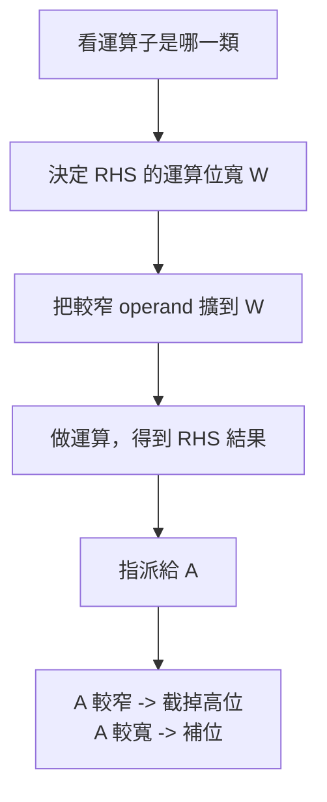

# 四則運算與邏輯運算的位寬
assign A = B 符號 C 
的通則

- RHS (B、C)
- LHS (A)


#### 最先背的總流程



這個流程的法源依據是兩條：
第一，Verilog 規定 expression 的位寬由 operands 和 context 一起決定；第二，在 assignment 中，RHS 的位寬會受 LHS 影響，而且若 RHS 比 LHS 寬，assign 時會直接丟掉 RHS 的 MSB(高位)。([比爾肯大學計算機科學系][2])

---

#### 通則一：先決定 RHS 要用幾 bit 算

這一步不是看 `A` 一眼就結束，而是看 `符號` 的類型。

##### 1. Arithmetic / Bitwise binary operators

也就是這些：

```verilog
+  -  *  /  %  &  |  ^  ^~
```

這一類在運算子表裡都是 **context-determined**；它們的基本結果位寬是 `max(L(B), L(C))`。但因為整個 RHS 正在 assignment 右邊，所以 assignment 的 context 會把 `A` 也帶進來。實務上，你在 `assign A = B op C;` 這種情況可以直接用：

```text
W = max( L(A), L(B), L(C) )
```

然後把 `B`、`C` 先擴到 `W` 再算。這也是你前面那三題會得到不同答案的原因。([开放图书][1])

所以像：

```verilog
assign A = B + C;
assign A = B & C;
```

都可以先套這條。([开放图书][1])

題外話：
如果想要 nor ，要寫 c = ~( A & B );，就是二元運算外面套一個一元運算。nand 也是。

---

##### 2. Shift operators

也就是：

```verilog
<<  >>
```

這類比較特別。規則不是看 `B`、`C` 兩邊取 max，而是：

* **結果位寬 = 左操作數 `B` 的位寬**
* 但在 assignment context 裡，這個左操作數 `B` 會先被 context 擴位
* **右操作數 `C` 是 self-determined**，只拿來表示 shift amount(位移量)，不參與結果位寬決定。([开放图书][1])

所以：

```verilog
assign A = B << C;
```

最實用的判斷法是：

```text
W = max( L(A), L(B) )
```

然後先把 `B` 擴到 `W`，再左移 `C`。`C` 不會把結果撐寬。([开放图书][1])

這也是很多人第一次踩坑的地方：
`B << C` 不是「左移後自動變寬」，而是「在既定位寬裡左移，移出去就沒了」。社群討論常見的誤解也集中在這裡。([开放图书][1])

---

##### 3. Comparison / Logical operators

也就是：

```verilog
==  !=  ===  !==  >  >=  <  <=  &&  ||
```

這一類的**結果固定是 1 bit**。而且表格裡明列它們屬於 **self-determined**；也就是說，結果寬度不因 `A` 變寬就改變。([开放图书][1])

所以：

```verilog
assign A = B == C;
```

RHS 的結果就是 1 bit。
接著 assign 給 `A` 時：

* `A` 若比 1-bit 寬，就補位
* `A` 若剛好 1-bit，就直接放進去。([國立宜蘭大學資訊工程學系][3])

---

##### 4. Conditional operator

也就是：

```verilog
assign A = B ? C : D;
```

這個不完全是你現在問的二元形式，但很常一起考。它的規則是：

* 條件 `B` 是 self-determined
* 結果位寬看 `max(L(C), L(D))`
* 在 assignment 裡，再受 `A` 的 context 影響。([开放图书][1])

---

##### 5. Concatenation

也就是：

```verilog
assign A = {B, C};
```

這個是 **self-determined**。
位寬直接等於：

```text
W = L(B) + L(C)
```

不是看 `A` 去決定運算位寬。也因為 concatenation 裡的成員是 self-determined，所以像 `{B+C}` 這種寫法會和直接 `B+C` 有差別，這是 Verilog 新手很常中招的點，Stack Overflow 上也很多這類問答。([开放图书][1])

---

#### 通則二：擴位時看 signedness(有號/無號)

決定出 RHS 要用 `W` bit 計算後，較窄 operand 需要先擴位。這時不是永遠補 0，而是：

* propagated type(傳播後型別) 若是 signed，就 **sign-extension(符號擴位)**
* 否則就 **zero-extension(補 0 擴位)**。([國立宜蘭大學資訊工程學系][3])

所以你前面那幾題用 `wire [n:0]`、沒有 `signed`，都屬於無號向量；因此擴位時一律補 0。([國立宜蘭大學資訊工程學系][3])

---

#### 通則三：算完之後才 assign 給 A

這一步很重要，因為很多人會誤以為「先把 RHS 壓成和 A 一樣寬再算」。
標準的流程其實是：

1. 先依規則決定 RHS 的運算位寬
2. 在那個位寬下完成運算
3. 最後把結果 assign 給 `A`
4. 若 RHS 比 `A` 寬，**丟掉 RHS 的高位**
5. 若 RHS 比 `A` 窄，則延伸到 `A` 的寬度。([國立宜蘭大學資訊工程學系][3])

也就是說，**截斷發生在 assignment 階段，不是先發生在運算階段**。
但你也要小心另一件事：如果 RHS 的運算位寬本身就不夠，那 overflow/carry 可能會在 **RHS 計算時就先丟掉**。IEEE 文件對 interim results 也特別提醒了這件事。([國立宜蘭大學資訊工程學系][3])

生活化一點講：

* 「RHS 要用幾格草稿紙算」先決定
* 算完之後
* 才看 `A` 這個答案欄夠不夠長。([國立宜蘭大學資訊工程學系][3])

---

#### 你可以直接套用的簡化版通則

如果你現在只想處理最常見的 `assign A = B 符號 C;`，可以先背這張小表。

| 運算子類型                       | 常見符號                        | RHS 運算位寬怎麼決定                    |                             |              |
| --------------------------- | --------------------------- | ------------------------------- | --------------------------- | ------------ |
| Arithmetic / Bitwise binary | `+ - * / % &                | ^ ^~`                           | `W = max(L(A), L(B), L(C))` |              |
| Shift                       | `<< >>`                     | `W = max(L(A), L(B))`，`C` 只當位移量 |                             |              |
| Comparison / Logical        | `== != === !== > >= < <= && |                                 | `                           | 結果固定 `1 bit` |
| Concatenation               | `{B,C}`                     | `W = L(B) + L(C)`，不看 `A` 決定運算寬度 |                             |              |

這張表是把 Synopsys 參考手冊的 operator bit-width 表，和 IEEE/OVI 對 assignment context 的規則合在一起後，整理成最適合你現在解題的版本。([开放图书][1])

---

#### 套回你前面的三題

1. `assign A[3:0] = B[4:0] & C[3:0];`
   `&` 屬於 Arithmetic / Bitwise binary 類，所以 `W = max(4,5,4)=5`。先做 5-bit AND，再截成 4-bit。([开放图书][1])

2. `assign A[3:0] = B[4:0] + C[3:0];`
   `+` 也屬於這一類，所以 `W = max(4,5,4)=5`。先做 5-bit 加法，再截成 4-bit。([开放图书][1])

3. `assign A[5:0] = B[4:0] + C[3:0];`
   這次 `W = max(6,5,4)=6`。所以 `A` 會把整個加法拉寬到 6-bit，結果不用再截。([开放图书][1])

---

#### 最後濃縮成一句最好背的版本

你可以直接背這句：

> **先判斷 `符號` 屬於哪一類，再決定 RHS 的運算位寬；較窄 operand 先擴到那個位寬；算完後再 assign 給 `A`，`A` 較窄就截高位，較寬就補位。** ([开放图书][1])

如果你要，我下一則可以直接幫你做成一張「Verilog 位寬規則速查表」，把 `+ - & | ^ == << >> ?: {}` 全放進同一張。

[1]: https://book.huihoo.com/pdf/crafting-a-chip-a-practical-guide-to-the-uofu-vlsi-cad-flow/synopsys/hdlcv_4.pdf "HDL Compiler for Verilog RM: 4. Expressions"
[2]: https://www.cs.bilkent.edu.tr/~will/courses/CS223/Verilog/VerilogLangRefManual.pdf "Verilog HDL  LRM"
[3]: https://www.csie.nuk.edu.tw/~stpan/course/Verilog1964-2005.pdf "Title"
