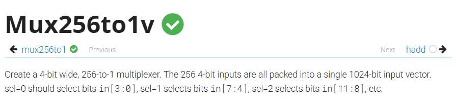

題目：https://hdlbits.01xz.net/wiki/Mux256to1v



這題的優秀寫法是以下代碼：

```v
module top_module( 
    input [1023:0] in,
    input [7:0] sel,
    output reg [3:0] out );
	integer i;
    always @(*)begin
        out = in[sel*4 +: 4];
    end
endmodule
```

其中的 in[sel*4 +: 4] 是啥意思呢 ？

請看[indexed-part-select索引式區段選取](vector.md#indexed-part-select索引式區段選取)。