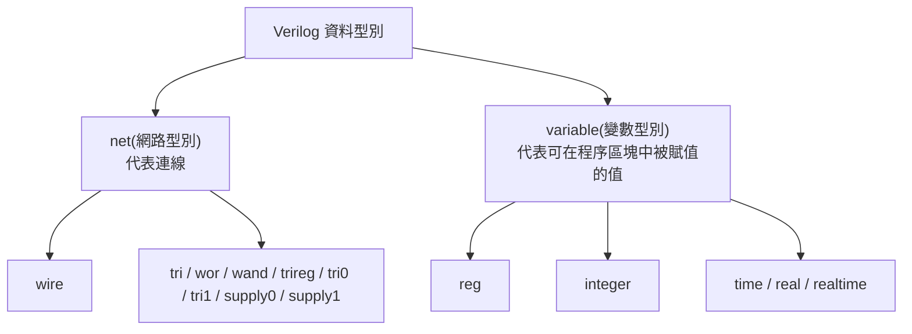

# Verilog Quick Reference：常見資料型別

## 分類總覽



## 最常用三種

### wire
- 屬於 `net`
- 表示連線(connection)
- 本身不在 `always` / `initial` 內被程序賦值
- 常見用途：
  - `assign` 左邊
  - 接子模組輸出
  - 中介連線

```verilog
wire y;
assign y = a & b;
```

### reg
- 屬於 `variable`
- 表示可在 `always` / `initial` 中被賦值的變數
- `reg` 不等於實體暫存器(register)
- 是否綜合成 combinational logic(組合邏輯)、latch(閂鎖)、flip-flop(正反器)，取決於寫法

```verilog
reg y;
always @(*) begin
    y = a & b;
end
```

### integer
- 屬於 `variable`
- 常見視為 `32-bit signed`
- 最常用於：
  - `for` 迴圈索引
  - 整數計數
  - testbench 暫時整數變數
- 不建議拿來取代一般固定寬度硬體訊號

```verilog
integer i;
always @(*) begin
    for (i = 0; i < 8; i = i + 1)
        y[i] = a[i] & b[i];
end
```

## 快速選擇規則

### 規則一
`assign` 左邊 → 用 `wire`

```verilog
wire out;
assign out = a ^ b;
```

### 規則二
`always` / `initial` 左邊 → 用 `reg`

```verilog
reg out;
always @(*) begin
    out = a ^ b;
end
```

### 規則三
`for (i = ...)` 的 `i` → 通常用 `integer`

```verilog
integer i;
```

### 規則四
要表示固定寬度的硬體訊號 → 優先用 `wire [N:0]` 或 `reg [N:0]`

```verilog
wire [7:0] data_in;
reg  [7:0] data_out;
```

不要把所有東西都寫成 `integer`。

## Port(埠) 宣告規則

### input
預設是 `wire`

```verilog
input a;
```

等同於：

```verilog
input wire a;
```

### output
預設是 `wire`

```verilog
output y;
```

等同於：

```verilog
output wire y;
```

### output reg
當 `output` 要在 `always` / `initial` 中被賦值時，宣告成 `output reg`

```verilog
module top_module(
    input  a,
    input  b,
    output reg y
);
    always @(*) begin
        y = a & b;
    end
endmodule
```

### inout
預設也是 `wire`

## 模組內常見宣告方式

### 中介連線
```verilog
wire n1, n2;
wire [3:0] bus;
```

### 程序變數
```verilog
reg q;
reg [7:0] count;
```

### 迴圈索引
```verilog
integer i;
```

## 常見使用情境

### wire 用在
- combinational continuous assignment(連續指定)
- module instance 之間的連線
- 單純被驅動的訊號

```verilog
wire sum;
assign sum = a ^ b ^ cin;
```

### reg 用在
- combinational always block
- sequential always block

```verilog
reg y;
always @(*) begin
    y = sel ? a : b;
end
```

```verilog
reg q;
always @(posedge clk) begin
    q <= d;
end
```

### integer 用在
- `for` loop index
- testbench 計數器
- 暫時整數控制值

```verilog
integer i;
always @(*) begin
    for (i = 0; i < 4; i = i + 1)
        out[i] = in[i];
end
```

## 常見誤解修正

### `reg` 不是一定會變成 register
- `reg` 只是 variable 型別名稱
- 實際電路型態看 `always` 的觸發條件與賦值是否完整

### `wire` 不是只能接簡單訊號
- `wire` 可以接任何由 `assign` 或模組輸出持續驅動的結果

### `integer` 不是完全不能綜合
- 可綜合的 `for` 迴圈索引很常用 `integer`
- 但 RTL 資料路徑仍以明確位寬的 `wire/reg` 為主

## 其他常見型別

### 其他 net 型別
- `tri`
- `wand`
- `wor`
- `triand`
- `trior`
- `tri0`
- `tri1`
- `supply0`
- `supply1`
- `trireg`

前期 RTL / HDLBits 通常先不用。

### 其他 variable 型別
- `time`
- `real`
- `realtime`

多用於 simulation(模擬) / testbench。

### event
- 用於模擬控制流程
- RTL 初學階段通常先不用

## HDLBits 實戰心法

### 看到 input
先當 `wire`

### 看到 output
預設當 `wire`

### output 如果在 always 裡改
改成 `output reg`

### 模組內中介訊號
若只是連線，用 `wire`

### 模組內在 always 裡被指定的變數
用 `reg`

### for 迴圈索引
用 `integer`

## 超短版速記

```text
assign 左邊     -> wire
always 左邊     -> reg
for 的 i        -> integer
input/output    -> 預設 wire
output 在 always 裡改 -> output reg
reg 不等於 register
integer 不拿來取代一般固定寬度訊號
```

## 一眼判斷版

### 這條訊號只是被接來接去
用 `wire`

### 這個值要在 always 裡算出來
用 `reg`

### 這個變數只是拿來跑 for
用 `integer`
