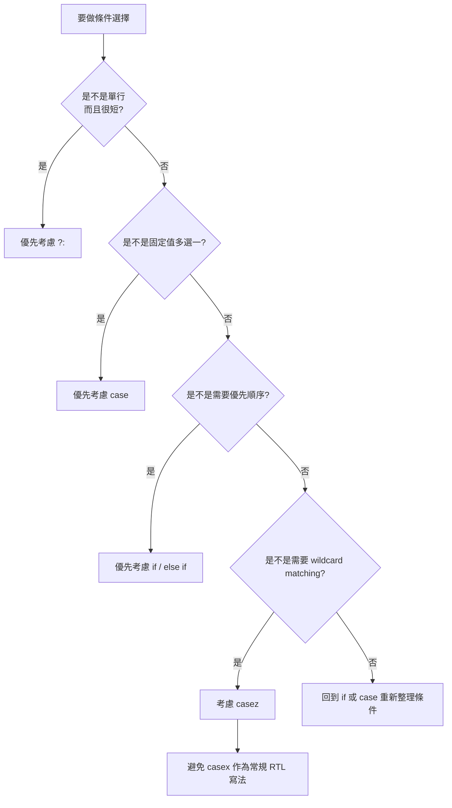

# 選擇結構

## 總覽

| 結構 | 適合情境 | 典型硬體 | 重點([nandland.com](https://nandland.com/how-to-avoid-creating-a-latch/?utm_source=chatgpt.com))| `else if` 代表有先後優先權 |
| `?:` | 短小單行選擇 | mux | 適合簡潔組合邏輯 |
| `case` | 固定值多選一 | mux、decoder、FSM | 適合等值比對 |
| `casez` | 需要 wildcard matching | priority encoder、pattern matching | `?` / `z` 可當 don’t care |
| `casex` | 幾乎不建議用在 RTL | 不建議常規使用 | 會把 `x` 也當 don’t care，容易掩蓋 bug |

## `if / else if / else`

### 語法

```verilog
if (condition_1)
    statement_1;
else if (condition_2)
    statement_2;
else
    statement_default;
```

```verilog
if (condition_1) begin
    ...
end
else if (condition_2) begin
    ...
end
else begin
    ...
end
```

### 你要記的規則

- `condition` 放 expression，最後會被判斷成 true / false。
- `statement` 可以是一句 procedural statement，或 `begin ... end`。
- 在 `always @(*)` 中，這通常描述組合邏輯。
- 在 `always @(posedge clk)` 中，這通常描述循序邏輯控制。
- `else if` 天生帶有優先順序。
- 分支很多、而且本質是「固定值對固定值」時，通常改用 `case` 更清楚。

### 常見用途

- priority logic(優先邏輯)
- enable / reset 控制
- 範圍判斷
- 小型 mux

### 建議寫法

```verilog
always @(*) begin
    if (req2)
        grant = 2'b10;
    else if (req1)
        grant = 2'b01;
    else
        grant = 2'b00;
end
```

### 組合邏輯常用模板

```verilog
always @(*) begin
    grant = 2'b00;

    if (req2)
        grant = 2'b10;
    else if (req1)
        grant = 2'b01;
end
```

### Quick Notes

- Verilog 沒有 `elif`，只有 `else if`。
- 多行分支請加 `begin ... end`。
- 組合邏輯若不是每條路徑都有賦值，可能推導出 latch。

## `?:` conditional ternary operator

### 語法

```verilog
assign out = sel ? b : a;
```

```verilog
assign out = (sel == 2'd0) ? a :
             (sel == 2'd1) ? b :
             (sel == 2'd2) ? c : d;
```

### 你要記的規則

- 這是 expression，不是 procedural statement。
- 很適合搭配 `assign` 使用。
- 最適合單行、短小、明確的選擇邏輯。
- 巢狀太深會很難讀。

### 常見用途

- 2-to-1 mux
- 小型多選一
- 單行條件輸出

### C++ 對照

```cpp
out = sel ? b : a;
```

### 建議寫法

```verilog
assign out = sel ? b : a;
```

### 不建議這樣濫用

```verilog
assign out = (a) ? x :
             (b) ? y :
             (c) ? z :
             (d) ? p :
             (e) ? q : r;
```

- 層數太多時，改寫成 `if` 或 `case`。

## `case`

### 語法

```verilog
case (expr)
    item_1: statement_1;
    item_2: statement_2;
    default: statement_default;
endcase
```

```verilog
case (expr)
    item_1: begin
        ...
    end
    default: begin
        ...
    end
endcase
```

### 你要記的規則

- `expr` 是被比較的 expression，例如 `sel`、`state`。
- `item` 通常寫常數，而且位寬格式要一致。
- 適合「固定值多選一」。
- 常用於 mux、decoder、FSM。
- 若在組合邏輯裡使用，請確保所有路徑都有賦值。

### 建議寫法

```verilog
always @(*) begin
    case (sel)
        2'b00: out = in0;
        2'b01: out = in1;
        2'b10: out = in2;
        2'b11: out = in3;
        default: out = 8'b0;
    endcase
end
```

### 更穩的組合邏輯模板

```verilog
always @(*) begin
    out = 8'b0;

    case (sel)
        2'b00: out = in0;
        2'b01: out = in1;
        2'b10: out = in2;
        2'b11: out = in3;
    endcase
end
```

### Quick Notes

- case item 多句時要加 `begin ... end`。
- 常數格式盡量統一，例如都寫成 `2'b00`、`2'b01`。
- `default` 很常需要保留，尤其在組合邏輯。

## `casez`

### 語法

```verilog
always @(*) begin
    casez (in)
        4'b1???: out = 2'd3;
        4'b01??: out = 2'd2;
        4'b001?: out = 2'd1;
        4'b0001: out = 2'd0;
        default: out = 2'd0;
    endcase
end
```

### 你要記的規則

- `casez` 會把 `z` 與 `?` 當作 wildcard。
- 最常見寫法是用 `?` 表示 don’t care。
- 適合 priority encoder、pattern matching。
- 若多個 item 都匹配，會依照撰寫順序，前面的先匹配。
- 因此它可以描述 priority logic。

### 推薦觀念

- 寫 don’t care 時，優先用 `?`，可讀性通常比直接寫 `z` 更好。
- 只有在你真的要 wildcard matching 時才用 `casez`。

### 典型範例

```verilog
always @(*) begin
    casez (in)
        4'b1???: pos = 2'd3;
        4'b01??: pos = 2'd2;
        4'b001?: pos = 2'd1;
        4'b0001: pos = 2'd0;
        default: pos = 2'd0;
    endcase
end
```

### Quick Notes

- `casez` 很方便，但也可能把不該被忽略的 `z` 輸入匹配掉。
- 有 wildcard 就代表你要特別小心覆蓋順序。

## `casex`

### 語法

```verilog
casex (in)
    4'b1xxx: out = 1'b1;
    default: out = 1'b0;
endcase
```

### 你要記的規則

- `casex` 會把 `x`、`z`、`?` 都當成 don’t care。
- 這會讓未知值 `x` 也被吞掉。
- 在模擬中，`x` 常代表未初始化、衝突、不確定值。
- 所以 `casex` 很容易掩蓋 bug。

### 結論

- RTL 設計中，一般不建議使用 `casex`。
- 能用 `case` 就用 `case`。
- 需要 wildcard 時，優先考慮 `casez`。

## 選擇結構怎麼挑



## 最常用模板

### 2-to-1 mux

```verilog
assign out = sel ? b : a;
```

```verilog
always @(*) begin
    if (sel)
        out = b;
    else
        out = a;
end
```

### priority logic

```verilog
always @(*) begin
    if (req2)
        grant = 2'b10;
    else if (req1)
        grant = 2'b01;
    else
        grant = 2'b00;
end
```

### 多選一 mux

```verilog
always @(*) begin
    case (sel)
        2'b00: out = in0;
        2'b01: out = in1;
        2'b10: out = in2;
        2'b11: out = in3;
        default: out = 4'b0000;
    endcase
end
```

### priority encoder

```verilog
always @(*) begin
    casez (in)
        4'b1???: pos = 2'd3;
        4'b01??: pos = 2'd2;
        4'b001?: pos = 2'd1;
        4'b0001: pos = 2'd0;
        default: pos = 2'd0;
    endcase
end
```

## 地雷總表

- 組合邏輯中沒有完整賦值。
- `if` / `case` 分支漏掉輸出賦值。
- `case` 忘記 `default`，又沒有先給預設值。
- `case` 分支多句但忘記 `begin ... end`。
- `casez` 濫用 wildcard，導致匹配範圍超出預期。
- `casex` 把 `x` 吞掉，讓 bug 不容易暴露。
- 多層 ternary operator (`?:`) 寫太深，造成可讀性很差。

## 一句話版

- 有優先權：`if / else if`
- 單行短邏輯：`?:`
- 固定值多選一：`case`
- 要 wildcard：`casez`
- 常規 RTL：避免 `casex`
