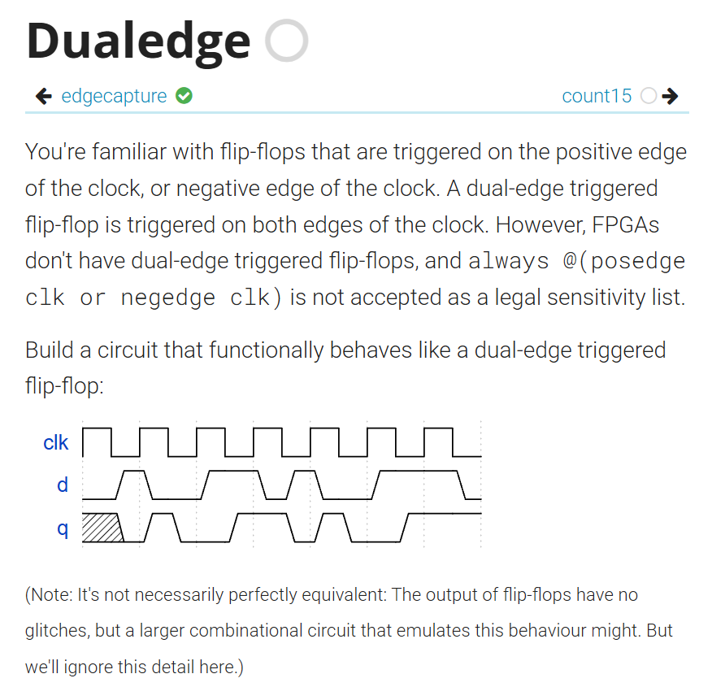

# 雙邊緣觸發

題目：
https://hdlbits.01xz.net/wiki/Dualedge




## 解題

看到這題，我們會第一直覺用一個 always + posedge、negedge 來寫。
如下：

```v
module top_module (
    input clk,
    input d,
    output q
);
    always @(posedge clk , negedge clk)begin
        q <= d;
    end

endmodule
```

其實這是不允許的，因為這不是一個標準可以用的元件，對於相同訊號不能同時有正邊和負邊，例如`always @(posedge clk or negedge reset)`。
但是可以對於不同的訊號有正邊和負邊，像是`always @(posedge clk or negedge reset)`。

既然不行，那我們就把他拆開來阿！像下面這樣。

```v
module top_module (
    input clk,
    input d,
    output q
);

    always @(posedge clk)
        q <= d;

    always @(negedge clk)
        q <= d;

endmodule
```

這樣其實也不行，因為對於不同的 always ，不能同時驅動相同的 reg ，像這邊的 q 不能同時用兩個 always 驅動。
那我們還有什麼辦法？

我們或許可以像下面這樣。

```v
module top_module (
    input clk,
    input d,
    output q
);

    reg q_pos, q_neg;

    always @(posedge clk)
        q_pos <= d;

    always @(negedge clk)
        q_neg <= d;

    assign q = clk ? q_pos : q_neg;

endmodule
```
q_pos 是 d 在上邊緣的數值。
q_neg 是 d 在下邊緣的數值。
`q = clk ? q_pos : q_neg`：當 clk == 1 ，給上邊緣的數值，clk == 0 則反之。


這樣會有什麼問題呢？

>因為當`assign q = clk ? q_pos : q_neg;`的 clk 從 0 變成 1 時，會選擇 q_pos 。但是在這個瞬間`always @(posedge clk)q_pos <= d;`其實還沒有把 d 給 q_pos，他會延遲一下下，會導致 q_pos 在 d 傳遞給 q_pos 之前不是正確的資料。


那我們還有沒有其他解決方法？
有的，以下是最標準的解決方法。

```v
module top_module (
    input clk,
    input d,
    output q
);

    reg p, n;

    always @(posedge clk)
        p <= d ^ n;

    always @(negedge clk)
        n <= d ^ p;

    assign q = p ^ n;

endmodule
```

在我們了解他的運作之前，我們要先知道 XOR 的可逆性。

## XOR 的可逆性


XOR 像是一個可開可觀的翻轉器：

```
x ^ 0 = x
x ^ 1 = ~x
```

而且更重要的是用同一個東西 XOR 兩次，效果會完全取消：

```
x ^ a ^ a = x
```

這其實對於單位元和多位元都一樣。

感覺就像是開燈之後又關燈。

那麼已知我們最終目的是達到：

```v
q <= d
```

可以得到以下式子：

```v
q  <= p ^ n
    = (d ^ n) ^ n (代入 p <= d ^ n )
    = p ^ (d ^ p) (代入 n <= d ^ p )
    = d
```

所以我們如果要 q <= d，但是 q 不能同時出現在兩個 always ，所以我們就用 p 和 n 來傳遞 d：

```v
p <= d ^ n
n <= d ^ p

q <= p ^ n
```

聰明如你應該已經想到了，如果有三個東西要把 D 給 Q ，我們就可以像下面這樣寫。

```v
a <= D ^ b ^ c
b <= D ^ a ^ c
c <= D ^ a ^ b
Q <= a ^ b ^ c
```

這種寫法成立，靠的是這個前提：
>每次事件只改一個變數，其它變數都當成固定舊值來抵消。