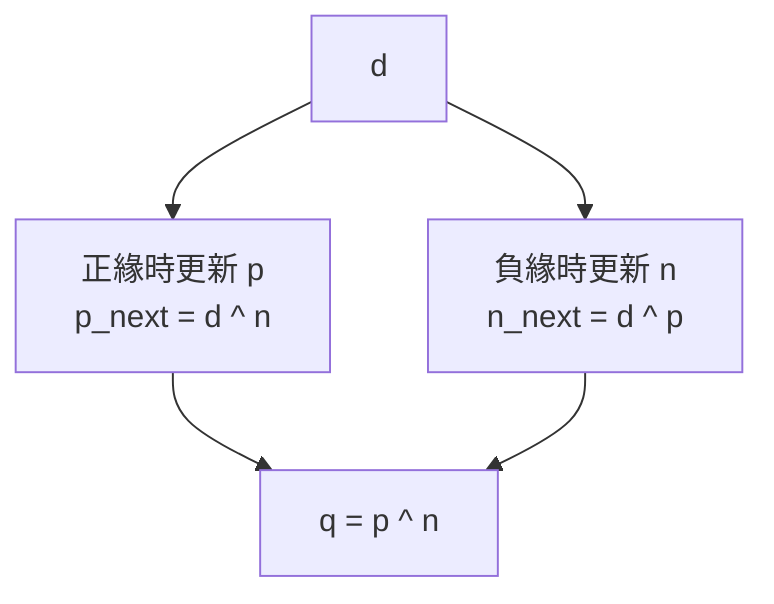

# 雙邊緣觸發

題目：
https://hdlbits.01xz.net/wiki/Dualedge


## 解題

### 法1
```v
module top_module (
    input clk,
    input d,
    output q
);

    reg q_pos, q_neg;

    always @(posedge clk)
        q_pos <= d;

    always @(negedge clk)
        q_neg <= d;

    assign q = clk ? q_pos : q_neg;

endmodule
```
q_pos 是 d 在上邊緣的數值。
q_neg 是 d 在下邊緣的數值。
`q = clk ? q_pos : q_neg`：當 clk == 1 ，給上邊緣的數值，clk == 0 則反之。


### 法2
```v
module top_module (
    input clk,
    input d,
    output q
);

    reg p, n;

    always @(posedge clk)
        p <= d ^ n;

    always @(negedge clk)
        n <= d ^ p;

    assign q = p ^ n;

endmodule
```

/// details | GPT 題解


#### 先講一句最核心的話

這三行不是在「直接把 `d` 存進 `q`」。

它們真正做的是：

> **把 `q` 拆成兩半狀態 `p` 和 `n`，並且永遠維持 `q = p ^ n`。**
> 當 clock 來到某個邊沿時，只更新其中一半，另一半先不動；然後把「要更新的那一半」算成剛好能讓 `q` 變成 `d` 的值。這正是 HDLBits `Dualedge` 題官方解法的結構。([HDLBits][1])

---

#### 原始程式

```verilog
reg p, n;

always @(posedge clk)
    p <= d ^ n;

always @(negedge clk)
    n <= d ^ p;

assign q = p ^ n;
```

---

#### `assign q = p ^ n;` 代表什麼

這一行是在定義：

```verilog
q = p ^ n
```

也就是說，`q` 不是獨立存起來的，而是由 `p` 和 `n` 這兩個內部狀態 XOR(異或) 出來的。這和官方解法完全一致。([blog.csdn.net][2])

你可以把它想成：

* `p`：正緣那一半負責的狀態
* `n`：負緣那一半負責的狀態
* `q`：把這兩半拼回來的最終輸出

XOR 的規則是：

```text
0 ^ 0 = 0
0 ^ 1 = 1
1 ^ 0 = 1
1 ^ 1 = 0
```

所以 `q` 是由 `p` 和 `n` 的「是否不同」決定。

---

#### `p <= d ^ n;` 代表什麼

這一行是在 **正緣** 時更新 `p`：

```verilog
always @(posedge clk)
    p <= d ^ n;
```

它的真正意思不是「把 `d ^ n` 存進去而已」，而是：

> **既然我希望更新完之後 `q = d`，而且此時 `n` 不會變，那我就反過來算：`p` 應該設成多少，才能讓 `p ^ n = d`？**

我們把這個式子直接解出來：

已知希望：

```text
q_new = d
```

而 `q = p ^ n`，所以想要：

```text
p_new ^ n_old = d
```

兩邊再 XOR `n_old`：

```text
p_new = d ^ n_old
```

所以正緣時就寫成：

```verilog
p <= d ^ n;
```

這不是隨便猜的，而是**由「我要讓 q 變成 d」反推出來的唯一自然寫法**。社群筆記也正是用這個角度解釋這個解法。([blog.csdn.net][2])

---

#### `n <= d ^ p;` 代表什麼

完全同理，這一行是在 **負緣** 時更新 `n`：

```verilog
always @(negedge clk)
    n <= d ^ p;
```

意思是：

> **現在輪到負緣更新，所以 `p` 保持不變；那我要把 `n` 算成多少，才能讓更新後的 `q = p ^ n = d`？**

同樣反推：

希望：

```text
p_old ^ n_new = d
```

兩邊再 XOR `p_old`：

```text
n_new = d ^ p_old
```

所以就得到：

```verilog
n <= d ^ p;
```

這樣每次負緣之後，`q` 也會被修正成最新的 `d`。([blog.csdn.net][2])

---

#### 為什麼它真的會讓 `q` 變成 `d`

這是整題最重要的驗證。

---

#### 情況 1：剛發生 `posedge clk`

這時：

* `p` 會更新成 `d ^ n`
* `n` 保持舊值

所以新的輸出：

```text
q_new = p_new ^ n_old
      = (d ^ n_old) ^ n_old
      = d ^ (n_old ^ n_old)
      = d ^ 0
      = d
```

也就是說：

> **每次正緣之後，`q` 一定等於當下的 `d`。**

---

#### 情況 2：剛發生 `negedge clk`

這時：

* `n` 會更新成 `d ^ p`
* `p` 保持舊值

所以新的輸出：

```text
q_new = p_old ^ n_new
      = p_old ^ (d ^ p_old)
      = (p_old ^ p_old) ^ d
      = 0 ^ d
      = d
```

也就是說：

> **每次負緣之後，`q` 也一定等於當下的 `d`。**

這正是題目要的「功能上像 dual-edge triggered flip-flop」。HDLBits 官方題目明確要求在正緣與負緣都能表現得像同一顆 flip-flop 被觸發，而這組方程式就是用兩顆單邊沿 FF 達到那個效果。([HDLBits][1])

---

#### 用生活化方式理解

你可以把 `q` 想成：

```text
q = p ^ n
```

也就是「`p` 和 `n` 組合後才是最後答案」。

那麼：

* 正緣時，只允許你改 `p`
* 負緣時，只允許你改 `n`

所以每次更新時，你都不是在「直接寫 q」，而是在做：

> **已知另一半先固定，現在把我這一半調整成一個剛好能讓最終答案變成 `d` 的值。**

這很像兩個人一起抬一張桌子：

* 桌子的最後高度 = `p ^ n`
* 如果現在只允許左邊那個人動，那左邊就要補成一個剛好讓桌子高度變成目標值的高度
* 如果現在只允許右邊那個人動，也是同理

所以 `p <= d ^ n`、`n <= d ^ p` 的本質就是「補值」。

---

#### 用 C++ 類比你會更好懂

你可以把它看成每次只更新一個變數，但希望最終 `q` 維持目標：

```cpp
bool q = p ^ n;
```

如果現在 `n` 固定不變，而你要讓 `q = d`，那 `p` 必須設成：

```cpp
p = d ^ n;
```

如果現在 `p` 固定不變，而你要讓 `q = d`，那 `n` 必須設成：

```cpp
n = d ^ p;
```

所以這三行其實是：

```cpp
// 定義最後答案
q = p ^ n;

// 正緣時，只能改 p，所以把 p 算成剛好讓 q 變 d
p = d ^ n;

// 負緣時，只能改 n，所以把 n 算成剛好讓 q 變 d
n = d ^ p;
```

---

#### 你最容易誤解的點

##### 1. 以為 `p` 跟 `n` 都是在存 `d`

不是。

* `p` 不是「正緣版的 d」
* `n` 不是「負緣版的 d」

它們都只是**中間狀態**。
真正有意義的是：

```verilog
q = p ^ n
```

也就是 `p` 和 `n` 合起來才還原成你要的輸出。

---

##### 2. 以為 `d ^ n` 很神祕

其實它只是解方程式而已。

你要的是：

```text
p ^ n = d
```

那就移項得到：

```text
p = d ^ n
```

XOR 在這裡的角色，很像加減法裡的「移項」。

---

##### 3. 以為這題是語法技巧題

不是。HDLBits 官方提示就明說這題是 **circuit design problem(電路設計題)**，不是純 coding 題；關鍵是先想出結構，再寫 Verilog。([HDLBits][1])

---

#### 一張圖看整體關係



更精確地說：

* 正緣時：`n` 固定，解出 `p_next`
* 負緣時：`p` 固定，解出 `n_next`
* 平常輸出：`q = p ^ n`

---

#### 你可以直接背成這三句

```text
q = p ^ n
```

意思：最終輸出由 `p` 和 `n` XOR 出來。

```text
p <= d ^ n
```

意思：正緣時，因為 `n` 不動，所以把 `p` 補成讓 `q` 變成 `d` 的值。

```text
n <= d ^ p
```

意思：負緣時，因為 `p` 不動，所以把 `n` 補成讓 `q` 變成 `d` 的值。

---

#### 小結

這三行的本質可以濃縮成一句：

> **`q` 永遠定義成 `p ^ n`；每次 clock 來時，只更新其中一半，並把那一半算成剛好能讓 `q` 等於最新 `d` 的值。**

如果你願意，我下一則可以直接幫你把這組解法畫成「一步一步時序波形推演」，例如：

* 初始 `p=0, n=0`
* `d` 先變 1
* 遇到正緣後發生什麼
* 再遇到負緣後發生什麼

我會用表格逐拍展開。

[1]: https://hdlbits.01xz.net/wiki/Dualedge "Dualedge - HDLBits"
[2]: https://blog.csdn.net/Royonen/article/details/125218097 "HDLBits-Dualedge_hdlbits dualedge-CSDN博客"


///

