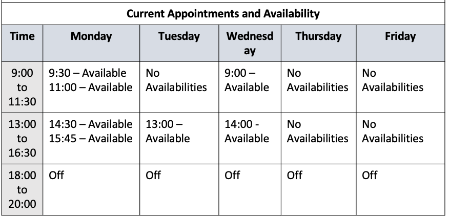

## 23

Who should I see about the pain in my chest?

A) I'm sorry to hear you're in pain.
⭐B) You should go to cardiology.
C) The doctor will see you shortly.

## 30

There are some serious side effects to these pills, so be cautious when taking them.

⭐A) Alright. I'll be sure to watch for anything odd.
B) I got the pills at the pharmacy. Why do you ask?
C) The prescription says to take them once a day.

## 44-46

Questions 44 to 46 refer to the following conversation.

W: Good morning, sir.
W: How may I help you today?
M: I need to get this prescription filled, please.
M: It's an antibiotic.
W: Oh, I'm very sorry.
W: We are currently out of that medication.
W: We are expecting a restock though.
M: When will the restock arrive?
W: It will take another two days.
W: Can you come back then?
M: I'm not sure I can wait that long, to be honest.
M: I'm feeling really sick.
W: Well, if you really need something for it, there are some over-the-counter antibiotics you could use.
M: That would be great, thank you.
M: Which do you recommend?
W: I think you should try Neosporin.
W: It should help until the restock arrives.
M: Okay.
M: Thank you.
M: And I'll be back in a couple of days to get my prescription.

### 44

What does the man initially want to do?

A) Get some medication from a doctor.
B) Provide the woman with some medicine.
C) Return an incorrect prescription.
⭐D) Ask about a certain type of medicine.

### 45

What does the woman mean when she says "Can you come back then"?

A) The medicine needs two days to work.
B) She will provide two days' worth of medicine.
⭐C) The antibiotics will arrive in two days.
D) She cannot give out the medicine for free.

### 46

What will the man probably do next?

⭐A) Buy an alternate medicine for now.
B) Complain to the pharmacy manager.
C) Wait at the pharmacy for the medicine.
D) Go to another pharmacy for his pills.

## 86-88

Questions 86 to 88 refer to the following voice message.

M: Thank you for calling Swanson Clinic, specialists in physical therapy and rehabilitation.
M: Unfortunately, we are not open at the moment.
M: Our hours of operation are Monday through Friday, from nine in the morning until six in the evening, with a one-hour break from twelve until one.
M: If you wish to make an appointment, you can do so on our website at any time.
M: Additionally, Dr. Glen is currently away due to a personal emergency and will not be back until June 23rd.
M: All appointments with Dr. Glen from now until then have been canceled.
M: To reschedule your appointment, please call back during working hours.

### 86

When would the listener hear this message?

A) After receiving a call from the clinic.
⭐B) When calling late at night.
C) Between two and four in the afternoon.
D) When they check the website.

### 87

What is mentioned about making an appointment online?

A) They can only be made in the morning.
⭐B) Appointments can be made any time.
C) They will receive priority over others.
D) The website cannot be used for appointments.

### 88

What does Dr. Glen plan to do on June 23rd?

⭐A) Return to work
B) Cancel appointments
C) Take a personal leave
D) Give a lecture

## 106

People were shocked to learn that the country's president had been admitted to a hospital ^^in order to^^ have emergency heart surgery.

A) apart from
B) prior to
C) so that
⭐D) in order to

## 126

Hoping to learn more about nutrition, the woman ^^booked^^ an appointment with the nutritionist at the local health clinic.

⭐A) booked
B) canceled
C) observed
D) investigated

## 161-163

https://www.mclaughlinclinic.com

Dr. Harriet White

Education: Graduated from Harvard University

Specializes in Otology, Rhinology, and Laryngology

Dr. White has been a valued member of the McLaughlin Clinic for ten years.
Her expertise in the fields of otology, rhinology, and laryngology has made her a leading figure in the fields of ear, nose, and throat care.
She has written several medical textbooks on the subject of diagnosis and treatment for a wide variety of ailments in addition to the bestselling ENT Homecare.
Dr. White continues to further research into groundbreaking means of treating common illnesses and afflictions.

To make an appointment with Dr. White, visit the Online Bookings page, or simply click [here] to make an appointment via text message.
Alternatively, you can make an appointment by calling the clinic during normal operation hours.
To see Dr. White's availability, please refer to the chart below.

### 161

What is the purpose of the website?

A) To inform patients of cancellations.
B) To provide information about a clinic.
⭐C) To provide information about a doctor.
D) To allow people to book surgeries.

### 162

What is indicated about Dr. White?

⭐A) She is a highly skilled doctor.
B) She does not have many appointments.
C) She no longer performs research.
D) She wrote a book about herself.

### 163

Which of the following is NOT a way to make an appointment with Dr. White?

A) Using the online reservation system.
B) Sending a text message for an appointment.
C) Calling the clinic's phone number.
⭐D) Walking into the clinic for an appointment.
