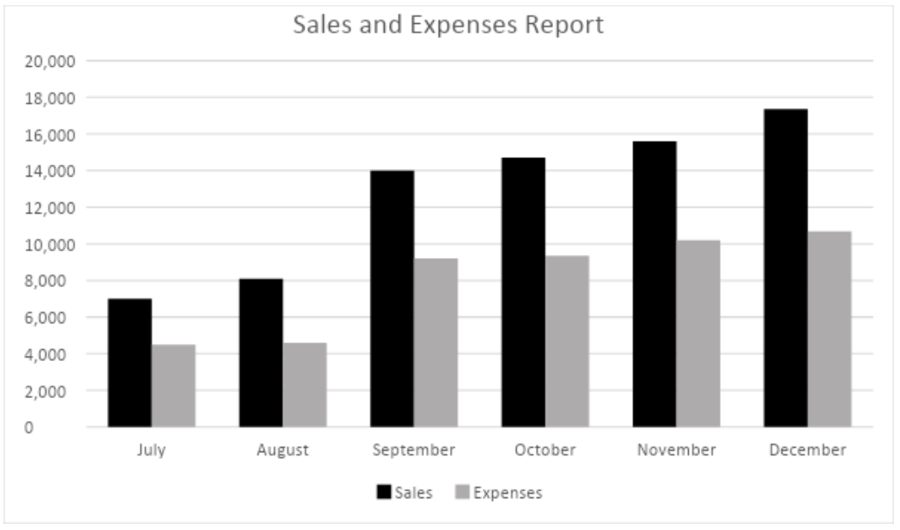

## 17

What do the earnings for this quarter look like?

A) I'm looking for it right now.
⭐B) They're better than last quarter.
C) My expenses are much lower now.

## 24

The price of raw materials has steadily been increasing, hasn't it?

A) Yes, you can increase the amount easily.
B) Yes, sales have been quite steady lately.
⭐C) Yes, as you can see on the chart here.

## 68-70

Questions 68 to 70 refer to the following conversation.

<table><tbody><tr><td>
Card: 5555 5267 8932 1123
</td></tr></tbody></table>

<table><tbody><tr><td colspan="3">
Cardholder: Ethan Bridges
</td></tr><tr><td>
Date of Purchase
</td><td>
Location
</td><td>
Amount
</td></tr><tr><td>
July 12
</td><td>
Los Angeles Airport
</td><td>
$85.96
</td></tr><tr><td>
July 14
</td><td>
New York
</td><td>
$146.00
</td></tr><tr><td>
July 23
</td><td>
New York
</td><td>
$295.00
</td></tr><tr><td>
July 24
</td><td>
Chicago
</td><td>
$875.63
</td></tr></tbody></table>

W: Thank you for calling World Bank.
W: How may I be of service?
M: Hello.
M: I'm calling about my credit card.
M: There's a problem with my statement.
W: What seems to be the problem, sir?
M: There's a charge on the card for something I didn't purchase.
W: Okay.
W: May I have the last eight digits of your card number, please?
M: It's 8932 1123.
W: Mr. Bridges, correct?
W: Which is the charge that you are disputing?
M: The charge in Chicago.
M: I was in New York that day.
W: Alright.
W: Was your card stolen or misplaced?
M: Yes, I called your bank that day to report it stolen.
W: I see the record of the call here.
W: Your card should have been canceled then.
M: Yes, the man said he would cancel it.
M: Can you please do so now?
W: Of course, Mr. Bridges.
W: The charge will be removed from your balance.
W: I apologize for this mistake.
M: Thank you, that's much appreciated.

### 68

Why is the man calling World Bank?

A) To apply for a new credit card.
B) To report his card as being stolen.
C) To inquire about his upcoming bill.
⭐D) To discuss a charge on his card.

### 69

Look at the graphic.
Which fee is the man speaking about?

A) &#36;85.96
B) &#36;146.00
C) &#36;295.00
⭐D) &#36;875.63

### 70

What did the bank fail to do?

A) Report the card to the police.
B) Issue a replacement card.
⭐C) Cancel the card as asked.
D) Return the balance to the man.

## 98-100

Questions 98 to 100 refer to the following speech.

M: As you can see here, our sales have steadily increased in the second half of the year.
M: Because of this, we have been able to meet our goals for sales in both the third and fourth quarter.
M: However, our costs also rose in comparison to our sales.
M: While we saw a significant spike in sales shortly after hiring our new marketing director, the new advertising campaign he initiated also drove up expenses quite a bit.
M: The good news is that now that people are aware of our brand and product, we will be able to scale back on the advertising, thus lowering our costs and increasing the profits from the continued rise in sales.

### 98

What is mentioned about the company's sales?

A) They were unable to meet their goals.
⭐B) They met their goals for two quarters.
C) They were lower than was expected.
D) They increased slower than predicted.

### 99

What is the reason for the sudden increase in sales?

A) Free samples.
B) Lower prices.
C) A new product launch.
⭐D) A new advertising campaign.

### 100

Look at the graphic.
When did the new marketing director likely begin working?

A) August
⭐B) September
C) October
D) November

## 112

The accounting department has suggested that we ^^implement^^ some changes in order to reduce the monthly department expenses.

⭐A) implement
B) improvement
C) introduction
D) introduced

## 120

^^Instructions^^ can be found on the reverse side of the bill should payment not be paid before the due date.

⭐A) Instructions
B) Investments
C) Deadlines
D) Exclusion

## 168-171

Group Chat: Ace Manufacturing (10 members)

Leonard\_Tsai [11:25](https://app.wordup.com.tw/materials/490/chapter/9570/components/33848/article#time=11:25)am

@bill1289, @Marie\_C Have you finished the preparations for next month's audit?

Marie\_C [11:27](https://app.wordup.com.tw/materials/490/chapter/9570/components/33848/article#time=11:27)am

I have most of the documents for the folks over in accounting ready.
I'm just waiting on the final copy of the payroll for all plant workers.

bill1289 [11:31](https://app.wordup.com.tw/materials/490/chapter/9570/components/33848/article#time=11:31)am

I'll have the payroll ready for you by this afternoon and have it sent to your office.
There's also an updated transaction report with the latest information on storage unit sales you'll need.

Leonard\_Tsai [11:33](https://app.wordup.com.tw/materials/490/chapter/9570/components/33848/article#time=11:33)am

Please make sure all the department heads know the audit will take about three days to complete.
They might need to provide some additional documents.

bill1289 [11:35](https://app.wordup.com.tw/materials/490/chapter/9570/components/33848/article#time=11:35)am

I'll be sure to pass the message along.
Is there anything else that still needs to be arranged?

Marie\_C [11:40](https://app.wordup.com.tw/materials/490/chapter/9570/components/33848/article#time=11:40)am

Leonard, did you say something a few days ago about the auditors needing a conference room to work in?

Leonard\_Tsai [11:45](https://app.wordup.com.tw/materials/490/chapter/9570/components/33848/article#time=11:45)am

Yes.
I was thinking we could let them use the one on the seventh floor since it doesn't get used that often.
Bill, could you make the arrangements?

bill1289 [11:48](https://app.wordup.com.tw/materials/490/chapter/9570/components/33848/article#time=11:48)am

Sure, I'll take care of it.
Let me know if they need any specific equipment as well.

### 168

At what kind of company do the people most likely work?

A) A studio for shooting movies.
B) A fast-food restaurant chain.
C) A shoe-making company.
⭐D) A manufacturing company.

### 169

What is mentioned about the audit?

A) It will be finished the following week.
B) The auditors have interviewed employees.
C) All necessary documents have been submitted.
⭐D) The auditors may ask for more documents.

### 170

At [11:35](https://app.wordup.com.tw/materials/490/chapter/9570/components/33848/article#time=11:35), what does Bill mean when he says "I'll be sure to pass the message along."?

⭐A) He will let other staff know to be prepared.
B) He has received a message from the auditors.
C) He will forward an email to Leonard.
D) He is about to write a memo to Marie.

### 171

What will Bill most likely do next?

A) Fill out a request for time off.
⭐B) Reserve the seventh-floor room.
C) Prepare for his meeting with the auditor.
D) Send some documents to Leonard.
